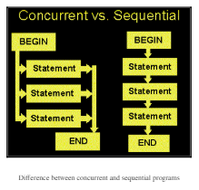
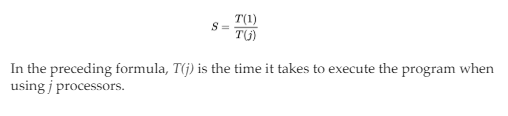
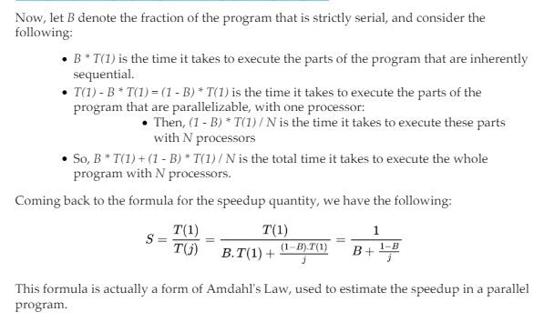
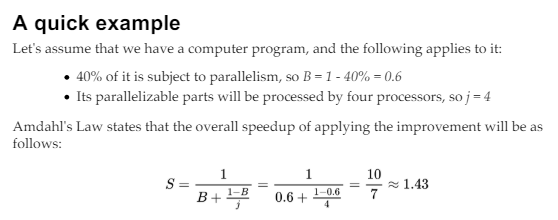
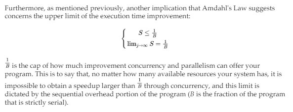
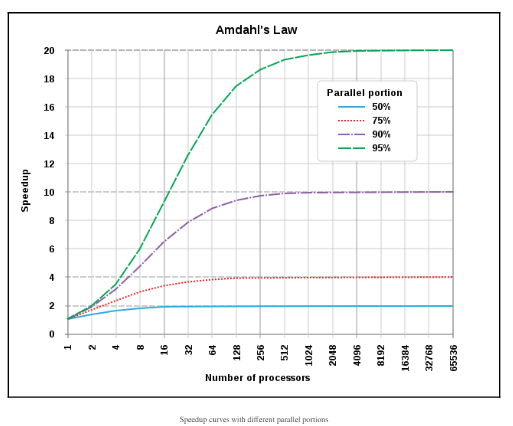
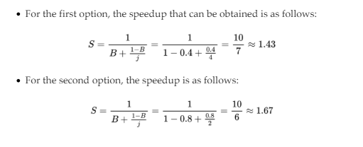

# Mastering Concurrency in Python

---

# Chapter 1 - Advanced Introduction to Concurrent and Parallel Programming

Concurrent programming vs. sequential programming

Topics:
- The concept of concurrency
- Why some programs cannot be made concurrent, and how to differentiate them from programs that can
- The history of concurrency in computer science: how it is used in the industry today, and what can be expected in the future
- The specific topics that will be covered in each section/chapter of the book
- How to set up a Python environment, and how to check out/download code from GitHub

## What is concurrency?

Concurrent programming: one of the most prominent ways to effectively process data
- It is estimated that the amount of data that needs to be processed by computer programs doubles every two years

## Concurrent versus sequential

Most obvious way to understand concurrent programming: Compare it to sequential programming
- Sequential program: 1 place at a time
- Concurrent program: Different components are in independent/semi-independent states
    - Components in different states can be executed independently
        - Can be executed at the same time (1 component's execution does not depend on the result of the other)

Diagram to illustrate:



Advantage of concurrency: Improved execution time
- Since some tasks are independent, they can be completed at the same time, so less time is required for the computer to execute the whole program

## Example 1 – checking whether a non-negative number is prime

Sequential program:

```py
# Chapter01/example1.py
from timeit import default_timer as timer
# sequential
start = timer()
result = []
for i in input:
 if is_prime(i):
 result.append(i)
print('Result 1:', result)
print('Took: %.2f seconds.' % (timer() - start))
```

Results:
- Time passed: 3.41 seconds
- Computer performance: 83% idle


Concurrent program:

```py
# Chapter01/example1.py
from timeit import default_timer as timer
# sequential
start = timer()
result = []
for i in input:
 if is_prime(i):
 result.append(i)
print('Result 1:', result)
print('Took: %.2f seconds.' % (timer() - start))
```

Results:
- Time passed: 2.33 seconds
- Computer performance: 37% idle


## Concurrent versus parallel

Is concurrency and different than parallelism? Yes.
- Differences:
    - Parallel programs: A number of processing flows (CPUs/cores) working independently all at once
    - Concurrent programs: Might be different processing flows (mostly threads)
        - These threads use a shared resource at the same time

Diagram to explain:


Parallelism: Top, where cars are in their own lane and don't interact with each other

Concurrency: Bottom, where cars need to wait there turn to cross the street (ie. wait for others to finish before they can execute)

## A quick metaphor

Concurrency is difficult to grasp right away, so here is a metaphor ( to make concurrency and its differences from parallelism easier to
understand):

Assume that different parts of the human brain are responsible for performance separate/exclusive body part actions:
- Example: left hemisphere of brain controls right side of body, and vice versa
- Example: left hemisphere of brain controls speaking, the other controls writing
    - If you want to move your left hand, only the right side of your brain can process that command
        - The left side of the brain is then free to do something else, like speaking

Parallelism: Where different processes don't interact with ie. are independent of each other
- One hand eating, other hand snapping ie. left/right hands for independent tasks at the same time

Concurrency: Sharing the same resources
- Juggling ie. two hands perform different tasks at the same time, but interact with the same object
    - Some form of coordination/communicationt between the two hands is required

## Not everything should be made concurrent

Not all programs are created equal:
- Some program: can be made parallel or concurrent relatively easily
- Others: inherently sequential
    - cannot be executed concurrently or in parallel
- Others: embarrassingly parallel
    - little or no dependency, no need for communication

## Embarrassingly parallel

Example: 3D video rendering handled by a graphics processing unit (GPU)
- each frame/pixel can be processed with no interdependency

Example: Password cracking
- can easily be distributed on CPU cores

Example: Web scraping

## Inherently sequential

Opposite of embarrasingly parallel: These tasks heavily depend on the results of others ie. tasks are not independent (Cannot be made parallel/concurrent)
- If we tried to implement concurrency, it could cost us more execution time for the SAME results

Example: Chapter01/example1.py
- Assuming we want the output of prime numbers in order, this is what happened:
    - Method 1 (sequential): we went down the line in order
        - Output stays in order
    - Method 2 (concurrent): since we split the tasks into different groups, the
        - Requires a sort at the end, which could increase execution time 

This brings up the topic of pregnancy!

Pregnancy: A topic used to illustrate the innate sequentialy of some tasks
- The number of women will never reduce the length of pregnancy
    - Adding more processors will NOT improve execution time
- Examples:
    - iterative algorithms
    - iterative numerical approximation methods

## Example 2 – inherently sequential tasks

Sequential program:

```py
# Chapter01/example2.py
import concurrent.futures
from timeit import default_timer as timer
# sequential
def f(x):
    return x * x - x + 1

start = timer()
result = 3
for i in range(20):
    result = f(result)

print('Result is very large. Only printing the last 5 digits:', result % 100000)
print('Sequential took: %.2f seconds.' % (timer() - start))
```

Results:
- Time passed: 0.10 seconds


Concurrent program:

```py
# Chapter01/example2.py
import concurrent.futures
from timeit import default_timer as timer
# concurrent
def concurrent_f(x):
    global result
    result = f(result)

result = 3

with concurrent.futures.ThreadPoolExecutor(max_workers=20) as exector:
    futures = [exector.submit(concurrent_f, i) for i in range(20)]

    _ = concurrent.futures.as_completed(futures)

print('Result is very large. Only printing the last 5 digits:', result % 100000)
print('Concurrent took: %.2f seconds.' % (timer() - start))
```

Results:
- Time passed: 0.19 seconds

Why did this occur, when both methods produce the same result?
- Every time a new thread from `ThreadPoolExecutor` was spwaned, the function `concurrent_f()` inside of that thread need to wait for `result` to be processed by the previous thread completely
    - The program therefore executes in a sequential manner, anyways

There was no actual concurrency in the 2nd method! (Not to mention, the overhead cost of spawning new threads contributes to worse execution time as well)

This is an example where concurrency/parallelism should NOT be applied, as it is a inherently sequential task.

## I/O bound

Another way to think about sequentiality: The CS concept of a condition called I/O bound
- Time it takes to complete a computation is mainly determined by time spent waiting for the input/output (I/O) operations to be completed
    - This condition arises when the rate at which data is requested is slower than the rate at which it is being consumed
        - In other words: More time is spent requesting data than processing it

- I/O bound state: CPU stalls its operation, waiting for data to be processed
    - What this mean: Even if the CPU gets faster at processing data, processes tend to not increase in speed (in proportion to the increased CPU speed) since it just gets more I/O-bound
    - New computers/processors are very fast, so I/O bound states are undesirable (although they are quite common in programs now)

Remember: Do not see concurrency as a golden ticket

## The history, present, and future of concurrency

The field of concurrent programming has enjoyed popularity since the early days of computer science, so let's go over how this has evolved/is evolving:

### The history of concurrency

Concurrency: been around for a long time now!
- idea started: early work on railroads/telegraphy in the 19th/20th centuries
    - some terms have survived ie. semaphore
        - semaphore: a variable that controls access to a shared resource, in a concurrent program
- first application: how to handle multiple trains on the same railroad system
    - need to avoid collisions
    - wanted to maximize efficiency
- second application: how to handle multiple transmissions over a set of wires in telegraphy
- 1959: academic study of concurrency begins
    - Dijkstra paper in 1965
    - no considerable interest after this
- 1970-2000: processors were doubling in execution speed every 18 months
    - programmers did not need to learn concurrent programming
- early 2000s: manufacturers started focusing on groups of smaller/slower processors
    - think multicore processor
- nowadays: average computer has more than 1 core
    - if you write a program to be non-concurrent in any way, you only use 1 core/thread to process data (rest of CPU sits idle!)
- another reason for increasing popularity of concurrency: graphical/multimedia, web-based application development
    - example: web development
        - each new request made by a user comes in as its own process (multi-processing) OR asynchronously coordinated with other requests (asynchronous programming)
        - if any of the requests need to share a resource (ie. database), concurrency should be considered

### The present

Present day: explosive growth of the internet and data sharing happens every second
- concurrency is more important than ever
- current use emphasis:
    - correctness
    - performance
    - robustness
- some concurrent systems (operating systems, database management systems) operate indefinitely
    - have automatic recovery from failure
    - use shared resources, so require a semaphore to control/coordinate access to the shared resource(s)
- examples where concurrency is present:
    - common programming languages: C++, C#, Erlang, Go, Java, Julia, JavaScript, Perl, Python, Ruby, Scala, and so on
    - almost every computer has multiple cores, so to take advantage of this computing power, need well-designed software
    - iphone 4s (2011): has a dual core CPU
    - Xbox360/PS3 are multicore/multi-CPU
    - on average, Google processes over 40,000 search queries per second
        - 3.5 billion per day
        - 1.2 trillion per year
        - concurrency is the best way to handle this!
- cloud: a large % of today's data and applications are stored in the cloud
    - cloud computing instances are smaller, so web applications have to be concurrent
        - need to process small jobs simultaneously
        - web apps with good design just need to utilize more servers
- GPUs: used as parallel computing engines
    - almost all Kaggle prize-winning solutions use GPU during training processes
    - concurrency is an effective solution for combing through all of this big data
    - example of using concurrency to increase model-training time: AI algos that break input data down into smaller portions and process them independently

### The future

Today: Users expect instant output for all applications
- developers struggle to provide better speed for applications
    - concurrency is a unique solutions to this problem
- some may argue that concurrent programming may become more standard in academia
    - concurrency/parallelism are covered in CS
        - this is only the beginning
- more skeptical view: that concurrency is about dependency analysis
    - combination of low number of programmers who understand concurrency, and possibility of automating concurrency design, makes for decreased interest in learning
    - may be a push for compilers, with support from operating systems, to implement concurrency into the programs they compile
        - compiler will look at program, analyze statements/instructions, produce a dependency graph, and apply concurrency/parallelism
- time will tell!
- concurrent programming is very complicated and hard to get right
    - knowledge gained is beneficial

## A brief overview of mastering concurrency in Python

Python: one of the most popular programming languages out there
-  pros: comes with numerous libraries and frameworks that facilitate highperformance computing
-  cons: Global Interpreter Lock (GIL)
    - difficulty of implementing concurrent/parallel programs
    - concurrency and parallelism do behave differently in Python than in other common
    programming languages
    - it is still possible for programmers to implement programs that run concurrently or in parallel
- this book: provide a detailed overview of how concurrency and parallelism are being used in
real-world applications
    - theoretical analysis
    - practical examples

## Why Python?

Python: has GIL (Global Interpreter Lock)
- mutex that protects access to Python objects
    - prevents multiple threads from executing Python byte codes at once
    - necessary, as CPython's memory management is not thread-safe
        - thread-safe: a function is thread-safe when it can be invoked or accessed concurrently by multiple threads without causing unexpected behavior, race conditions, or data corruption
        - CPython uses reference counting, which can cause incorrect handling of data
- addressing problem with GIL
    - lock allows only 1 thread access to Python code and objects
    - this means to implement multithreading, you need to be aware of the GIL and work around it
- why work with Python at all if it has the GIL?
    - GIL is only a bottleneck for multithreaded programs that spend significant time in the GIL
        - prevents multithreadeded programs from taking full advantage of multiprocessor systems 
            - blocking operations ie. I/O, image processing, NumPy number crunching happen outside of the GIL
                - multiprocessing applications that do not share any common resources among processes, such as I/O, image processing, or NumPy number crunching, can work seamlessly with the GIL
        - other forms of concurrent programming do not have this problem (that multithreading does)

- why Python:
    - user friendly syntax
    - overall readability
    - development can be 10x faster than C/C++ code
    - strong and growing support community
    - sheer number of development tools available
        - vicious circle of Python. David Robinson, chief data scientist at DataCamp, wrote a blog (https://stackoverflow.blog/2017/09/06/incredible-growthpython/) about the incredible growth of Python, and called it the most popular programming language.

- other cons of Python:
    - slow (slower than other languages)
        - dynamically typed/interpreted language
            - values are stored in scattered objects, not dense buffers
                - direct result of having readability

    - luckily, we can use concurrency to and other options to speed up your programs

---

# Chapter 2 - Amdahl's Law

Amdahl's Law: explains the theoretical speedup of the execution of a program, when using concurrency

## Amdahl's Law

How to balance between parallelizing a sequential program (increasing # of processors) and optimizing the execution speed of the sequential program?
- Option 1: 4 processors run program at 40% of its execution
- Option 2: 2 processors run program, but for twice as long
    - this tradeoff in concurrent programming is analyzed via Amdahl's Law

Notes:
- Concurrency/parallelism are powerful, but not able to speed up any non-sequential architecture
    - Important to know its limits
        - Amdahl's Law helps with that!


## Terminology

Amdahl's Law: Provides a mathematical formula that calculates the potential improvement (in speed) of a concurrent program by increasing resources (# of available processors)
- this law applies to potential speedup when executing tasks in parallel
- speed: time for program to execute in full
- speedup: benefit of executing a computation in parallel
    - time to execute in serial (w/ 1 processor), divided by time to execute in parallel (w/ 2+ processors)



## Formula and interpretation

Let's assume we have N workers working on a job that is fully parallelizable:
- job is divided into N equal sections
    - N workers will do 1/N work
    - it will take 1/N time as 1 worker doing all of the work

Note: Most computer programs are NOT 100% parallelizable (some parts are inherently sequential)

## The formula for Amdahl's Law



## A quick example



## Implications

Gene Amdahl (1967):
- sequential overhead nature of a program sets an upper boundary on the possible speedup
- as the number of resources increases (ie. # of available processors), speed of execution increases
    - however: this does not mean to always use as many processors as possible!
        - speedup decreases eventually (as we add more processors for our concurrent program, we will obtain less and less improvement in execution time.)

upper limit of the execution time improvement:



## Amdahl's Law's relationship to the law of diminishing returns

Diminishing returns: Popular concept in economics
- Only a special case of applying Amdahl's law: It depends on the order of improvement
    - Optimal method: First applying improvements that result in the greatest speedups
    - Reverse: Improve the less optimal components of the program first
        - Can be more beneficial since optimal components are usually complex

- Another similarity: Improvement of speedup via adding more processors
    - Fixed-size task: New processor added to the system offers less usable computation power than the previous processor
        - Remember: Throughput has an upper boundary
- Also need to keep in mind bottlenecks:
    - Memory bandwidth
    - I/O bandwidth
        - These don't usually scale with processors, so adding processors gives lower return

## How to simulate in Python

In this section, we will look at the results of Amdahl's Law through a Python program.

What this function does: checks for prime numbers

```py
# ch2/example1.py

from math import sqrt

import concurrent.futures
import multiprocessing

from timeit import default_timer as timer


def is_prime(x):
    if x < 2:
        return False

    if x == 2:
        return x

    if x % 2 == 0:
        return False

    limit = int(sqrt(x)) + 1
    for i in range(3, limit, 2):
        if x % i == 0:
            return False

    return x

```

The next part of the code: Indicates the number of processors (workers) we will be utilizing to concurrently solve the problem

```py
def concurrent_solve(n_workers):
    print('Number of workers: %i.' % n_workers)

    start = timer()
    result = []

    with concurrent.futures.ProcessPoolExecutor(max_workers=n_workers) as executor:

        futures = [executor.submit(is_prime, i) for i in input]
        completed_futures = concurrent.futures.as_completed(futures)

        sub_start = timer()

        for i, future in enumerate(completed_futures):
            if future.result():
                result.append(future.result())

        sub_duration = timer() - sub_start

    duration = timer() - start
    print('Sub took: %.4f seconds.' % sub_duration)
    print('Took: %.4f seconds.' % duration)


input = [i for i in range(10 ** 13, 10 ** 13 + 1000)]

```

Finally: We loop from one to the maximum number of processors available in our
system, and we will pass that number to the preceding concurrent_solve() function

```py
for n_workers in range(1, multiprocessing.cpu_count() + 1):
    concurrent_solve(n_workers)
    print('_' * 20)
```

Note: You can the number of available processors from your computer with this call in your terminal (I got 8)

```bash
python
import multiprocessing
multiprocessing.cpu_count()
exit()

```

Note: You may need to guard in order to avoid the following error:

```bash
RuntimeEntityError:
        An attempt has been made to start a new process before the
        current process has finished its bootstrapping phase.

        This probably means that you are not using fork to start your
        child processes and you have forgotten to use the proper idiom
        in the main module:

            if __name__ == '__main__':
                freeze_support()
                ...
```

How to ensure main guard and use freeze_support():

```bash
import multiprocessing
if __name__ == '__main__':
    multiprocessing.freeze_support()
```

Why is this: the multiprocessing module in Python needs a special setup on Windows.
- freeze_support() is called to ensure that when a new process is started on Windows, it doesn’t run into issues with recursive process creation
- Unlike on Unix-based systems, where the fork method is used to start child processes, Windows uses the spawn method
    - spawn method starts a fresh Python interpreter process
        - Due to this, the code running in the child process needs to be properly guarded by `if __name__ == '__main__':` to prevent unintended code execution when the module is imported

```py
import multiprocessing
if __name__ == '__main__':
    multiprocessing.freeze_support()
    for n_workers in range(1, multiprocessing.cpu_count() + 1):
        concurrent_solve(n_workers)
        print('_' * 20)
```

Let's run the program:

```bash
cd mastering_concurrency_in_python
python Mastering-Concurrency-in-Python/Chapter02/example1.py
```

Here is my output:

```bash
Number of workers: 1.
Sub took: 10.1639 seconds.
Took: 10.4939 seconds.
____________________
Number of workers: 2.
Sub took: 5.2571 seconds.
Took: 5.5624 seconds.
____________________
Number of workers: 3.
Sub took: 3.7803 seconds.
Took: 4.1331 seconds.
____________________
Number of workers: 4.
Sub took: 3.1190 seconds.
Took: 3.4789 seconds.
____________________
Number of workers: 5.
Sub took: 3.0214 seconds.
Took: 3.4106 seconds.
____________________
Number of workers: 6.
Sub took: 2.5960 seconds.
Took: 3.0392 seconds.
____________________
Number of workers: 7.
Sub took: 2.6030 seconds.
Took: 3.1581 seconds.
____________________
Number of workers: 8.
Sub took: 3.0615 seconds.
Took: 3.5715 seconds.
____________________
```

A few things to note:
1. In each iteration: Subtask took almost as long as entire program
- ie. the concurrent computation was the majority of the program
    - Makes sense, since prime checking is the only other real computation

2. We can see hardly an improvement from 3-4 processors
- 1-2 had considerable improvement
- 2-3 had considerable improvement
- 3-4, 4-5, etc. saw almost the same numbers
    - some took longer (this is probably due to overhead processing ie. work and resources used by a system or application that are not directly related to the primary tasks the system is meant to perform)
    - this aligns with our learing earlier of Amdahl's Law + the law of diminishing returns

Here is a graph that shows the relationship between Number of processors and speedup, based on the portion of the program that is parallel:



## Practical applications of Amdahl's Law

Using Amdahl's law, we can estimate the upper limit of potential speed improvements from parallel computing. From there, we can decide whether the increase in computing power is worth it.
- You apply it when you have a concurrent program that is a mixture of BOTH sequentially and executed-in-parallels instructions
- How we use it: To determine speedup through each incrementation in # of cores available

Going back to the initial problem at the beginning of the chapter, there is a trade-off between increasing # of processors vs. increasing in how long parallelism can be applied. Here is our example:
- Current state: We are developing a program with 40% of its instructions parallelizable, and we have 2 choices to increase the speed of the program:
    1. Have 4 processors
    2. Have 2 processors, but increase parallelizable portion to 80%

We can compare these two choices using Amdahl's Law:



We can calculate this with Python:

```bash
python
```

```py
b = (1 - 0.4) # 40% parallelizable
j = 4 # processors
s = 1 / (b + ((1 - b) / j))
print(f"speedup for choice 1: {s}")

b = (1 - 0.8) # 40% parallelizable
j = 2 # processors
s = 1 / (b + ((1 - b) / j))
print(f"speedup for choice 2: {s}")

```

As you can see, the second option (which has fewer processors than the first) is actually the
better choice to speed up our specific program.

Final note: Remember that this law makes some of assumptions, and by no means is it a be-all-end-all.
- Examples of important factors that it ignores:
    - Overhead of parallelism
    - Speed of memory

Best way to think about and use Amdahl's Law? We must actually measure the speedup by implementing in practice.

## Summary

Summary:
- Amdahl's Law gives us a way to estimate the potential speedup in execution time
- When only the number of processors increases, Amdahl's Law resembles the law of diminishing returns (The speedup curve flattens out)
- Improvement through concurrency and parallelism is NOT always what we want when designing an efficient concurrent program

Next chatper: We will discuss the tools that Python provides for us to implement concurrency, more specifically threads!

# Chapter 3 - Working with Threads in Python

In this chapter:
- We will be introduced to the formal definition of a thread, and the `threading` library in Python.
- A number of ways to work with threads in Python:
    - Creating new threads
    - Synchronizing threads
    - Working with multithreaded priority queues
- Learn about the concept of "a lock in thread synchronization"
- Implementing a lock-based multithreaded application
    
The following topics will be covered in this chapter:
- The concept of a thread in the context of concurrent programming in computer
science
- The basic API of the `threading` module in Python
- How to create a new thread via the `threading` module
- The concept of a lock and how to use different locking mechanisms to synchronize threads
- The concept of a queue in the context of concurrent programming, and how to use the `Queue` module to work with queue objects in Python

## The concept of a thread

In CS, a "thread of execution" is the smallest unit of programming commands (ie. code) that a scheduler (part of an OS) can process/manage.
- Depending on the OS, the implementation of threads and processes varies
- In general: A thread is an element/component of the process

## Threads vs. Processes

More than one thread can be implemented within the 1 same process, often executing concurrently and accessing/sharing the same resources (ie. memory)
- Separate processes do not do this
- Threads in the same process share:
    - The latter's instructions (code)
    - Context (the values that its variable reference at any given moment)

Key difference:
- Thread: Typically a component of a process
- Process: 
    - Can include multiple threads