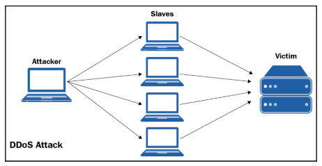
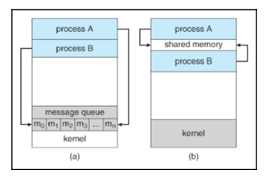

# Mastering Concurrency in Python

---

# Chapter 1 - Advanced Introduction to Concurrent and Parallel Programming

Concurrent programming vs. sequential programming

Topics:
- The concept of concurrency
- Why some programs cannot be made concurrent, and how to differentiate them from programs that can
- The history of concurrency in computer science: how it is used in the industry today, and what can be expected in the future
- The specific topics that will be covered in each section/chapter of the book
- How to set up a Python environment, and how to check out/download code from GitHub

## Technical requirements

Steps:
1. Download Python 3
2. Download the github repo from https://github.com/PacktPublishing/Mastering-Concurrency-in-Python/
- Copy the folder, delete the .git file, and rename the folder `code`

## What is concurrency?

Concurrent programming: one of the most prominent ways to effectively process data
- It is estimated that the amount of data that needs to be processed by computer programs doubles every two years

## Concurrent versus sequential

Most obvious way to understand concurrent programming: Compare it to sequential programming
- Sequential program: 1 place at a time
- Concurrent program: Different components are in independent/semi-independent states
    - Components in different states can be executed independently
        - Can be executed at the same time (1 component's execution does not depend on the result of the other)

Diagram to illustrate:


Advantage of concurrency: Improved execution time
- Since some tasks are independent, they can be completed at the same time, so less time is required for the computer to execute the whole program

## Example 1 – checking whether a non-negative number is prime

Sequential program:

```py
# Chapter01/example1.py
from timeit import default_timer as timer
# sequential
start = timer()
result = []
for i in input:
 if is_prime(i):
 result.append(i)
print('Result 1:', result)
print('Took: %.2f seconds.' % (timer() - start))
```

Results:
- Time passed: 3.41 seconds
- Computer performance: 83% idle


Concurrent program:

```py
# Chapter01/example1.py
from timeit import default_timer as timer
# sequential
start = timer()
result = []
for i in input:
 if is_prime(i):
 result.append(i)
print('Result 1:', result)
print('Took: %.2f seconds.' % (timer() - start))
```

Results:
- Time passed: 2.33 seconds
- Computer performance: 37% idle


## Concurrent versus parallel

Is concurrency and different than parallelism? Yes.
- Differences:
    - Parallel programs: A number of processing flows (CPUs/cores) working independently all at once
    - Concurrent programs: Might be different processing flows (mostly threads)
        - These threads use a shared resource at the same time

Diagram to explain:


Parallelism: Top, where cars are in their own lane and don't interact with each other

Concurrency: Bottom, where cars need to wait there turn to cross the street (ie. wait for others to finish before they can execute)

## A quick metaphor

Concurrency is difficult to grasp right away, so here is a metaphor ( to make concurrency and its differences from parallelism easier to
understand):

Assume that different parts of the human brain are responsible for performance separate/exclusive body part actions:
- Example: left hemisphere of brain controls right side of body, and vice versa
- Example: left hemisphere of brain controls speaking, the other controls writing
    - If you want to move your left hand, only the right side of your brain can process that command
        - The left side of the brain is then free to do something else, like speaking

Parallelism: Where different processes don't interact with ie. are independent of each other
- One hand eating, other hand snapping ie. left/right hands for independent tasks at the same time

Concurrency: Sharing the same resources
- Juggling ie. two hands perform different tasks at the same time, but interact with the same object
    - Some form of coordination/communicationt between the two hands is required

## Not everything should be made concurrent

Not all programs are created equal:
- Some program: can be made parallel or concurrent relatively easily
- Others: inherently sequential
    - cannot be executed concurrently or in parallel
- Others: embarrassingly parallel
    - little or no dependency, no need for communication

## Embarrassingly parallel

Example: 3D video rendering handled by a graphics processing unit (GPU)
- each frame/pixel can be processed with no interdependency

Example: Password cracking
- can easily be distributed on CPU cores

Example: Web scraping

## Inherently sequential

Opposite of embarrasingly parallel: These tasks heavily depend on the results of others ie. tasks are not independent (Cannot be made parallel/concurrent)
- If we tried to implement concurrency, it could cost us more execution time for the SAME results

Example: Chapter01/example1.py
- Assuming we want the output of prime numbers in order, this is what happened:
    - Method 1 (sequential): we went down the line in order
        - Output stays in order
    - Method 2 (concurrent): since we split the tasks into different groups, the
        - Requires a sort at the end, which could increase execution time 

This brings up the topic of pregnancy!

Pregnancy: A topic used to illustrate the innate sequentialy of some tasks
- The number of women will never reduce the length of pregnancy
    - Adding more processors will NOT improve execution time
- Examples:
    - iterative algorithms
    - iterative numerical approximation methods

## Example 2 – inherently sequential tasks

Sequential program:

```py
# Chapter01/example2.py
import concurrent.futures
from timeit import default_timer as timer
# sequential
def f(x):
    return x * x - x + 1

start = timer()
result = 3
for i in range(20):
    result = f(result)

print('Result is very large. Only printing the last 5 digits:', result % 100000)
print('Sequential took: %.2f seconds.' % (timer() - start))
```

Results:
- Time passed: 0.10 seconds


Concurrent program:

```py
# Chapter01/example2.py
import concurrent.futures
from timeit import default_timer as timer
# concurrent
def concurrent_f(x):
    global result
    result = f(result)

result = 3

with concurrent.futures.ThreadPoolExecutor(max_workers=20) as exector:
    futures = [exector.submit(concurrent_f, i) for i in range(20)]

    _ = concurrent.futures.as_completed(futures)

print('Result is very large. Only printing the last 5 digits:', result % 100000)
print('Concurrent took: %.2f seconds.' % (timer() - start))
```

Results:
- Time passed: 0.19 seconds

Why did this occur, when both methods produce the same result?
- Every time a new thread from `ThreadPoolExecutor` was spwaned, the function `concurrent_f()` inside of that thread need to wait for `result` to be processed by the previous thread completely
    - The program therefore executes in a sequential manner, anyways

There was no actual concurrency in the 2nd method! (Not to mention, the overhead cost of spawning new threads contributes to worse execution time as well)

This is an example where concurrency/parallelism should NOT be applied, as it is a inherently sequential task.

## I/O bound

Another way to think about sequentiality: The CS concept of a condition called I/O bound
- Time it takes to complete a computation is mainly determined by time spent waiting for the input/output (I/O) operations to be completed
    - This condition arises when the rate at which data is requested is slower than the rate at which it is being consumed
        - In other words: More time is spent requesting data than processing it

- I/O bound state: CPU stalls its operation, waiting for data to be processed
    - What this mean: Even if the CPU gets faster at processing data, processes tend to not increase in speed (in proportion to the increased CPU speed) since it just gets more I/O-bound
    - New computers/processors are very fast, so I/O bound states are undesirable (although they are quite common in programs now)

Remember: Do not see concurrency as a golden ticket

## The history, present, and future of concurrency

The field of concurrent programming has enjoyed popularity since the early days of computer science, so let's go over how this has evolved/is evolving:

### The history of concurrency

Concurrency: been around for a long time now!
- idea started: early work on railroads/telegraphy in the 19th/20th centuries
    - some terms have survived ie. semaphore
        - semaphore: a variable that controls access to a shared resource, in a concurrent program
- first application: how to handle multiple trains on the same railroad system
    - need to avoid collisions
    - wanted to maximize efficiency
- second application: how to handle multiple transmissions over a set of wires in telegraphy
- 1959: academic study of concurrency begins
    - Dijkstra paper in 1965
    - no considerable interest after this
- 1970-2000: processors were doubling in execution speed every 18 months
    - programmers did not need to learn concurrent programming
- early 2000s: manufacturers started focusing on groups of smaller/slower processors
    - think multicore processor
- nowadays: average computer has more than 1 core
    - if you write a program to be non-concurrent in any way, you only use 1 core/thread to process data (rest of CPU sits idle!)
- another reason for increasing popularity of concurrency: graphical/multimedia, web-based application development
    - example: web development
        - each new request made by a user comes in as its own process (multi-processing) OR asynchronously coordinated with other requests (asynchronous programming)
        - if any of the requests need to share a resource (ie. database), concurrency should be considered

### The present

Present day: explosive growth of the internet and data sharing happens every second
- concurrency is more important than ever
- current use emphasis:
    - correctness
    - performance
    - robustness
- some concurrent systems (operating systems, database management systems) operate indefinitely
    - have automatic recovery from failure
    - use shared resources, so require a semaphore to control/coordinate access to the shared resource(s)
- examples where concurrency is present:
    - common programming languages: C++, C#, Erlang, Go, Java, Julia, JavaScript, Perl, Python, Ruby, Scala, and so on
    - almost every computer has multiple cores, so to take advantage of this computing power, need well-designed software
    - iphone 4s (2011): has a dual core CPU
    - Xbox360/PS3 are multicore/multi-CPU
    - on average, Google processes over 40,000 search queries per second
        - 3.5 billion per day
        - 1.2 trillion per year
        - concurrency is the best way to handle this!
- cloud: a large % of today's data and applications are stored in the cloud
    - cloud computing instances are smaller, so web applications have to be concurrent
        - need to process small jobs simultaneously
        - web apps with good design just need to utilize more servers
- GPUs: used as parallel computing engines
    - almost all Kaggle prize-winning solutions use GPU during training processes
    - concurrency is an effective solution for combing through all of this big data
    - example of using concurrency to increase model-training time: AI algos that break input data down into smaller portions and process them independently

### The future

Today: Users expect instant output for all applications
- developers struggle to provide better speed for applications
    - concurrency is a unique solutions to this problem
- some may argue that concurrent programming may become more standard in academia
    - concurrency/parallelism are covered in CS
        - this is only the beginning
- more skeptical view: that concurrency is about dependency analysis
    - combination of low number of programmers who understand concurrency, and possibility of automating concurrency design, makes for decreased interest in learning
    - may be a push for compilers, with support from operating systems, to implement concurrency into the programs they compile
        - compiler will look at program, analyze statements/instructions, produce a dependency graph, and apply concurrency/parallelism
- time will tell!
- concurrent programming is very complicated and hard to get right
    - knowledge gained is beneficial

## A brief overview of mastering concurrency in Python

Python: one of the most popular programming languages out there
-  pros: comes with numerous libraries and frameworks that facilitate highperformance computing
-  cons: Global Interpreter Lock (GIL)
    - difficulty of implementing concurrent/parallel programs
    - concurrency and parallelism do behave differently in Python than in other common
    programming languages
    - it is still possible for programmers to implement programs that run concurrently or in parallel
- this book: provide a detailed overview of how concurrency and parallelism are being used in
real-world applications
    - theoretical analysis
    - practical examples

## Why Python?

Python: has GIL (Global Interpreter Lock)
- mutex that protects access to Python objects
    - prevents multiple threads from executing Python byte codes at once
    - necessary, as CPython's memory management is not thread-safe
        - thread-safe: a function is thread-safe when it can be invoked or accessed concurrently by multiple threads without causing unexpected behavior, race conditions, or data corruption
        - CPython uses reference counting, which can cause incorrect handling of data
- addressing problem with GIL
    - lock allows only 1 thread access to Python code and objects
    - this means to implement multithreading, you need to be aware of the GIL and work around it
- why work with Python at all if it has the GIL?
    - GIL is only a bottleneck for multithreaded programs that spend significant time in the GIL
        - prevents multithreadeded programs from taking full advantage of multiprocessor systems 
            - blocking operations ie. I/O, image processing, NumPy number crunching happen outside of the GIL
                - multiprocessing applications that do not share any common resources among processes, such as I/O, image processing, or NumPy number crunching, can work seamlessly with the GIL
        - other forms of concurrent programming do not have this problem (that multithreading does)

- why Python:
    - user friendly syntax
    - overall readability
    - development can be 10x faster than C/C++ code
    - strong and growing support community
    - sheer number of development tools available
        - vicious circle of Python. David Robinson, chief data scientist at DataCamp, wrote a blog (https://stackoverflow.blog/2017/09/06/incredible-growthpython/) about the incredible growth of Python, and called it the most popular programming language.

- other cons of Python:
    - slow (slower than other languages)
        - dynamically typed/interpreted language
            - values are stored in scattered objects, not dense buffers
                - direct result of having readability

    - luckily, we can use concurrency to and other options to speed up your programs

---

# Chapter 2 - Amdahl's Law

Amdahl's Law: explains the theoretical speedup of the execution of a program, when using concurrency

## Amdahl's Law

How to balance between parallelizing a sequential program (increasing # of processors) and optimizing the execution speed of the sequential program?
- Option 1: 4 processors run program at 40% of its execution
- Option 2: 2 processors run program, but for twice as long
    - this tradeoff in concurrent programming is analyzed via Amdahl's Law

Notes:
- Concurrency/parallelism are powerful, but not able to speed up any non-sequential architecture
    - Important to know its limits
        - Amdahl's Law helps with that!


## Terminology

Amdahl's Law: Provides a mathematical formula that calculates the potential improvement (in speed) of a concurrent program by increasing resources (# of available processors)
- this law applies to potential speedup when executing tasks in parallel
- speed: time for program to execute in full
- speedup: benefit of executing a computation in parallel
    - time to execute in serial (w/ 1 processor), divided by time to execute in parallel (w/ 2+ processors)


## Formula and interpretation

Let's assume we have N workers working on a job that is fully parallelizable:
- job is divided into N equal sections
    - N workers will do 1/N work
    - it will take 1/N time as 1 worker doing all of the work

Note: Most computer programs are NOT 100% parallelizable (some parts are inherently sequential)

## The formula for Amdahl's Law


## A quick example


## Implications

Gene Amdahl (1967):
- sequential overhead nature of a program sets an upper boundary on the possible speedup
- as the number of resources increases (ie. # of available processors), speed of execution increases
    - however: this does not mean to always use as many processors as possible!
        - speedup decreases eventually (as we add more processors for our concurrent program, we will obtain less and less improvement in execution time.)

upper limit of the execution time improvement:


## Amdahl's Law's relationship to the law of diminishing returns

Diminishing returns: Popular concept in economics
- Only a special case of applying Amdahl's law: It depends on the order of improvement
    - Optimal method: First applying improvements that result in the greatest speedups
    - Reverse: Improve the less optimal components of the program first
        - Can be more beneficial since optimal components are usually complex

- Another similarity: Improvement of speedup via adding more processors
    - Fixed-size task: New processor added to the system offers less usable computation power than the previous processor
        - Remember: Throughput has an upper boundary
- Also need to keep in mind bottlenecks:
    - Memory bandwidth
    - I/O bandwidth
        - These don't usually scale with processors, so adding processors gives lower return

## How to simulate in Python

In this section, we will look at the results of Amdahl's Law through a Python program.

What this function does: checks for prime numbers

```py
# ch2/example1.py

from math import sqrt

import concurrent.futures
import multiprocessing

from timeit import default_timer as timer


def is_prime(x):
    if x < 2:
        return False

    if x == 2:
        return x

    if x % 2 == 0:
        return False

    limit = int(sqrt(x)) + 1
    for i in range(3, limit, 2):
        if x % i == 0:
            return False

    return x

```

The next part of the code: Indicates the number of processors (workers) we will be utilizing to concurrently solve the problem

```py
def concurrent_solve(n_workers):
    print('Number of workers: %i.' % n_workers)

    start = timer()
    result = []

    with concurrent.futures.ProcessPoolExecutor(max_workers=n_workers) as executor:

        futures = [executor.submit(is_prime, i) for i in input]
        completed_futures = concurrent.futures.as_completed(futures)

        sub_start = timer()

        for i, future in enumerate(completed_futures):
            if future.result():
                result.append(future.result())

        sub_duration = timer() - sub_start

    duration = timer() - start
    print('Sub took: %.4f seconds.' % sub_duration)
    print('Took: %.4f seconds.' % duration)


input = [i for i in range(10 ** 13, 10 ** 13 + 1000)]

```

Finally: We loop from one to the maximum number of processors available in our
system, and we will pass that number to the preceding concurrent_solve() function

```py
for n_workers in range(1, multiprocessing.cpu_count() + 1):
    concurrent_solve(n_workers)
    print('_' * 20)
```

Note: You can the number of available processors from your computer with this call in your terminal (I got 8)

```bash
python
import multiprocessing
multiprocessing.cpu_count()
exit()

```

Note: You may need to guard in order to avoid the following error:

```bash
RuntimeEntityError:
        An attempt has been made to start a new process before the
        current process has finished its bootstrapping phase.

        This probably means that you are not using fork to start your
        child processes and you have forgotten to use the proper idiom
        in the main module:

            if __name__ == '__main__':
                freeze_support()
                ...
```

How to ensure main guard and use freeze_support():

```bash
import multiprocessing
if __name__ == '__main__':
    multiprocessing.freeze_support()
```

Why is this: the multiprocessing module in Python needs a special setup on Windows.
- freeze_support() is called to ensure that when a new process is started on Windows, it doesn’t run into issues with recursive process creation
- Unlike on Unix-based systems, where the fork method is used to start child processes, Windows uses the spawn method
    - spawn method starts a fresh Python interpreter process
        - Due to this, the code running in the child process needs to be properly guarded by `if __name__ == '__main__':` to prevent unintended code execution when the module is imported

```py
import multiprocessing
if __name__ == '__main__':
    multiprocessing.freeze_support()
    for n_workers in range(1, multiprocessing.cpu_count() + 1):
        concurrent_solve(n_workers)
        print('_' * 20)
```

Let's run the program:

```bash
cd mastering_concurrency_in_python
python code/Chapter02/example1.py
```

Here is my output:

```bash
Number of workers: 1.
Sub took: 10.1639 seconds.
Took: 10.4939 seconds.
____________________
Number of workers: 2.
Sub took: 5.2571 seconds.
Took: 5.5624 seconds.
____________________
Number of workers: 3.
Sub took: 3.7803 seconds.
Took: 4.1331 seconds.
____________________
Number of workers: 4.
Sub took: 3.1190 seconds.
Took: 3.4789 seconds.
____________________
Number of workers: 5.
Sub took: 3.0214 seconds.
Took: 3.4106 seconds.
____________________
Number of workers: 6.
Sub took: 2.5960 seconds.
Took: 3.0392 seconds.
____________________
Number of workers: 7.
Sub took: 2.6030 seconds.
Took: 3.1581 seconds.
____________________
Number of workers: 8.
Sub took: 3.0615 seconds.
Took: 3.5715 seconds.
____________________
```

A few things to note:
1. In each iteration: Subtask took almost as long as entire program
- ie. the concurrent computation was the majority of the program
    - Makes sense, since prime checking is the only other real computation

2. We can see hardly an improvement from 3-4 processors
- 1-2 had considerable improvement
- 2-3 had considerable improvement
- 3-4, 4-5, etc. saw almost the same numbers
    - some took longer (this is probably due to overhead processing ie. work and resources used by a system or application that are not directly related to the primary tasks the system is meant to perform)
    - this aligns with our learing earlier of Amdahl's Law + the law of diminishing returns

Here is a graph that shows the relationship between Number of processors and speedup, based on the portion of the program that is parallel:


## Practical applications of Amdahl's Law

Using Amdahl's law, we can estimate the upper limit of potential speed improvements from parallel computing. From there, we can decide whether the increase in computing power is worth it.
- You apply it when you have a concurrent program that is a mixture of BOTH sequentially and executed-in-parallels instructions
- How we use it: To determine speedup through each incrementation in # of cores available

Going back to the initial problem at the beginning of the chapter, there is a trade-off between increasing # of processors vs. increasing in how long parallelism can be applied. Here is our example:
- Current state: We are developing a program with 40% of its instructions parallelizable, and we have 2 choices to increase the speed of the program:
    1. Have 4 processors
    2. Have 2 processors, but increase parallelizable portion to 80%

We can compare these two choices using Amdahl's Law:


We can calculate this with Python:

```bash
python
```

```py
b = (1 - 0.4) # 40% parallelizable
j = 4 # processors
s = 1 / (b + ((1 - b) / j))
print(f"speedup for choice 1: {s}")

b = (1 - 0.8) # 40% parallelizable
j = 2 # processors
s = 1 / (b + ((1 - b) / j))
print(f"speedup for choice 2: {s}")

```

As you can see, the second option (which has fewer processors than the first) is actually the
better choice to speed up our specific program.

Final note: Remember that this law makes some of assumptions, and by no means is it a be-all-end-all.
- Examples of important factors that it ignores:
    - Overhead of parallelism
    - Speed of memory

Best way to think about and use Amdahl's Law? We must actually measure the speedup by implementing in practice.

## Summary

Summary:
- Amdahl's Law gives us a way to estimate the potential speedup in execution time
- When only the number of processors increases, Amdahl's Law resembles the law of diminishing returns (The speedup curve flattens out)
- Improvement through concurrency and parallelism is NOT always what we want when designing an efficient concurrent program

Next chatper: We will discuss the tools that Python provides for us to implement concurrency, more specifically threads!

---

# Chapter 3 - Working with Threads in Python

In this chapter:
- We will be introduced to the formal definition of a thread, and the `threading` library in Python.
- A number of ways to work with threads in Python:
    - Creating new threads
    - Synchronizing threads
    - Working with multithreaded priority queues
- Learn about the concept of "a lock in thread synchronization"
- Implementing a lock-based multithreaded application
    
The following topics will be covered in this chapter:
- The concept of a thread in the context of concurrent programming in computer
science
- The basic API of the `threading` module in Python
- How to create a new thread via the `threading` module
- The concept of a lock and how to use different locking mechanisms to synchronize threads
- The concept of a queue in the context of concurrent programming, and how to use the `Queue` module to work with queue objects in Python

## The concept of a thread

In CS, a "thread of execution" is the smallest unit of programming commands (ie. code) that a scheduler (part of an OS) can process/manage.
- Depending on the OS, the implementation of threads and processes varies
- In general: A thread is an element/component of the process

## Threads vs. Processes

More than one thread can be implemented within the same 1 process, often executing concurrently and accessing/sharing the same resources (ie. memory)
- Separate processes do not do this
- Threads in the same process share:
    - The latter's instructions (code)
    - Context (the values that its variable reference at any given moment)

Key difference:
- Thread: Independent component of process of computation
    - Typically a component of a process
    - Allow for shared resources (Memory/data)
        - 
- Process:
    - Usually don't allow shared resources (it is rare)
    - Can include multiple threads
        - These threads can execute simultaneously
            - Can share address space/data

Example:


## Multithreading

In Computer Science:
- Single-threading: Traditional sequential processing
    - 1 single command at any given time
- Multithreading: Implements 2+ threads to exist/execute 1 process
    - Allow access shared resources/contexts
    - Helps applications gain speed in execution of independent tasks

Multithreading can be achieved in 2 ways:
1. Single-processor systems
- Time Slicing: A technique that allows the CPU to switch between different software running on different threads


2. Multiple-processor systems
- Systems with multiple processors/cores can easy implement multithreading
- Each thread is in a separate process/core, at the same time
- Time slicing is an option
    - Not good practice, as these multicore systems can only have 1 processor/core to switch between tasks

Advantaged of Multithreaded applications:
- Faster execution time: If threads are sufficiently independent of each other, you can execute them concurrently/in parallel
- Responsiveness: By using separate threads, you can take in different user input simultaneously
    - In single-threaded programs, if the main execution threads blocks on a long-running task (ie. heavy computational task), the whole program will not be able to continue with other input
- Efficiency in resource consumption: Serve and process many client requests for data concurrently
    - Since multiple threads can share/access the same resources, it takes less resources because you can process data requests concurrently
        - Fewer resources used = quicker communication between threads

And their disadvantages:
- Crashes: 1 illegal operation within 1 thread can affect the processing of all threads + crash the entire program
- Synchronization: Careful consideration is needed to "share" the resources
    - Usually: Must coordinate threads in a systematic manner (so that shared data is computed and manipulated correctly)
    - Unintuitive problems you may run into:
        - Deadlocks
        - Livelocks
        - Race conditions
            - We will discuss these more later!
        

## An example in Python

To illustrate the concept of running multiple threads in the same process, let's look at a
quick example in Python:

```py
# ch3/my_thread.py

import threading
import time


class MyThread(threading.Thread):
    def __init__(self, name, delay):
        threading.Thread.__init__(self)
        self.name = name
        self.delay = delay

    def run(self):
        print('Starting thread %s.' % self.name)
        thread_count_down(self.name, self.delay)
        print('Finished thread %s.' % self.name)

def thread_count_down(name, delay):
    counter = 5

    while counter:
        time.sleep(delay)
        print('Thread %s counting down: %i...' % (name, counter))
        counter -= 1

```

What is going on here:
- the `threading` module is the foundation of `MyThread` class
- Each object of this class has:
    - name
    - delay
    - `run()` method
        - calls `thread_count_down()` (This function counts down from the number 5 to the number 0, while sleeping between iterations for a number of seconds, specified by the delay parameter.)

Point of this example: Show concurrent nature of running 2+ threads in the same program/process
- This is achieved by starting more than 1 object of `MyThread`
    - My quick thought: If we start more than 8 threads, we may have an issue (My computer has 8 cores only)

This function is more of a class to be imported into other function, but you can run it if you want with this call:

```bash
cd mastering_concurrency_in_python
python code/Chapter03/my_thread.py
```

Next, let's look at the Chapter3/example1.py file:

```py
# ch3/example1.py

from my_thread import MyThread


thread1 = MyThread('A', 0.5)
thread2 = MyThread('B', 0.5)

thread1.start()
thread2.start()

thread1.join()
thread2.join()


print('Finished.')

```

What is going on here:
- Init 2 threads and run them together

Let's run the program:

```bash
cd mastering_concurrency_in_python
python code/Chapter03/example1.py
```

Our output looks something like this:

```bash
C:\Users\Myles\mastering_concurrency_in_python>python code/Chapter03/example1.py
Starting thread A.
Starting thread B.
Thread A counting down: 5...
Thread B counting down: 5...
Thread B counting down: 4...
Thread A counting down: 4...
Thread B counting down: 3...
Thread A counting down: 3...
Thread B counting down: 2...
Thread A counting down: 2...
Thread A counting down: 1...
Thread B counting down: 1...
Finished thread A.
Finished thread B.
Finished.
```

As you can see, both Thread A and Thread B were running simultaneously/executed concurrently.
- A sequential program would have had to count down for Thread A, then do Thread B next
-   We see almost a 2x improvement in speed
 - This does not account for overhead and declarations

Notes:
- See how the countdown of thread B actually got ahead of thread A in execution, even though we know that thread A was initialized and started before thread B
    - This phenomenon is a direct result of concurrency via multithreading
        - since the two threads were initialized and started almost simultaneously, it was quite likely for one thread to get ahead of the other in execution
        - if you executed this script many times, you would see varying outputs (I did it again and this time, Thread A printed out 4 first)

## An overview of the threading module

There are a lot of choices when it comes to implementing multithreaded programs in Python.
- One of the most common ways to work with threads in Python is through the `threading` module
- Before we dive into the module's usage and its syntax, first, let's explore the `thread` model
    - was previously the main thread-based development module in Python

## The thread module in Python 2

Before the `threading` module became popular, the primary thread-based development module was `thread`.
- If you are using an older version of Python 2, it is possible to use the module as it is.
    - However, according to the module documentation page, the thread module was renamed `_thread in Python 3

The main feature of the thread module is its fast and sufficient method of creating new
threads to execute functions: the thread.start_new_thread() function.
- Aside from this, the module only supports a number of low-level ways to work with multithreaded
primitives and share their global data space.
- Additionally, simple lock objects (for example, mutexes and semaphores) are provided for synchronization purposes

Note: The old thread module has been considered deprecated by Python developers for a long
time, mainly because of its rather low-level functions and limited usage.

## The threading module in Python 3

The `threading` module is built on top of the `thread` module, providing easier ways to work with threads through powerful, higher-level APIs.

Main difference between `thread` and `threading`:
- `thread`: considers each thread a function
    - when the `thread.start_new_thread()` is called, it actually takes in a separate function as its
main argument, in order to spawn a new thread
- `threading`: treats each thread that is created as an object
    - designed to be user-friendly for those that come from the object-oriented software development paradigm

In addition, `threading` supports a number of extra methods:
- `threading.activeCount()`: This function returns the number of currently active thread objects in the program
- `threading.currentThread()`: This function returns the number of thread objects in the current thread control from the caller
- `threading.enumerate()`: This function returns a list of all of the currently active thread objects in the program

Following the object-oriented software development paradigm, the threading module also provides a Thread class that supports the object-oriented implementation of threads. The following methods are supported in this class:
- `run()`: This method is executed when a new thread is initialized and started
- `start()`: This method starts the initialized calling thread object by calling the run() method
- `join()`: This method waits for the calling thread object to terminate before continuing to execute the rest of the program
- `isAlive()`: This method returns a Boolean value, indicating whether the calling thread object is currently executing
- `getName()`: This method returns the name of the calling thread object
- `setName()`: This method sets the name of the calling thread object

## Creating a new thread in Python

As mentioned previously, the `threading` module is most likely the most common way of working with threads in Python. Specific situations require use of the thread module and maybe other tools, as well, and it is important for us to be able to differentiate those situations.

### Starting a thread with the thread module

In the thread module, new threads are created to execute functions concurrently. As we have mentioned, the way to do this is by using the `thread.start_new_thread()` function:

```py
thread.start_new_thread(function, args[, kwargs])
```

When this function is called, a new thread is spawned to execute the function specified by
the parameters, and the identifier of the thread is returned when the function finishes executing.
- arguments:
    - function parameter: the name of the function to be executed
    - args parameter: includes the arguments to be passed to the specified function
        - has to be a list or a tuple
    - optional kwargs argument: a separate dictionary of additional keyword arguments

When the thread.start_new_thread() function returns, the thread also terminates silently.

Let's look at an example:

```py
# ch3/example2.py

import _thread as thread
from math import sqrt

def is_prime(x):
    if x < 2:
        print('%i is not a prime number.' % x)

    elif x == 2:
        print('%i is a prime number.' % x)

    elif x % 2 == 0:
        print('%i is not a prime number.' % x)

    else:
        limit = int(sqrt(x)) + 1
        for i in range(3, limit, 2):
            if x % i == 0:
                print('%i is not a prime number.' % x)
                return

        print('%i is a prime number.' % x)

my_input = [2, 193, 323, 1327, 433785907]

for x in my_input:
    thread.start_new_thread(is_prime, (x, ))

a = input('Type something to quit: \n')
print('Finished.')

```

Run the program:

```bash
cd mastering_concurrency_in_python
python code/Chapter03/example2.py

```

There is a line of code to take in the user's input at the end:

```py
a = input('Type something to quit: \n')
```

- If you comment this out, the program terminates without printing out any output
    - This is because the entire program finishes before the threads can finish executing
        - When a new thread is spawned via `thread.start_new_thread()`, the program continues, and by the time it reaches the end, any thread that has not finished executing is just terminated (therefore ignored)
            - In this case: All of them!
                - Sometimes, you will see 1 thread finish in time (I was not able to re-produce this)

- This last line of code is a workaround for the `thread` module:
    - It prevents the program from exiting until the user presses a key
        - Strategy: Wait for program to finish executing all threads, then quit manually
    - As you can see, the "Type something to quit:" line was printed out before the output from the is_prime() function
        - this is consistent with the fact that that line is executed before any of the other threads finish executing

`thread` needs unintuitive workarounds, which is part of why it is not preferred.

### Starting a thread with the threading module

To create and customize a new thread using the `threading` module, these are the steps:
1. Define a subclass of the `threading.Thread` class in your program
2. Override the default __init__(self [,args]) method inside of the subclass
    - this adds custom arguments for the class
3. Override the default run(self [,args]) method inside of the subclass
    - this customizes the behavior of the `thread` class when a new thread is initialized and started

(You actually saw an example of this in the first example of this chapter)

In our next example, we will look at the problem of determining whether a specific number
is a prime number.
- This time, we will be implementing a multithreaded program through the `threading` module.

```py
# ch3/example3.py

import threading
from math import sqrt

def is_prime(x):
    if x < 2:
        print('%i is not a prime number.' % x)

    elif x == 2:
        print('%i is a prime number.' % x)

    elif x % 2 == 0:
        print('%i is not a prime number.' % x)

    else:
        limit = int(sqrt(x)) + 1
        for i in range(3, limit, 2):
            if x % i == 0:
                print('%i is not a prime number.' % x)
                return

        print('%i is a prime number.' % x)

class MyThread(threading.Thread):
    def __init__(self, x):
        threading.Thread.__init__(self)
        self.x = x

    def run(self):
        print('Starting processing %i...' % x)
        is_prime(self.x)

my_input = [2, 193, 323, 1327, 433785907]

threads = []

for x in my_input:
    temp_thread = MyThread(x)
    temp_thread.start()

    threads.append(temp_thread)

for thread in threads:
    thread.join()

print('Finished.')

```

What is going on here:
- `MyThread` builds upon `threading.Thread`
    - It takes input of an integer, `x`
- Each instance of `MyThread` is spawned, takes in `x`, and does the following:
    - run(self) is called via `.start()`
        - A message prints that thread `x` is starting
        - `is_prime(self.x)` is called
    - thread is added to the list threads
        - list of threads is needed to join them
- Iterate over the list of threads and call `.join()` on each thread
    - This successfully makes sure each thread finished executing

Run the program:

```bash
cd mastering_concurrency_in_python
python code/Chapter03/example3.py

```

Note: Unlike with the `thread` module where we had to use a workaround, we used the `join()` method

## Synchronizing threads

As you saw in the previous examples, the threading module has many advantages over
its predecessor, the thread module, in terms of functionality and high-level API calls. Even
though some recommend that experienced Python developers know how to implement
multithreaded applications using both of these modules, you will most likely be using the
threading module to work with threads in Python. In this section, we will look at using
the threading module in thread synchronization.

### The concept of thread synchronization

Before we jump into an actual Python example, let's explore the concept of synchronization
in computer science.

Sometimes, it is undesirable to have all portions parts of a program run in parallel.
- Most contemporary concurrent programs have sequential portions AND concurrent portions
    - Inside of concurrent portions, there has to be coordination between different threads/processes as well

**Thread/Process Synchronization**: A concept in Computer Science that makes sure that no more than 1 concurrent thread/process can process and execute a particular program portion at a time
- This is known as "critical section"
    - Will discuss more later in Chapter 12 (Starvation) + Chapter 13 (Race Conditions)
    - When a threading is accessing the critical section of the program, the other threads have to wait until that thread is done
- Goal of thread synchronization: Avoid data discrepancies
    - By allowing only ` thread to execute the critical section, you guarantee no data conflicts

### The threading.Lock class

One of the most common ways to apply thread synchronization: locking mechanisms
- In the `threading` module, the `threading.Lock` class provides a simple/intuitive approach to working with locks.

Its main usage includes the following methods:
- threading.Lock(): initializes and returns a new lock object.
- acquire(blocking): When this method is called, all of the threads will run synchronously (that is, only one thread can execute the critical section at a time)
    - The optional argument `blocking` allows us to specify whether the current thread should wait to acquire the lock
        - When `blocking` = 0, the current thread does NOT wait for the lock
            - it simply returns 0 if the lock cannot be acquired by the thread, or 1 otherwise
        - When `blocking` = 1, the current thread blocks and waits for the lock to be released
            - acquires it afterwards
- release(): When this method is called, the lock is released.

### An example in Python

In this example, we will be looking at the Chapter03/example4.py file.
- We will go back to the thread example of counting down from five to one, which we looked at at the beginning of this chapter

In this example, we will be tweaking the MyThread class, as follows:

```py
# ch3/example4.py

import threading
import time

class MyThread(threading.Thread):
    def __init__(self, name, delay):
        threading.Thread.__init__(self)
        self.name = name
        self.delay = delay

    def run(self):
        print('Starting thread %s.' % self.name)
        thread_lock.acquire()
        thread_count_down(self.name, self.delay)
        thread_lock.release()
        print('Finished thread %s.' % self.name)

def thread_count_down(name, delay):
    counter = 5

    while counter:
        time.sleep(delay)
        print('Thread %s counting down: %i...' % (name, counter))
        counter -= 1
```

What is different here:
- The `MyThread` class has a lock object (`thread_lock`) inside of its run function
    - How this works:
        - lock object is acquired before the `thread_count_down()` function is called (ie. when the countdown begins)
        - lock object is released right after it ends
- What we expect to see now:
    - Program will execute the thread separately (ie. the countdowns will take place 1 after another)
        - Before: The executed their countdowns simultaneously

Here is the rest of the logic:

```py
thread_lock = threading.Lock()

thread1 = MyThread('A', 0.5)
thread2 = MyThread('B', 0.5)

thread1.start()
thread2.start()

thread1.join()
thread2.join()


print('Finished.')
```

In Summary: We are initializing the `thread_lock` variable and running 2 separate instances of the `MyThread` class.

Let's run it and look at the output:

```bash
cd mastering_concurrency_in_python
python code/Chapter03/example4.py

```

```bash
Starting thread A.
Starting thread B.
Thread A counting down: 5...
Thread A counting down: 4...
Thread A counting down: 3...
Thread A counting down: 2...
Thread A counting down: 1...
Finished thread A.
Thread B counting down: 5...
Thread B counting down: 4...
Thread B counting down: 3...
Thread B counting down: 2...
Thread B counting down: 1...
Finished thread B.
Finished.

```

## Multithreaded priority queue

Queue: Abstract data structure that is a collection of elements in a specific order
- This is a computer science concept that is widely used in both non-concurrent and concurrent
programming

### A connection between real-life and programmatic queues

Queues: Intuitive concept that we can relate to our everyday life
- Example: Standing in line to board a plane
    - Enter in at 1 end, exit at the other end
    - If person A enters the line before person B, person A will also leave the line before person B
        - (unless person B has more priority)
    - Once everyone has boarded the plane, there will be no one left in the line.
        - In other words, the line will be empty
- In computer science terms now:
    - Elements can be added to the end of the queue; this task is called `enqueue`
    - Elements can also be removed from the beginning of the queue; this task is called `dequeue`
    - In a First In First Out (FIFO) queue, the elements that are added first will be removed first (hence, the name FIFO).
        - This is contrary to another common data structure in computer science, called stack, in which the last element that is added will be removed first. This is known as Last In First Out (LIFO).
            - Think of a stack of dishes
    - If all of the elements inside of a queue have been removed, the queue will be empty and there will be no way to remove further elements from the queue.
        - Similarly, if a queue is at the maximum capacity of the number of elements it can hold, there is no way to add any other elements to the queue


### The queue module

The `queue` module in Python provides a simple implementation of the queue data structure. Each queue in the `queue.Queue` class can hold a specific amount of element, and can have the following methods as its high-level API:
- `get()`: returns the next element of the calling queue object (and removes it from the queue object)
- `put()`: adds a new element to the calling queue object
- `qsize()`: returns the number of current elements in the calling `queue` object
    - ie. its size
- `empty()`: Boolean, indicates whether the calling queue object is empty
- `full()`: Boolean, indicaties whether the calling queue object is full

## Queuing in concurrent programming

The concept of a queue is even more prevalent in of concurrent programming (especially when we need to implement a fixed number of threads in our program to interact with a varying number of shared resources.)

Previous examples: We have assigned a specific task to a new thread
- What this means: The number of tasks that need to be processed dictates the number of threads our program spawns
    - Example: in `Chapter03/example3.py`, we spawned 5 threads for each of the 5 input numbers

Sometimes: It is undesirable to have as many threads as tasks we need to process
- If we have a lot of tasks, then spawning 1000 threads is inefficient
    - Better answer: Spawn a fixed # of threads to work through the tasks in a cooperative manner
        - This is a "thread pool"

Here is when the concept of a queue comes in!

How we design our structure:
- Pool of threads does not hold any information on the tasks they should execute
- Tasks are stored in a queue (the task queue)
- Items in the task queue are fed to the threads in the pool of threads
- When a task is completed by a member of the pool thread, that worker is freed up
    - If the task queue still has work to be done/elements to be processed, that next element in the queue is sent to the thread/worker that just became available

This diagram further illustrates this setup:


Let's look at an example in Python - in this example, we will print out all positive factors of a number in a list of positive integers.

We have adjusted the `MyThread` class once again:

```py
class MyThread(threading.Thread):
    def __init__(self, name):
        threading.Thread.__init__(self)
        self.name = name

    def run(self):
        print('Starting thread %s.' % self.name)
        process_queue()
        print('Exiting thread %s.' % self.name)
```

What has changed:
- When a new instance of `MyThread` is initialized and started, the method `process_queue()` is called
    - This attempts to grab the next value of the queue object (`my_queue`)
        - Usually: `.get(block=True)` is a blocking call
            - You will wait at that line of code until a value is entered/is available in the queue
        - `block=False` makes sure that it does not block
            - will raise `queue.Empty` if the queue is empty, and then moves on (given that you handle this error/exception)

Let's look at the rest of the code:

```py
# ch3/example5.py

def process_queue():
    while True:
        try:
            x = my_queue.get(block=False)
        except queue.Empty:
            return
        else:
            print_factors(x)

        time.sleep(1)

def print_factors(x):
    result_string = 'Positive factors of %i are: ' % x
    for i in range(1, x + 1):
        if x % i == 0:
            result_string += str(i) + ' '
    result_string += '\n' + '_' * 20

    print(result_string)


# setting up variables
input_ = [1, 10, 4, 3]

# filling the queue
my_queue = queue.Queue()
for x in input_:
    my_queue.put(x)


# initializing and starting 3 threads
thread1 = MyThread('A')
thread2 = MyThread('B')
thread3 = MyThread('C')

thread1.start() # Start the thread; this calls the run method
thread2.start()
thread3.start()

# joining all 3 threads
thread1.join()
thread2.join()
thread3.join()

print('Done.')

```

What is going on here:
- `process_queue()`: defines logic to look in the queue `my_queue`
    - does 1 of 2 things:
    1. grabs value from queue in non-blocking way and prints the factors, then waits 1 second before trying to retrieve the next item in the queue
    OR
    2. returns nothing, effectively ending the loop and the thread's run method
- `print_factors()`: takes an integer, prints string of factors
- the queue is filled via looping through a basic list
- 3 separate threads are initialized, started via `thread.start()`, and joined via `thread.join()`
    - We chose a fixed number of threads to simulate the design of processing a queue whose size can change independently
    - Note: The class's `run()` method specifies what the thread does when it is started
        - Important: The run method does not execute during the initialization of the class instance (`__init__`)
    - it is the method that is called when the thread's `.start()` method is invoked.

Let's run the code to see what happens:

```bash
cd mastering_concurrency_in_python
python code/Chapter03/example5.py

```

Run the program and you will see the following output:

```bash
# > python example5.py
Starting thread A.
Starting thread B.
Starting thread C.
Positive factors of 1 are: 1
____________________
Positive factors of 10 are: 1 2 5 10
____________________
Positive factors of 4 are: 1 2 4
____________________
Positive factors of 3 are: 1 3
____________________
Exiting thread C.
Exiting thread A.
Exiting thread A.
Done.
```

Note: I actually got this... (hmmmm)

```bash
Starting thread A.
Starting thread B.
Positive factors of 1 are: 1
____________________
Positive factors of 10 are: 1 2 5 10
____________________
Starting thread C.
Positive factors of 4 are: 1 2 4
____________________
Positive factors of 3 are: 1 3 
____________________
Exiting thread B.
Exiting thread C.
Exiting thread A.
Done.
```

### Multithreaded priority queue

Priority queue: Abstract data structure similar to the queue + stack
- Each element in the queue has a "priority" associated with it
    - When an element is added to the priority queue, its priority needs to be specified
    - Elements with higher priorities are processed before those with lower priorities
        - Unlike in regular queues, where dequeuing removes the element at the front of the queue/line
- Examples of use: applications that use a definite scoring system/function to determine the priority of its elements
    - bandwidth management
        - prioritized traffic, such as real-time streaming, is processed with the least delay and the least likelihood of being rejected
    - Dijkstra's algorithm
    - best-first search algorithms
        -  implemented to keep track of unexplored routes
            - routes with shorter estimated path lengths are given higher priorities in the queue

## Summary

Summary:
- A thread of execution is the smallest unit of programming commands
- The `threading` module in Python 3 provides an efficient, powerful, and high-level API to work with threads
- Queuing and priority queuing are important data structures; and they are essential concepts in concurrent and parallel programming

---

# Chapter 4 - Using the with Statement in Threads

The `with` statement can cause confusion for notices and experienced programmers alike.
- This chapter explains the idea behind the `with` statement as a context manager
- It also epxlains its usage in concurrent/parallel programming
    - Specifically: Regarding the use of locks while synchronizing threads

The following topics will be covered in this chapter:
- The concept of context management and the options that the with` statement
    - provides as a context manager, specifically in concurrent and parallel programming
- The syntax of the `with` statement and how to use it effectively and efficiently
- The different ways of using the `with` statement in concurrent programming

## Context management

`with` statement: most commonly used as a context manager that manages resources
- essential in concurrent and parallel programming (since resources are shared across different entities in the concurrent or parallel application)

## Starting from managing files

As an experienced Python user, you have probably seen the `with` statement being used to
open and read external files inside Python programs.
- At a lower level: The operatoin of opening an external file in Python consumes a resource
    - resource: file descriptor
    - operating system sets a limit on this resource
        - What this means: upper limit on how many files a single process can open simultaneously

Let's look at a quick example to illustrate:

```py
# ch4/example1.py

n_files = 254
files = []

# method 1
for i in range(n_files):
    files.append(open('output1/sample%i.txt' % i, 'w'))
```

Run the program:

```bash
cd mastering_concurrency_in_python
cd code
cd Chapter04
python example1.py

```

It runs, and there are no prints or anything. OK...

Now, try running it with `n_files` = 10000! This is similar to what you should see:

```bash
C:\Users\Myles\mastering_concurrency_in_python\code\Chapter04>python example1.py
Traceback (most recent call last):
  File "C:\Users\Myles\mastering_concurrency_in_python\code\Chapter04\example1.py", line 
8, in <module>
OSError: [Errno 24] Too many open files: 'output1/sample8189.txt'
```

What is going on here:
-  File descriptor leakage: Your laptop/device can only handle a certain amount of opened files at the same time
    - On LINUX/UNIX-like systems, print `ulimit -n` to see how many files (I got 1024 via my Ubuntu on WSL)
- Can lead to a number of problems:
    -  unauthorized I/O operations on open files

Example 2 takes care of this properly too. (Run the code if you'd like to see)

## The with statement as a context manager

In real-life applications: It is easy to mismanage opened files in your programs (ie. by forgetting to close them)
- It can also be impossible to tell whether the program has processed a file
    - Makes it difficult to close the file appropriately
    - This situation is even more common in concurrent and parallel programming, where the
order of execution between different elements changes frequently

Solution 1: use a `try...except...finally` block every time we want to interact with an
external file
-  still requires the same level of management and significant overhead
- does not provide a good improvement in the ease and readability of our
programs either

Solution 2 (better): `with` statement
- gives us a simple way of ensuring that all opened files are properly managed and cleaned up when the program finishes using them
    - most notable advantage: even if the code is successfully executed or it returns an error, the with statement always handles and manages the opened files appropriately (via context)

Let's look at an example:

```py
for i in range(n_files):
    with open('output1/sample%i.txt' % i, 'w') as f:
        files.append(f)

```

Another pro: the with statement helps us indicate the scope of certain variables
- in this case, the variables that point to the opened files—and hence, their context
- in this example: `f` indicates the current opened file within the `with` block at each iteration of the `for` loop
    - as soon as program exits the `with` block, you can no longer access `f`
        - guarantees that all cleanup associated with a file descriptor happens appropriately
            - hence why it is called a context manager

## The syntax of the with statement

Purpose: wrapping the execution of a block with methods defined by a context manager

```bash
with [expression] (as [target]):
    [code]
```

Note: `as [target]` is not required
- Another note: `with` statement can handle more than 1 item on the same line
- Specifically, the context managers created are treated as if multiple with statements were nested inside one another

Look at this example:

```bash
with [expression1] as [target1], [expression2] as [target2]:
    [code]
```

This is interpreted as follows:

```bash
with [expression1] as [target1]:
    with [expression2] as [target2]:
        [code]

```

## The with statement in concurrent programming

These are simple examples - opening and closing files does not resemble concurrency much at all.

As a context manager, is not only used to manage file descriptors, but most resources in general.
-  if you actually found managing lock objects from the `threading.Lock()` class similar to managing external files while going through Chapter 2 - Amdahl's Law, then this is where the comparison comes in handy

Refresher: locks are used in concurrent and parallel programming to synchronize threads in a multithreaded application
- goal: prevent one thread from accessing the critical session at the same time as another
- unfortunately, locks are a common source of deadlock
    - deadlock: when a thread acquires a lock but never releases it (due to an unhandled occurrence)
        - this stops the entire program!

## Example of deadlock handling

Let's take a look at this example:

```py
# ch4/example2.py

from threading import Lock

my_lock = Lock()

# induces deadlocks
def get_data_from_file_v1(filename):
    my_lock.acquire()

    with open(filename, 'r') as f:
        data.append(f.read())

    my_lock.release()

# handles exceptions
def get_data_from_file_v2(filename):
    with my_lock, open(filename, 'r') as f:
        data.append(f.read())

data = []

try:
    get_data_from_file_v1('output2/sample0.txt')
    #get_data_from_file_v2('output2/sample0.txt')
except FileNotFoundError:
    print('File could not be found...')

my_lock.acquire()
print('Lock can still be acquired.')

```

Run the code:

```bash
cd mastering_concurrency_in_python
cd code
cd Chapter04
python example2.py

```

What is going on here:
- We declare a lock `my_lock`
- We run a function `get_data_from_file_v1` try to read a file (that doesn't exist)
    - Lock is acquired via `my_lock.acquire()` ie. the thread takes over this lock
    - Error occurs reading file (since it doesn't exist)
    - Lock does not get released via `my_lock.release()` due to error
        - We know this because the print statement at the end of the program never runs
            - Deadlock was induced!

My program is stuck - look at this:


Let's try with `with` - Comment out line 24 ie. `get_data_from_file_v1('output2/sample0.txt')` and uncomment line 25 and you will now get the following:

```bash
File could not be found...
Lock can still be acquired.
```

Since Lock objects are context managers, simply using `with my_lock:` ensures that
the lock object is acquired and released appropriately
- even if an exception is encountered inside the block!

## Summary

The `with` statement in Python offers an intuitive/convenient way to manage resources, while still ensuring that errors and exceptions are handled correctly.
- This ability to manage resources is even more important in concurrent and parallel programming
    - various resources are shared across different entities
        - specifically, by using the `with` statement with `threading.Lock` objects that are used to synchronize different threads in a multithreaded application.

Aside from better error handling and guaranteed cleanup tasks, the `with` statement also
provides extra readability from your programs
- one of the strongest features that Python offers its developers

In the next chapter, we will be discussing one of the most popular uses of Python at the
moment: web-scraping applications.
- We will look at the concept and the basic idea behind web scraping, the tools that Python provides to support web scraping, and how concurrency will significantly help your web-scraping applications.

---

# Chapter 5 - Concurrent Web Requests

This chapter will focus on the application of concurrency in making web requests.
- Intuitively: making requests to a web page to collect information about it is independent to applying the same task to another web page.
- Concurrency, specifically threading in this case, therefore can be a powerful tool that provides a significant speedup in this process.

In this chapter, we will learn the fundamentals of web requests and how to interact with
websites using Python.

We will also see how concurrency can help us make multiple requests in an efficient way.

Finally, we will look at a number of good practices in web requests.

In this chapter, we will cover the following concepts:
- The basics of web requests
- The requests module
- Concurrent web requests
- The problem of timeout
- Good practices in making web requests

## The basics of web requests

The worldwide capacity to generate data is estimated to double in size every two years.
- Even though there is an interdisciplinary field known as data science that is entirely dedicated to the study of data, almost every programming task in software development also has something to do with collecting and analyzing data.
- A significant part of this is, data collection.
    - However, the data that we need for our applications is sometimes not stored nicely and cleanly in a database—sometimes, we need to collect the data we need from web pages.

Example: Google runs numerous web scrapers of its own to find and index web pages for the search engine
- Python provides some good options for applications like this
- In this chapter, we will mainly work with the `requests` module

Before we use this module, we need to understand some basic web terminology.

## HTML

HTML: Hypertext Markup Language
- standard/most common markup language for web pages/web applications
- "a plaintext file with .html file extension"

Example:


Fortunately, detailed knowledge on what each HTML tag accomplishes is not required for
us to be able to make effective web requests.
- As we will see later on in this chapter, the more essential part of making web requests is the ability to interact with web pages efficiently.

## HTTP requests

In a typical communication process on the web, HTML texts are the data that is to be saved
and/or further processed.
- This data needs to be first collected from web pages

how can we go about doing that?

Most of the communication is done via the internet
- more specifically, the World Wide Web
    - this utilizes the Hypertext Transfer Protocol (HTTP).
    - In HTTP, request methods are used to convey the information of what data is being requested and should be sent back from a server.

For example: when you type `packtpub.com` in your browser...
- the browser sends a request method via HTTP to the Packt website's main server asking for data from the website
    - Now, if both your internet connection and Packt's server are working well, your browser will receive a response back from the server
- This response will be in the form of an HTML document
    - this will be interpreted by your browser and the browser displays the HTML output to the screen.


Generally: requests methods are defined as verbs
- they indicate the desired action to be performed when the HTTP client and server communicate
- Examples: GET, HEAD, POST, PUT, DELETE
    - GET: Retrieve data
        - Does not affect server or databases
    - POST: Send data (to the server)
        - must be sent in a form that is accepted by the server
        - could be data that is added to a database

Note: All general-purpose HTTP servers that we see on the internet are required to implement at least the GET (and HEAD) method
-  the POST method is considered optional

## HTTP status code

The server cannot always process our requests and return the data - failures do occur
- the server could be completely down OR busy interacting with other clients (ie. unresponsive to new requests)
- the client could also have made a bad request
    - incorrect format
    - malicious requests

A way to categorize these problems = HTTP response status code!
- Typically: 3 digit number that gives info of the response the server sends to the client
- 5 large categories, indicated by the first digit of the code:
    - 1xx: informational status code
        - requests was received, server is processing it
        - example: 100 = request header received, server is waiting for request body
        - example: 102 = request is being processed
            - used for large requests ie. to prevent a client timing out
    - 2xx: successful status code
        - request successfully received, understood + processed
        - example: 200 = successfully fulfilled
        - example: 202 = accepted, processing not complete
    - 3xx: redirectional status code
        - additional steps need to be taken
        - example: 300 = there are multiple options for how the response from server should be processed
            - for example, giving the client multiple video format options when a video file is to be downloaded
        - example: 301 = server has been moved permanently ie. use another address
    - 4xx: error status code (for the client)
        - request was incorrectly formatted and cannot be processed
        - example: 400 = client sent a bad request ie. too large
        - example: 404 = request method is not supported
            - most well known status code
    - 5xx: error status code (for the server)
        - request was valid, but server could not process it
        - example: 500 = internal server error ie. unexpected condition occurred
        - example: 504 = gateway timeout
            - server was acting as gateway/proxy, did not get a response from final server in time
        
A lot more can be said about these status codes, but it is already sufficient for us to keep in
mind the big five categories previously mentioned when making web requests from Python.
- If you would like to find more specific information about the above or other status codes, the Internet Assigned Numbers Authority (IANA) maintains the official registry of HTTP status codes. 

## The requests module

The `requests` module allows its users to make and send HTTP request methods.
- In the applications that we will be considering, it is mainly used to make contact with the server
of the web pages we want to extract data from and obtain the response for the server.

To install on your local:

```bash
pip install requests
```

These commands should install requests and any other required dependencies (idna,
certifi, urllib3, and so on) for you if your system does not have those already.

After this, run import requests in a Python interpreter to confirm that the module has been
installed successfully.

```bash
python
import requests
exit()

```

## Making a request in Python

Let's look at an example usage of the module:

```py
# ch05/example1.py

import requests

url = 'http://www.google.com'

res = requests.get(url)

print(res.status_code)
print(res.headers)

with open('google.html', 'w') as f:
    f.write(res.text)

print('Done.')

```

Run the code:

```bash
cd mastering_concurrency_in_python
cd code
cd Chapter05
python example1.py
```

You should get the following output:

```bash
200
{'Date': 'Wed, 19 Jun 2024 02:56:02 GMT', 'Expires': '-1', 'Cache-Control': 'private, max-age=0', 'Content-Type': 'text/html; charset=ISO-8859-1', 'Content-Security-Policy-Report-Only': "object-src 'none';base-uri 'self';script-src 
'nonce-k2FFKKHqTtWbqnCGIZaOMQ' 'strict-dynamic' 'report-sample' 'unsafe-eval' 'unsafe-inline' https: http:;report-uri https://csp.withgoogle.com/csp/gws/other-hp", 'P3P': 'CP="This is not a P3P policy! See g.co/p3phelp for more info."', 'Content-Encoding': 'gzip', 'Server': 'gws', 'Content-Length': '8421', 'X-XSS-Protection': '0', 'X-Frame-Options': 'SAMEORIGIN', 'Set-Cookie': '1P_JAR=2024-06-19-02; expires=Fri, 19-Jul-2024 02:56:02 GMT; path=/; domain=.google.com; Secure, AEC=AQTF6Hy3lS4pSGwIuEc8EpYHwsng8GT0-xjQ81f00XMUbXc4aiNDclvRUss; expires=Mon, 16-Dec-2024 02:56:02 GMT; path=/; domain=.google.com; Secure; HttpOnly; SameSite=lax, NID=515=JXP5W1sxGRsCKqcqz40WTNIODdP7ooqvR8-CAyeWbMgrm3yOEpWbWnFXlxl6x56MwEChL1DmfwzklhLedDyf0G_Ry-Fk9PD-ExrKu3qflWhIFICSPehvzGuGDrPa3bqNFFtC-CxxDG0m3FJPt8Zoz8DjYP0BpL7MqEjLnAQ5MCQ; expires=Thu, 19-Dec-2024 02:56:02 GMT; path=/; domain=.google.com; HttpOnly'}
Done.
```

What is going on here:
- we use `requests` to download the HTML code of www.google.com
    - requests.get() sents a GET request to the url
    - we store the response to `res`
    - then, we write the text in res to a file `google.html`

The complete data sent from the server was also written to the google.html file.
- When you open the file in a text editor, you can see the HTML code of the web page that we downloaded
- If you use a web browser, you will see how **most** of the information from the original web page is being displayed through a downloaded/offline file

For example, the following is how Google Chrome on my system interprets the HTML file:


Note: There is other information that is stored on the server that web pages of that server make
reference to.
- What this means: not all of the information in an online web pagecan be downloaded via a GET request
    - this is why offline HTML code sometimes fails to contain all of the information available on the online web page
    - example: not display the Google icon correctly

## Running a ping test

Let's run a ping test

Ping test: process where you test the communication between your system (client) and some specific web servers
- How: make a request to each server
- How test is evaluated: HTTP responses codes
- What it evaluates:
    - internet connection of your own system;
    - the availability of the servers
- quite common with web administrators
    - they need to manage a large # of websites at the same time
- What they are good for:
    - quickly finding pages that are unresponsive/down

To simulate different HTTP response status codes to be sent back to our program, we will
be using httpstat.us
- super simple service for generating different HTTP codes
    - useful for testing how your own scripts deal with varying responses
    - example: to use a request that will return a 200 status code, make a request to httpstat.us/200

Let's look at an example:

```py
# ch05/example2.py

import requests

def ping(url):
    res = requests.get(url)
    print(f'{url}: {res.text}')

urls = [
    'http://httpstat.us/200',
    'http://httpstat.us/400',
    'http://httpstat.us/404',
    'http://httpstat.us/408',
    'http://httpstat.us/500',
    'http://httpstat.us/524'
]

for url in urls:
    ping(url)

print('Done.')

```

Run the code:

```bash
cd mastering_concurrency_in_python
cd code
cd Chapter05
python example2.py
```

Output:

```bash
http://httpstat.us/200: 200 OK
http://httpstat.us/400: 400 Bad Request
http://httpstat.us/404: 404 Not Found
http://httpstat.us/408: 408 Request Timeout
http://httpstat.us/500: 500 Internal Server Error
http://httpstat.us/524: 524 A Timeout Occurred
Done.
```

What is going on here:
- `ping()` function takes in URL, makes GET request to site
    - prints out content of each response

## Concurrent web requests

In the context of concurrent programming, we can see that the process of making a request to a web server and obtaining the returned response is independent from the same procedure for a different web server.
- we can apply concurrency and parallelism to our ping test application to speed up execution

In the concurrent ping test applications that we are designing: multiple HTTP requests will
be made to the server at the same time


## Spawning multiple threads

we apply concurrency via `threading` in this example:

```py
# ch05/example3.py

import threading
import requests
import time

def ping(url):
    res = requests.get(url)
    print(f'{url}: {res.text}')

urls = [
    'http://httpstat.us/200',
    'http://httpstat.us/400',
    'http://httpstat.us/404',
    'http://httpstat.us/408',
    'http://httpstat.us/500',
    'http://httpstat.us/524'
]

start = time.time()
for url in urls:
    ping(url)
print(f'Sequential: {time.time() - start : .2f} seconds')

print()

start = time.time()
threads = []
for url in urls:
    thread = threading.Thread(target=ping, args=(url,))
    threads.append(thread)
    thread.start()
for thread in threads:
    thread.join()

print(f'Threading: {time.time() - start : .2f} seconds')

```

```bash
cd mastering_concurrency_in_python
cd code
cd Chapter05
python example3.py

```

Output:

```bash
http://httpstat.us/200: 200 OK
http://httpstat.us/400: 400 Bad Request
http://httpstat.us/404: 404 Not Found
http://httpstat.us/408: 408 Request Timeout
http://httpstat.us/500: 500 Internal Server Error
http://httpstat.us/524: 524 A Timeout Occurred
Sequential:  0.47 seconds

http://httpstat.us/200: 200 OK
http://httpstat.us/404: 404 Not Found
http://httpstat.us/400: 400 Bad Request
http://httpstat.us/408: 408 Request Timeout
http://httpstat.us/500: 500 Internal Server Error
http://httpstat.us/524: 524 A Timeout Occurred
Threading:  0.21 seconds
```

What happened:
- threading was much faster

note: each thread was executed independently, so the order may not finish how they started

## Refactoring request logic

We can improve the readability by making a class:

```py
# ch05/example4.py

import threading
import requests
import time

class MyThread(threading.Thread):
    def __init__(self, url):
        threading.Thread.__init__(self)
        self.url = url
        self.result = None

    def run(self):
        res = requests.get(self.url)
        self.result = f'{self.url}: {res.text}'

urls = [
    'http://httpstat.us/200',
    'http://httpstat.us/400',
    'http://httpstat.us/404',
    'http://httpstat.us/408',
    'http://httpstat.us/500',
    'http://httpstat.us/524'
]

start = time.time()

threads = [MyThread(url) for url in urls]
for thread in threads:
    thread.start()
for thread in threads:
    thread.join()
for thread in threads:
    print(thread.result)

print(f'Took {time.time() - start : .2f} seconds')

print('Done.')

```

What is going on here:
- `MyThread` inherits from `threading.Thread`
- added attributes:
    - `url`: url to send request to
    - `result`: response
- This lets us simply loop through the threads.

The speedup is still significant, and now our main program is more readable!
- We can also adjust the request logic without impacting the rest of the program

## The problem of timeout

Potential improvement to our ping test app: timeout handling
- timeouts: typically occur when server takes too long to handle a request
    - connection between client/server is terminated

In context of ping test application: We will implement a customized threshold for timeouts
- if request takes more that timeout threshold, we "categorize" that server with a timeout

### Support from httpstat.us and simulation in Python

httpstat.us also gives us a way to simulate delays in response when you send in a request
- delay time: in milliseconds
- example: http://httpstat.us/200?sleep=5000
    - delays 5 seconds, then returns 200

Let's see how delays can affect our ping test program:

```py
# ch05/example5.py

import threading
import requests
import time

class MyThread(threading.Thread):
    def __init__(self, url):
        threading.Thread.__init__(self)
        self.url = url
        self.result = None

    def run(self):
        res = requests.get(self.url)
        self.result = f'{self.url}: {res.text}'

urls = [
    'http://httpstat.us/200',
    'http://httpstat.us/200?sleep=20000',
    'http://httpstat.us/400'
]

start = time.time()

threads = [MyThread(url) for url in urls]
for thread in threads:
    thread.start()
for thread in threads:
    thread.join()
for thread in threads:
    print(thread.result)

print(f'Took {time.time() - start : .2f} seconds')

print('Done.')

```

Run the code:

```bash
cd mastering_concurrency_in_python
cd code
cd Chapter05
python example5.py

```

Output:

```bash
http://httpstat.us/200: 200 OK
http://httpstat.us/200?sleep=20000: 200 OK
http://httpstat.us/400: 400 Bad Request
Took  20.31 seconds
Done.
```

What happened: A 20 second delay occured in the 2nd thread
- will make the execution take way longer to finish

## Timeout specifications

An efficient ping test should NOT be waiting for responses from its websites for a long time!
- needs to have a set threshold
    - if threshold exceeds, that server is deemed non-responsive
- how we will do this:
    - count down from timeouts threshold
    - if we get to 0 ie. the threshold passed, we print all responses (whether returned yet or not)

One more consideration: Keeping track of how many requests are pending ie. have not had a response returned
- `isAlive()`: method from `threading.Thread` that tells if a response has returned
    - if it is alive, the response is still pending

Let's look at an example, specifically `process_requests()` method:

```py
# ch05/example6.py

import threading
import requests
import time

UPDATE_INTERVAL = 0.01

def process_requests(threads, timeout=5):
    def alive_count():
        alive = [1 if thread.is_alive() else 0 for thread in threads]
        return sum(alive)

    while alive_count() > 0 and timeout > 0:
        timeout -= UPDATE_INTERVAL
        time.sleep(UPDATE_INTERVAL)
    for thread in threads:
        print(thread.result)

```

What this function does:
- Take in list of threads that have been making web requests
- Checks how many threads are alive
    - While that value is > 0 and timeout is > 0, sleep and check again
        - Once either of these values is 0, we print the result of each thread

Next, the updated `MyThread` class:

```py
class MyThread(threading.Thread):
    def __init__(self, url):
        threading.Thread.__init__(self)
        self.url = url
        self.result = f'{self.url}: Custom timeout'
```

What has changed here:
- self.result has a default value
    - if the timeout threshold is passed, this initial value is used when responses print out

Finally, the main part of the program:

```py
urls = [
    'http://httpstat.us/200',
    'http://httpstat.us/200?sleep=4000',
    'http://httpstat.us/200?sleep=20000',
    'http://httpstat.us/400'
]

start = time.time()

threads = [MyThread(url) for url in urls]
for thread in threads:
    # thread.setDaemon(True)
    thread.daemon = True
    thread.start()
process_requests(threads)

print(f'Took {time.time() - start : .2f} seconds')

print('Done.')
```

What is going on here:
- We have list of URLs
    - 2 respond right away
    - 1 responds in 4s
    - 1 respons in 20s
        - this is > timeout threshold of 5s, so it won't get a response

Another consideratio: Daemon threads
- daemon thread:  a thread that runs in the background and does not prevent the program from exiting
    - in this example: when the main program ends, and the 20s thread is still not getting a response, the thread is terminated
        - program then ends successfully
    - if this was not a daemon thread: The 20-second-delay request will still be running after our program exits out of `process_requests()`
        - will block the main program from finishing until the thread itself finishes
        - what exactly will happen: the main program will hang for around 20 seconds, as the non-daemon thread processing the 20-second-delay request is still running, before being able to finish its execution (even though the output produced will be identical)

Run the code:

```bash
cd mastering_concurrency_in_python
cd code
cd Chapter05
python example6.py

```

Output:

```bash
http://httpstat.us/200: 200 OK
http://httpstat.us/200?sleep=4000: 200 OK
http://httpstat.us/200?sleep=20000: Custom timeout
http://httpstat.us/400: 400 Bad Request
Took  5.81 seconds
Done.
```

As you can see, the program took 5 seconds, as opposed to 20!
- it took 5 seconds waiting for threads that were still running
 - as soon as 5 seconds passed, program printed results and ended
 - for the thread that would have taken 20 seconds, notice how it printed 'Custom timeout' as declared in the `MyThread` class

## Good practices in making web requests

### Consider the terms of service and data-collecting policies

Unauthorized data collection: a top of discussion in technology for years
- it will continue to be a topic, so it is important for developers to be aware of websites' policies on data collecting
    - typically: found in terms of service/similar docs
    - can contact website directly as well

### Error handling

Error: something that no one can avoid when programming
- especially true when making web requests!
- types of errors:
    - bad/invalid requests or bad internet connections
    - mishandling/unsuccessfully downloaded HTML code
- important: try...except blocks

Again: avoiding crashes is especially important when code/applications are in production w/ larger applications!

Specifically for concurrent web scraping: some threads may collect data, others will not
- implementing error-handling functionalities can ensure that successful threads can return their results
    - ie. make sure a failed thread won't crash the program

Important to note: Blind error-catching is undesirable
- what this term indicates: large try...except blocks in our program
    - ones that will catch any/all errors
    - specifically: we don't get any information on the errors
        - "Error swallowing"

Recommendation: specific error handling code
1. appropriate actions can be taken for that error
2. other errors that have not been found yet might be revealed

### Update your program regularly

Websites commonly change their request-handling logic AND displayed data
- Example: Program makes requests to a website in a certain format, and handles only 1 type of response
    - If website alters how it handles requests, the program will stop working correctly
- Where this happens frequently: Web scraping program that look for data in specific HTML tags
    - when HTML tags change, program will fail to find the data

Why do websites do this: prevent automated data collecting programs from working

### Avoid making a large number of requests

Everytime out program runs: It makes HTTPS requests to a server that manages the site you are trying to get data from
- With concurrent programs: This happens more frequently + in a shorter period of time

Servers Nowadays: Can handle many request at the same time
- However: to avoid overworking/consuming too many resources, servers are designed to stop answering requests that come in too fast
- Example: Amazon/Twitter look for large amounts of automated requests from 1 IP address
    - response protocols are implemented ie.
        - delays
        - refusal to respond
        - blocked IP address (for a period of time)

Why? Heavy-duty requests to servers is a form of hacking a website!
- Denial of Service (DoS) attacks and Distributed Denial of Service (DDoS) attacks: many requests made at same time to a server
    - This floods the bandwidth
    - Normal requests now are denied (servers are busy processing the malicious concurrent requests)



To avoid this...

Important: Space out concurrent requests to make sure you are not seen as a hacker/malicious client
- Methods:
    - limit max. number of threads/requests at a time
    - pause threads using `time.sleep()` before making a request to the server


## Summary

In this chapter, we have learned about the basics of HTML and web requests.
- The two most common web requests are GET and POST requests.
- There are five main categories for HTTP response status code
    - each indicating a different concept regarding the communication between the server and its client
    - By considering the status codes received from different websites, we can write a ping test application that effectively checks for the responsiveness of those websites

Concurrency can be applied to the problem of making multiple web requests at the same time via threading
- provides a significant improvement in application speed.
- However, it is important to keep in mind a number of considerations when make concurrent web requests.

In the next chapter, we will start discussing another major player in concurrent programming: processes.

We will be considering the concept of and the basic idea behind a process, and the options that Python provides for us to work with processes.

---

# Chapter 6 - Working with Processes in Python

This chapter is the first of 3 chapters on using concurrency through multiprocessing programming in Python.

In this chapter:
- formal definition of a process
- the `multiprocessing` module in Python
- most common ways of working with processes using the API of the `multiprocessing` module
    - `Process` class
    - `Pool` class
    - interprocess communication tools such as the `Queue` class

The following topics will be covered in this chapter:
- The concept of a process in the context of concurrent programming in computer science
- The basic API of the multiprocessing module in Python
- How to interact with processes and the advanced functionalities that the multiprocessing module provides
- How the multiprocessing module supports interprocess communication
- The key differences between multiprocessing and multithreading in concurrent programming

## The concept of a process

process of execution: an instance of a specific computer program/software that is being executed by the operating system
- contians both the program code and its current activities and interactions with other entities

Depending on the operating system, the implementation of a process can be made up of
multiple threads of execution that can execute instructions concurrently or in parallel.

Important to note: a process is not equivalent to a computer program.
- a program: a static collection of instructions (program code)
- a process is instead the actual execution of those instructions
    - the same program could be run concurrently by spawning multiple processes (these processes execute the same code from the parent program)

Example: Google Chrome
- Chrome usually manages a process called Google Chrome Helper for its main program
    - in order to facilitate web browsing and other processes, to assist with various purposes.

Easy way to see what different processes your system is running/managing: Task Manager
- Activity Monitor for iOS, System Monitor for Linux

The following is a screenshot of my Activity Monitor.
- Multiple processes with the name "Google Chrome Helper" can be seen in the list
- The PID column (which stands for process ID) reports the unique ID that each process has:


Note: Task Manager -> Details is similar on Windows

## Processes versus threads

One of the most common mistakes that programmers make when developing concurrent/parallel applications is to confuse the structure and functionalities of processes and threads.

The relationship between Threads and Processes is shown in this diagram:


Processes:
- larger programming units than threads
    - more complicated
    - consists of more programming components
    - requires more resources

Threads:
- "lightweight process"

In a typical computer process, here are some of the main resources running:
- An image (or copy) of the code being executed from the parent program.
- Memory associated with an instance of a program
    - This might include:
        - executable code
        - input and output for that specific process
        - a call stack to manage programspecific events
        - a heap that contains generated computation data (and is currently being used by the process during runtime)
- Descriptors for the resources allocated to that specific process by the operating system
- Security components of a specific process
    - namely: the owner of the process and its permissions and allowed operations
- The processor state (process context).
    - The context data of a process is often located in processor registers, the memory used by the process, or in control registers used by the operating system to manage the process.

Because each process has a state dedicated to it, processes hold more state information than threads.
- multiple threads within a process in turn share process states, memory, and other various resources
- For similar reasons, processes only interact with each other through "system-facilitated interprocess communication methods"
    - threads can communicate with one another easily through shared resources

Additionally: context-switching
- context-switching is the act of saving the state data of a process/thread to interrupt the execution of a task (so you can resume it later)
    - takes more time between different processes than between different threads in the same process
        - threads require careful memory synchronization for data handling
        - processes do not (little to no synchronization)

## Multiprocessing

Multitasking: When an operating system swithces between different processes at a high speed
- Gives the appearance they are being executed simultaneously
    - In reality: 1 process is executing on 1 CPU at a given time
    - Multiprocessing: Using more than 1 CPU to execute a given task

While there are a number of different uses of the term multiprocessing, in the context of
concurrency and parallelism... multiprocessing refers to "the execution of multiple concurrent
processes in an operating system"
- each process is executed on a separate CPU
    - as opposed to a single process being executed at any given time
- an operating system needs to have 2+ CPUs to implement multiprocessing tasks
    - needs to support many processors and allocate tasks between them

This diagram shows the relationship between multiprocessing and multiple cores:


Multithreading shares a somewhat similar definition to multiprocessing:
- Multithreading: 1 processor is used
    - system switches between tasks within that 1 processor (ie. time slicing)
- Multiprocessing: 2+ processors used at the same time
    - multiple processes being executed in parallel

Multiprocessing applications have enjoyed significant popularity in the field of concurrent
and parallel programming. Some reasons for this are listed as follows:
- Faster execution time: when done correctly, concurrency speeds up your programs
- Synchronization free: since separate processes don't share resources, developers hardly need to coordinate this sharing (unlike in multithreading)
- Safety from crashes: since processes are independent in terms of computing procedures AND input/output, 1 process failing does not affect another processor (if handled correctly)
    - what this implies: programmers can spawn a ton of processes and the chance of the entire application crashing would not increase

With that being said, here are the disadvantages:
- Multiple processors needed: Even though multiple processors is common nowadays, you need this
- Processing time and space: It takes a lot of computing time and power to spawn and manage processes in a multiprocessing way

## Introductory example in Python

To illustrate the concept of running multiple processes on one operating system, let's look
at a quick example in Python.

```py
# ch6/example1.py

from multiprocessing import Process
import time


def count_down(name, delay):
    print('Process %s starting...' % name)

    counter = 5

    while counter:
        time.sleep(delay)
        print('Process %s counting down: %i...' % (name, counter))
        counter -= 1

    print('Process %s exiting...' % name)


if __name__ == '__main__':
    process1 = Process(target=count_down, args=('A', 0.5))
    process2 = Process(target=count_down, args=('B', 0.5))

    process1.start()
    process2.start()

    process1.join()
    process2.join()

    print('Done.')

```

What is going on here:
- Both processors count down from 5 to 1
    - Sleep between iterations for 0.5 seconds before continuing

Similar to how two separate threads would do this, our two processes will carry out their own countdowns concurrently.

Run the code:

```bash
cd mastering_concurrency_in_python
python code/Chapter06/example1.py

```

Output:

```bash
Process A starting...
Process B starting...
Process B counting down: 5...
Process A counting down: 5...
Process B counting down: 4...
Process A counting down: 4...
Process B counting down: 3...
Process A counting down: 3...
Process B counting down: 2...
Process A counting down: 2...
Process A counting down: 1...
Process A exiting...
Process B counting down: 1...
Process B exiting...
Done.
```

Even though processes are more expensive and contain more overhead than threads, multiprocessing also allows double the improvement in terms of speed for programs such as the preceding one.

Remember: in multithreading we saw a phenomenon in which the order of the printed
output changed between different runs of the program
- in multiprocessing this can occur too: it is a direct result of implementing and starting
two processes that execute the same function at almost the same time

## An overview of the multiprocessing module

The multiprocessing module is one of the most commonly used implementations of multiprocessing programming in Python.

What it offers:
- methods to spawn/interact with processes
    - similar API to start() and join() in `threading`
- allows both local AND remote concurrency
    - local concurrency: parallel operations happening within a single system
    - remote concurrency: managing parallel operations across different systems connected via a network
- avoids the global interpreter lock by using subprocesses instead of threads
    - GIL: a locking mechanism that ensures that only one thread can execute Python code at a time
        - even on multi-core processors (!)

## The process class

In the `multiprocessing` module, processes are typically spawned and managed through the `Process` class.
- Each `Process` object is an activity that executes in a separate process

Specifically, utilizing an object-oriented programming approach, `multiprocessing.Process` provides the following resources:
- `run()`: executed when a new process is init/started
- `start()`: starts the initialized calling `Process` object
    - calls the `run()` method
- `join()`: method that waits for the calling `Process` object to terminate before continuing along in the program
- `is_alive()`: returns boolean value for if it is currently executing
- `name`: attribute with name
- `pid`: attribute with process ID
- `terminate()`: terminates the calling `Process` object

As in the previous example, you can pass parameters to a function and execute it in a separate process:
- `target`: target function
- `args`: function params

Note: If you want, you can override the default `Process()` constructor and implement your own `run()` function

## The Pool class

`Pool` class: mainly used to implement a pool of processes
- each process carries out tasks that submit to a `Pool` object
- Generally: `Pool` is more convenient than `Process`
    - especially if the results returned from the concurrent application need to be in order

Note: We have seen that the order of completion for items in a list can change when put through a function concurrently
- This leads to difficulty when reordering the outputs to be like the inputs
    - One possible solution: Create tuples of processes and their outputs, sort by process ID

Luckily: This problem is addressed by the `Pool` class
- `Pool.map()` and `Pool.apply()` ensure that returned values are in same order as input
    - However, these methods block the main program
        - `Pool.map_async()` and `Pool.apply_async()` can assist concurrency and parallelism

## Determining the current process, waiting, and terminating processes

The Process class provides a number of ways to easily interact with processes in a
concurrent program.
- In this section, we will explore the options of managing different processes by determining the current process, waiting, and terminating processes.


## Determining the current process

Working with processes is at times considerably difficult, and significant debugging is required.

One method of debugging: Identify the processes that got errors
- We can do this with the `name` attribute of the `Process` class
- Naming processes is a better way to keep track of running processes (than passing an identifier to the target function itself - as we did earlier in Chapter06/example1.py)
    - especially in applications with different types of processes running at the same time

One powerful functionality of `multiprocessing` module: the current_process() method
- will return the Process object that is currently running at any point of a program
    - This is another way to keep track of running processes

Let's look at an example in more detail:

```py
# ch6/example2.py

from multiprocessing import Process, current_process
import time


def f1():
    pname = current_process().name
    print('Starting process %s...' % pname)
    time.sleep(2)
    print('Exiting process %s...' % pname)

def f2():
    pname = current_process().name
    print('Starting process %s...' % pname)
    time.sleep(4)
    print('Exiting process %s...' % pname)


if __name__ == '__main__':
    p1 = Process(name='Worker 1', target=f1)
    p2 = Process(name='Worker 2', target=f2)
    p3 = Process(target=f1)

    p1.start()
    p2.start()
    p3.start()

    p1.join()
    p2.join()
    p3.join()

```

Run the code:

```bash
cd mastering_concurrency_in_python
python code/Chapter06/example2.py

```

Output:

```bash
Starting process Worker 1...
Starting process Worker 2...
Starting process Process-3...
Exiting process Worker 1...
Exiting process Process-3...
Exiting process Worker 2...

```

What is going on here:
- 2 dummy functions: f1() and f2()
    - each print out the name of the process that executes the function before and after sleeping
- 3 separate process:
    - Worker 1 and 2
        - used f1(), so will exit after 2 seconds
    - Process-3 (name assigned by default)
        - used f2(), so will exit after 4 seconds
- current_process() helps keep track of the processes that ran the functions

Another way to keep tracking of running processes: look at individual process IDs via `os` module

Let's see this example:

```py
# ch6/example3.py

from multiprocessing import Process, current_process
import time
import os


def print_info(title):
    print(title)

    if hasattr(os, 'getppid'):
        print('Parent process ID: %s.' % str(os.getppid()))

    print('Current Process ID: %s.\n' % str(os.getpid()))

def f():
    print_info('Function f')

    pname = current_process().name
    print('Starting process %s...' % pname)
    time.sleep(1)
    print('Exiting process %s...' % pname)


if __name__ == '__main__':
    print_info('Main program')

    p = Process(target=f)
    p.start()
    p.join()

    print('Done.')

```

Run the code:

```bash
cd mastering_concurrency_in_python
python code/Chapter06/example3.py

```

Output:

```bash
Main program
Parent process ID: 28400.
Current Process ID: 20792.

Function f
Parent process ID: 20792.
Current Process ID: 18232.

Starting process Process-1...
Exiting process Process-1...
Done.

```

What is going on here:
- `print_info()`: uses `os.getpid()` and `os.getppid()` to identify the current process (using its process ID)
    - `os.getpid()`: returns process ID of current process
    - `os.getppid()`: returns process ID of current process
        - only available on Unix systems
    
- Tracking the processes:
- cmd.exe: main program (28400)
    - python.exe: starts a process (20792)
        - python.exe: start a process (18232)

(Look in Task Manager -> Details to find the PID/Process ID's)
(If you want to find the process ID's because they are going away too fast, use time.sleep(10))

## Waiting for processes

Oftentimes, we'd like to wait for all of our concurrent processes to finish executing before moving to a new section of the program.
- this is what `Process.join()` is for
    - implements a way to wait until a process has completed its task and exits

Sometimes: developers want something running in the background that does not block the main program from exiting
- commonly used when there is no easy way for the main program to tell whether it is appropriate to interrupt the process OR when exiting the main program (without completing the worker) does not affect the end result
- these processes are called *daemon processes*

Daemon processes: runs in the background
- default value: False

Let's look at an example:

```py
# ch6/example4.py

from multiprocessing import Process, current_process
import time


def f1():
    p = current_process()
    print('Starting process %s, ID %s...' % (p.name, p.pid))
    time.sleep(4)
    print('Exiting process %s, ID %s...' % (p.name, p.pid))

def f2():
    p = current_process()
    print('Starting process %s, ID %s...' % (p.name, p.pid))
    time.sleep(2)
    print('Exiting process %s, ID %s...' % (p.name, p.pid))


if __name__ == '__main__':
    p1 = Process(name='Worker 1', target=f1)
    p1.daemon = True
    p2 = Process(name='Worker 2', target=f2)

    p1.start()
    time.sleep(1)
    p2.start()

```

What is going on here:
- f1(); long running function
- f2(); faster function
- 2 processes (p1/p2)
    - p1: daemon processes assigned to long running function
    - p2: regular processes assigned to faster function
- How this works:
    - start both processes via `.start()`
    - we don't call `.join()`
        - this means that a daemon process (ie. p1) can finish in the background

Let's look at our output:

```bash
cd mastering_concurrency_in_python
python code/Chapter06/example4.py

```

```bash
Starting process Worker 1, ID 18056...
Starting process Worker 2, ID 2392...
Exiting process Worker 2, ID 2392...
```

Notice how p1 does not print that it is exiting (because it is daemon, it finishes in the background AFTER the main program has finished!)

The ability to terminate the main program without having to wait for specific tasks that the daemon is processing is indeed extremely useful.
- Sometimes: We might want to wait for daemon processes for a specific amount of time before exiting
    - this way, if the specifications of the program allow some waiting time for the process' execution, we could complete some potential daemon processes instead of terminating all of them prematurely

The combination of daemon processes and the `join()` method can help us implement this architecture
- especially given that while the `join()` method blocks the program execution indefinitely (or at least until the task finishes), you can pass a timeout argument to specify how long to wait

Let's change the logic of the way we handle the daemon process in this next example (`f1()` and `f2()` are the same):

```py
# ch6/example5.py

if __name__ == '__main__':
    p1 = Process(name='Worker 1', target=f1)
    p1.daemon = True
    p2 = Process(name='Worker 2', target=f2)

    p1.start()
    time.sleep(1)
    p2.start()

    p1.join(1)
    print('Whether Worker 1 is still alive:', p1.is_alive())
    p2.join()
```

Run the code:

```bash
cd mastering_concurrency_in_python
python code/Chapter06/example5.py

```

Output:

```bash
Starting process Worker 1, ID 16088...
Starting process Worker 2, ID 596...
Whether Worker 1 is still alive: True
Exiting process Worker 2, ID 596...
```

What happened here:
- start both processes via `.start()`
- call `.join()` on both processes
    - allow 1 second for p1 to finish
        - if it doesn't finish in that 1 second, p2.join() is called and the program is done
        - this is reinforced where before we exit, it prints that Worker 1 is still alive: True 

### Terminating processes

`terminate()`: a way to quickly terminate a process
- what happens when this method is called:
    - exit handlers/finally cause blocks/etc. are NOT executed
    - descendant process are not terminated, though
        - these are *orphaned processes*

Although it can be frowned upon, terminating is sometimes necessary.
- Some processes interact with inteprocess-communication resources
    - such as locks, semaphores, pipes, or queues
    - forcibly stopping those processes can cause them to be corrupted/unavailable to other processes
- takeaway: if the processes in your program never interacts with the aforementioned resources, the `terminate()` method is very useful
    - especially: if a process appears to be unresponsive/deadlocked

One thing to note when using `terminate()`: even though the `Process` object is effectively killed, it is still important that you `.join()` on the object as well
- the `alive` status is not always updated immediately after you call `terminate()`
- this ensures the background system updates to reflect the terminated process

## Interprocess communication

communication/synchronization:
- threads: locks
- processes: pipes and queues
    - they provide message-passing options between processes—pipes for connections between two processes and queues for multiple producers and consumers

In this section, we will be exploring the usage of queues, specifically `multiprocessing.Queue`
- `Queue` class is thread-and-process-safe
- All pickleable objects in Python can be passed through a Queue object
    - in this section, we will be using queues to pass messages back and forth between processes

Using a message queuee for interprocess communication is preferred over having shared resources
- if certain processes mishandle/corrupt shared memory and resources while being shared, then there will be undesirable/unpredictable effects
- if a process failed to handle its message correctly, other items in the queue remain intact

The following diagram represents the differences in architecture between using a message queue and shared resources (specifically memory) for interprocess communication:



### Message passing for a single worker

Before we dive into the example code in Python, first we need to discuss specifically how
we use a `Queue` object in our multiprocessing application.

Let's say that we have a worker class that performs heavy computations and does not require significant resource sharing/communication.

Yet, these worker instances still need to be able to receive information from time to time during their execution.

This is where the use of a queue comes in: when we put all the workers in a queue.
- At the same time, we will also have a number of initialized processes
    - each of which will go through that queue and process one worker.
    - If a process has finished executing a worker and there are still other workers in the queue, it will move on to another worker and execute it.

(Looking back at the earlier diagram, we can see that there are two separate processes that keep picking up and executing messages from a queue)

Let's look at an example script showing the use of a queue in Python. Navigate to and open
the Chapter06/example6.py file, as shown in the following code:

```py
# ch6/example6.py

import multiprocessing

class MyWorker():
    def __init__(self, x):
        self.x = x

    def process(self):
        pname = multiprocessing.current_process().name
        print('Starting process %s for number %i...' % (pname, self.x))

def work(q):
    worker = q.get()
    worker.process()

if __name__ == '__main__':
    my_queue = multiprocessing.Queue()

    p = multiprocessing.Process(target=work, args=(my_queue,))
    p.start()

    my_queue.put(MyWorker(10))

    my_queue.close()
    my_queue.join_thread()
    p.join()

    print('Done.')

```

What is going on here:
- `MyWorker` class that takes in a number x parameter and performs a computation from it
- `work()`: gets the first item in the queue and processes it
- Main function:
    - Initialize a `Queue` object
    - start a `Process`
    - add a `MyWorker` object with number 10
        - Process called work functions, so takes this and does work on it

I guess the structure is designed to pass a message:
- `MyWorker` object to one single process
- The main program then waits for the process to finish executing

Run the code:

```bash
cd mastering_concurrency_in_python
python code/Chapter06/example6.py

```

Output:

```bash
Starting process Process-1 for number 10...
Done.
```

### Message passing between several worke

As mentioned earlier, our goal is to have a structure where there are several processes
constantly executing workers from a queue, and if a process finishes executing one worker,
then it will pick up another.

To do this, we will be utilizing a subclass of Queue called `JoinableQueue`, which will provide the additional `task_done()` and `join()` methods

JoinableQueue is described in this list:
- `task_done()`: This method tells the program that the calling `JoinableQueue` object is complete
- `join()`: This method blocks until all items in the calling `JoinableQueue` object have been processed

The goal here is to have a `JoinableQueue` object holding all tasks that need to be executed
- let's call this the task queue
- we also have a number of processes
    - as long as there are items/messages in the task queue, the process will take their turn executing the items
- a `Queue` object stores all the results returned from the processes
    - this is the "result queue"

In the next example, we take a look at the `Consumer` class and the `Task` class:

```py
# ch6/example7.py

from math import sqrt
import multiprocessing

class Consumer(multiprocessing.Process):

    def __init__(self, task_queue, result_queue):
        multiprocessing.Process.__init__(self)
        self.task_queue = task_queue
        self.result_queue = result_queue

    def run(self):
        pname = self.name

        while not self.task_queue.empty():

            temp_task = self.task_queue.get()

            print('%s processing task: %s' % (pname, temp_task))

            answer = temp_task.process()
            self.task_queue.task_done()
            self.result_queue.put(answer)

class Task():
    def __init__(self, x):
        self.x = x

    def process(self):
        if self.x < 2:
            return '%i is not a prime number.' % self.x

        if self.x == 2:
            return '%i is a prime number.' % self.x

        if self.x % 2 == 0:
            return '%i is not a prime number.' % self.x

        limit = int(sqrt(self.x)) + 1
        for i in range(3, limit, 2):
            if self.x % i == 0:
                return '%i is not a prime number.' % self.x

        return '%i is a prime number.' % self.x

    def __str__(self):
        return 'Checking if %i is a prime or not.' % self.x

if __name__ == '__main__':

    tasks = multiprocessing.JoinableQueue()
    results = multiprocessing.Queue()

    # spawning consumers with respect to the
    # number cores available in the system
    n_consumers = multiprocessing.cpu_count()
    print('Spawning %i consumers...' % n_consumers)
    consumers = [Consumer(tasks, results) for i in range(n_consumers)]
    for consumer in consumers:
        consumer.start()

    # enqueueing jobs
    my_input = [2, 36, 101, 193, 323, 513, 1327, 100000, 9999999, 433785907]
    for item in my_input:
        tasks.put(Task(item))

    tasks.join()

    for i in range(len(my_input)):
        temp_result = results.get()
        print('Result:', temp_result)

    print('Done.')

```

What is going on here:
- `Consumer` class: inherits from `multiprocessing.Process`
    - processor logic ie. takes in a task queue and result queue
    - when started, each `Consumer` object will:
        - get the next item in task queue
            - each item is `Task` class
            - main function: prime check its `x` param
        - execute it
        - call `task_done()`
        - put returned result in the result queue

- Main Program:
    - create task queue/result queue
    - create list of `Consumer` objects
        - `start()` them all
        - number of processes corresponds to number of CPUs available
    - list of inputs with heavy computational tasks
        - init them as `Task` objects
        - put all in task queue
            - at this point, `Consumer` starts executing tasks
    - end of function: `join()` is called on task queue
        - makes sure all items have been executed
    - print out results via result queue

Let's run the code:

```bash
cd mastering_concurrency_in_python
python code/Chapter06/example7.py

```

Output:

```bash
Spawning 8 consumers...
Consumer-1 processing task: Checking if 2 is a prime or not.
Consumer-1 processing task: Checking if 36 is a prime or not.
Consumer-1 processing task: Checking if 101 is a prime or not.
Consumer-3 processing task: Checking if 193 is a prime or not.
Consumer-4 processing task: Checking if 323 is a prime or not.
Consumer-1 processing task: Checking if 513 is a prime or not.
Consumer-1 processing task: Checking if 1327 is a prime or not.
Consumer-1 processing task: Checking if 100000 is a prime or not.
Consumer-3 processing task: Checking if 9999999 is a prime or not.
Consumer-2 processing task: Checking if 433785907 is a prime or not.
Result: 2 is a prime number.
Result: 36 is not a prime number.
Result: 101 is a prime number.
Result: 513 is not a prime number.
Result: 1327 is a prime number.
Result: 193 is a prime number.
Result: 100000 is not a prime number.
Result: 323 is not a prime number.
Result: 9999999 is not a prime number.
Result: 433785907 is a prime number.
Done.
```

most of the tasks were executed by either Consumer-2 or Consumer-3, and that Consumer-4 executed only one task while Consumer-1 failed to execute any. What happened here?
- Example: when one of our consumers—let's say Consumer-3—finished executing a task, it tried to look for another task to execute immediately after
    - Most of the time: It gets priority over other consumers (since it was already being run by the main program)

This situation is undesirable for us, since the program is not utilizing all of the available processes that were created at the beginning of the program.
- To address this issue, a technique has been developed, to stop consumers from immediately
taking the next item from the task queue, called poison pill.

Poison pill: allows other consumers to get the next item in the task queue first
- after setting up the real tasks in the task queue, we also add in dummy tasks that contain "stop" values
    - this will have the current consumer hold

How to implement this technique:
- Add in "special objects" (None) our `tasks` value in the main program
    - one per consumer
- `Consumer` class to handle the special objects
    - it will print out exiting, mark `self.task_queue.task_done()`, and then break loop (ie. terminate process)

Let's look at our changes to the code in Example 8:

```py
# ch6/example8.py

class Consumer(multiprocessing.Process):

    def __init__(self, task_queue, result_queue):
        multiprocessing.Process.__init__(self)
        self.task_queue = task_queue
        self.result_queue = result_queue

    def run(self):
        pname = self.name

        while True:
            temp_task = self.task_queue.get()

            # ADDED LOGIC TO HANDLE POISON PILL
            if temp_task is None:
                print('Exiting %s...' % pname)
                self.task_queue.task_done()
                break

            print('%s processing task: %s' % (pname, temp_task))

            answer = temp_task.process()
            self.task_queue.task_done()
            self.result_queue.put(answer)

if __name__ == '__main__':

    ...

    my_input = [2, 36, 101, 193, 323, 513, 1327, 100000, 9999999, 433785907]
    for item in my_input:
        tasks.put(Task(item))

    # ADDING 1 POISON PILL/SPECIAL MESSAGE FOR EACH CONSUMER
    for i in range(n_consumers):
        tasks.put(None)

    tasks.join()

    ...

```

Run the code:

```bash
cd mastering_concurrency_in_python
python code/Chapter06/example8.py
```

Output:

```bash
Spawning 8 consumers...
Consumer-1 processing task: Checking if 2 is a prime or not.
Consumer-4 processing task: Checking if 36 is a prime or not.
Consumer-1 processing task: Checking if 101 is a prime or not.
Consumer-1 processing task: Checking if 193 is a prime or not.
Consumer-1 processing task: Checking if 323 is a prime or not.
Consumer-1 processing task: Checking if 1327 is a prime or not.
Consumer-1 processing task: Checking if 100000 is a prime or not.
Consumer-1 processing task: Checking if 9999999 is a prime or not.
Consumer-2 processing task: Checking if 433785907 is a prime or not.
Exiting Consumer-1...
Consumer-4 processing task: Checking if 513 is a prime or not.
Exiting Consumer-4...
Exiting Consumer-3...
Exiting Consumer-2...
Exiting Consumer-5...
Exiting Consumer-7...
Exiting Consumer-8...
Exiting Consumer-6...
Result: 2 is a prime number.
Result: 101 is a prime number.
Result: 193 is a prime number.
Result: 36 is not a prime number.
Result: 323 is not a prime number.
Result: 1327 is a prime number.
Result: 100000 is not a prime number.
Result: 9999999 is not a prime number.
Result: 513 is not a prime number.
Result: 433785907 is a prime number.
Done.
```

This time, as well as seeing the poison pill messages being printed out, the output also
shows a significantly better distribution in terms of which consumer executed which task

(I didn't exactly see this, but the example in the book did)


## Summary

process: an instance of a specific computer program or software that is being executed by the operating system
- contains program code and current activities/interactions with other entities
- more than 1 thread can be implemented within 1 process
    - they share memory and resources (2 processes do not interact this way)

In the context of concurrency and parallelism: multiprocessing refers to the execution of
2+ concurrent processes where each process is executed on a separate CPU (as opposed to a single process being executed sequentially)

The `multiprocessing` module in Python provides a powerful API to spawn and manage processes for a multiprocessing application.
- It also allows complex techniques for interprocess communication via the `Queue` class.

In the next chapter, we will be discussing a more advanced function of Python - reduction operations - and how it is supported in multiprocessing programming.

---

# Chapter 7 - Reduction Operators in Processes

Concept of reduction operators: many/all elements of an array are reduced into 1 single result
- closely associated with concurrent and parallel programming!
    - because of the associative and communicative nature of the operators, concurrency and parallelism can be applied

This chapter discusses the theoretical concurrent approach to designing and writing a reduction operator from the perspective of programmers and developers.

From here, this chapter also makes connections to similar problems that can be solved using concurrency in similar ways.

The following topics will be covered in this chapter:
- The concept of a reduction operator in computer science
- The communicative and associative properties of reduction operators, and therefore the reason why concurrency can be applied
- How to identify problems that are equivalent to a reduction operator
    - and how to apply concurrent programming in such cases

## The concept of reduction operators

As experienced programmers, you have undoubtedly encountered these situations:
- you need to calculate the sum or the product of all the numbers in an array
- you need to compute the result of applying the AND operator to all Boolean elements of an array (to see whether there is any false value in that array)

These are called reduction operators:
- takes a set/array of elements and performs some computation to return only 1 single result.

### Properties of a reduction operator

Not every mathematical or computer science operator is a reduction operator.
- even if an operator is capable of reducing an array of elements into one single value, there is no
guarantee that it is a reduction operator. 

An operator is a reduction operator if it satisfies the following conditions:
1. The operator can reduce an array of elements into one scalar value
- "reduction operators" ie. all elements of input array are combined and reduced into 1 scalar
2. The end result (the scalar value) must be obtained through creating and computing partial tasks
- this is in terms of concurrencyparallelism. (It requires the computation of any reduction operator, to be able to be divided into smaller partial computations.)

First, let's consider one of the most common reduction operators: addition.

For example, consider the input array [1, 4, 8, 3, 2, 5]—the sum of the elements in this array is as
follows:

```bash
1 + 4 + 8 + 3 + 2 + 5
= ((((1 + 4) + 8) + 3) + 2) + 5
= (((5 + 8) + 3) + 2) + 5
= ((13 + 3) + 2) + 5
= (16 + 2) + 5
= 18 + 5
= 23
```

We just reduced the numbers in our array into the sum of 23 in a sequential order.
- we went through each and every element of the array from the beginning to the end and added the current sum

Now, we know that addition is a commutative and associative operator, which means: `a + b = b + a` and `(a + b) + c = a + (b + c)`.

Therefore, we can perform the preceding computation in a more efficient way by breaking
the summation into smaller summations:

```bash
1 + 4 + 8 + 3 + 2 + 5
= ((1 + 4) + (8 + 3)) + (2 + 5)
= (5 + 11) + 7
= 16 + 7
= 23

```

This technique is at the heart of applying concurrency and parallelism (specifically multiprocessing) to a reduction operator.
- By breaking the whole task into smaller subtasks, multiple processes can perform those small computations simultaneously
- the system can get to the result much faster this way

For the same reason, the communicative and associative properties are considered to be equivalent to the requirements for a reduction operator that we discussed earlier.
- In other words, the operator is a reduction operator that's communicative and associative.
- Specifically the following:
    - Communicative: a b = b a
    - Associative: (a b) c = a (b c)

Here a, b, and c are elements of input arrays.

So, if an operator is a reduction operator, it has to be communicative and associative, and
therefore has the ability to break down a big task into smaller, more manageable subtasks,
which can be computed in a more efficient way using multiprocessing.

## Examples and non-examples

### Examples

So far, we have seen that addition is one example of a reduction operator. Steps:
1. divide the elements from input array into groups of 2
- each group of 2 is a subtask
2. perform addition on each group
3. take the added result from each group, divide into groups of two again
- repeat until we arrive at 1 number

This is a binary tree (uses groups of two to form subtasks)


```
[1, 4, 8, 3, 2, 5, ]
-> 
[1, 4] , [8, 3] , [2, 5]
[5], [11], [7]
-> 
[5, 11], [7]
[16], [7]
-> 
[23]
```

The most processes (brackets) that we ever had was 3.
- With 3 CPUs or more, we can do this operation in log2(6) = 3 steps
    - sequential takes 5 steps

Other common examples of reduction operators are multiplication and logical AND.

Example; reducing the same array of numbers [1, 4, 8, 3, 2, 5] using multiplication as a
reduction operator would be done as follows:

```
1 x 4 x 8 x 3 x 2 x 5
= ((1 x 4) x (8 x 3)) x (2 x 5)
= (4 x 24) x 10
= 96 x 10
= 960

```

To reduce an array of Boolean values, for example (True, False, False, True), using the
logical AND operator, we could do the following:

```
True AND False AND False AND True
= (True AND False) AND (False AND True)
= False AND False
= False
```

### Non-examples

A non-example of reduction operators is the power function
- changing the order of computation would change the final result (that is, the function is not communicative)

For example, reducing the array [2, 1, 2] sequentially would give us the following:

```
2 ^ 1 ^ 2 = 2 ^ (1 ^ 2) = 2 ^ 1 = 2
```

And if we were to change the order of operation as follows:

```
(2 ^ 1) ^ 2 = 2 ^ 2 = 4
```

We would obtain a different value. Therefore, the power function is not a reduction operation.

## Example implementation in Python

As we mentioned previously, due to their communicative and associative properties,
reduction operators can have their partial tasks created and processed independently, and
this is where concurrency can be applied.
- To truly understand how a reduction operator utilizes concurrency, let's try implementing a concurrent, multiprocessing reduction operator from scratch—specifically the add operator.

In this example, we will be using:
-  a task queue + a result queue: facilitates our interprocess communication
    - program stores all numbers of the input array in the task queue (as individual tasks)
    - as each consumer/process executes, it will call `get()` on the task queue 2x to get 2 task numbers
        - except; edge case where there is 0/1 numbers left in task queue (ie. when num1/num2 is None, `ReductionConsumer` handles this poison pill)
    - add numbers together and return to result queue
- after we iterate through the task queue 1x, the # of elements in the input array will be cut in half
- next, the program assigns the new task queue to be the result queue, and result queue init a new queue
- this repeats until

Remember: `multiprocessing.JoinableQueue` implements our task queues
- requirements: call `task_done()` after each time `get()` is called
    - if not, `join()` for that task queue will block the main program
    - point of this: if you call `get()` 2x, then call `task_done()` 2x
- Note: This is one of the more complex considerations while working with multiprocessing programs that facilitate interprocess communication.

To process and coordinate different consumer processes as well as manipulate the task
queue and the result queue after each iteration, we have a separate function called `reduce_sum()`:
- takes a python list of numbers
    - puts them in results so that the algorithm can start with `tasks = results`
- spawns consumer processes
- keeps track of result_size ie. # of elements in the result queue
    - if this dips to 1, we can return the results queue

Let's run the code:

```bash
cd mastering_concurrency_in_python
python code/Chapter07/example1.py

```

Output:

```bash
C:\Users\Myles\mastering_concurrency_in_python>python code/Chapter07/example1.py
Using process ReductionConsumer-4...
Running process ReductionConsumer-4 on numbers 0 and 1.
Running process ReductionConsumer-4 on numbers 2 and 3.
Running process ReductionConsumer-4 on numbers 4 and 5.
Running process ReductionConsumer-4 on numbers 6 and 7.
Running process ReductionConsumer-4 on numbers 8 and 9.
Running process ReductionConsumer-4 on numbers 10 and 11.
Running process ReductionConsumer-4 on numbers 12 and 13.
Running process ReductionConsumer-4 on numbers 14 and 15.
Running process ReductionConsumer-4 on numbers 16 and 17.
Running process ReductionConsumer-4 on numbers 18 and 19.
...
Using process ReductionConsumer-33...
Exiting process ReductionConsumer-33.
Using process ReductionConsumer-37...
Exiting process ReductionConsumer-37.
Final result: 190.
```

Note: This looks wrong

## Real-life applications of concurrent reduction operators

communicative/associative nature of reduction operators lets subtasks be processed by themselves
- that is why it is connected to concurrency + parallelism!

Prime applications:
- Numpy: code is implemented to be as parallelizable as possible
- Real world applications:
    - Communication w/ sockets/ports
    - Finite state machines
    - Compresson/encryption techniques 

## Summary

You must be careful when using multiprocessing for reduction operators (ie. converting a vector to a scalar)
- especially: program has task queues and result queues to let processes communicate

Next chapter: Image processing
- multiprocessing is applied in these applications

---

# Chapter 8 - Concurrent Image Processing

this chapter: processesing/manipulating images w/ concurrent programming
- multiprocessing is key
    - images are processed independently of one another, so concurrency speeds it up

The following topics will be covered in this chapter:
- The idea behind image processing and a number of basic techniques in image
processing
- How to apply concurrency to image processing, and how to analyze the
improvements it provides
- Best practices in concurrent image processing

## Technical requirements

### Installing OpenCV and NumPy

NumPy:

```bash
pip install numpy
```

OpenCV (Windows):
1. Download the most recent OpenCV build on [Sourceforge](https://sourceforge.net/projects/opencvlibrary/files/)
- I downloaded 4.10.0 ie. opencv-4.10.0-windows.exe
    - Self-extracting software will download it to Downloads
        - I moved it to C:\Program Files ie. C:\Program Files\opencv
2. Finalize the installation by setting the OpenCV environment variable and add it to the systems path section
- add the bin folders path to the systems path
    - Find the location for the .dll file ie. C:\Program Files\opencv\build\bin
        - Note: DLL: Dynamic-link libraries
            - Inside these are stored all the algorithms and information the OpenCV library contains.
            - The operating system will load them only on demand, during runtime
    - Edit the system environment variables -> Environment Variables -> System variables -> New...
        - Variable name: OPENCV_DIR
        - Variable value: C:\Program Files\opencv\build\bin

After reseting your device, VSCode should now be able to find your instance of OpenCV.

Verify:

```bash
pip install opencv-python

python
import cv2
print(cv2.__version__)
exit()

```

Output:

```bash
4.10.0
```

## Image processing fundamentals

image processing is so popular nowadays that it exists in many facets of everyday life
- taking a picture with filters
- image editing (Adobe)
- microsoft paint

Many of the techniques and algorithms used in image processing were developed in the
early 1960s for various purposes such as medical imaging, satellite image analysis,
character recognition, and so on
- these image processing techniques required
significant computing power
- the fact that the available computer equipment at the
time was unable to accommodate the need for fast number-crunching slowed down the use
of image processing.
- Fast-forwarding to the future, where powerful computers with fast, multicore processors
were developed, image processing techniques consequently became much more accessible,
and research on image processing increased significantly.
- Nowadays, numerous image processing applications are being actively developed and studied, including pattern recognition, classification, feature extraction, and so on
    - Examples: Hidden Markov Models, independent component analysis, neural-network models


## Python as an image processing tool

Python is very popular with computational image processing
- digital images are usually in 2-D/3-D matrices (lets computers process them easily)
- most of the time: image processing requires matrix calculations
    - Python provides libraries for this
        - as well as image reading/writing

This chapter - two main Python libraries:
- OpenCV (Open Source Computer Vision)
    - provides image processing and computer vision options in C++, Java, and Python
- NumPy
    - one of the most popular Python modules and performs efficient and
parallelizable number-crunching calculations


## Computer image basics

Before we jump into processing and manipulating digital image files, we first need to
discuss the fundamentals of those files, and how computers interpret data from them.
- Specifically, we need to understand how data regarding the colors and coordinates of
individual pixels in an image file is represented, and how to extract it using Python.

## RGB values

RGB values: the basics of how colors are represented digitally.
- Standing for Red, Green, and Blue, RGB values are constructed from the fact that all colors can be generated from a specific combination of red, green, and blue.
- An RGB value therefore is a tuple of three integer numbers
    - each of which ranges from 0 (which indicates no color at all) to 255 (which indicates the deepest shade of that specific color).
- examples:
    - red: (255, 0, 0)
        - highest value for red (255)
        - lowest value for green (0)
        - lowest value for blue (0)
    - yellow: (255, 255, 0)
        - highest value for red (255)
        - highest value for green (255)
        - lowest value for blue (0)
    - white: (255, 255, 255)
        - highest value for red (255)
        - highest value for green (255)
        - highest value for blue (255)
    - black: (0, 0, 0)
        - lowest value for red (0)
        - lowest value for green (0)
        - lowest value for blue (0)


## Pixels and image files

So, an RGB value indicates a specific color, but how do we connect this to a computer
image?
- If we were to view an image on our computer and try to zoom in as much as we can, we would observe that as we zoom in deeper and deeper, the image will start breaking apart into increasingly discernible colored squares
    - these squares are called pixels (which are the smallest units of color on a computer display or in a digital image)


A set of different pixels arranged in a tabular format (rows and columns of pixels) makes
up a computer image.
- each pixel is an RGB value

What this all means:
- each computer image is a 2-D array of tuples
    - sides: correspond to the size of the image
    - example: a 128x128 image has 128 rows/columns of RGB tuples

## Coordinates inside an image

Similar to indexing for two-dimensional arrays, the coordinate for a digital image pixel is a
pair of two integers, representing the x- and y-coordinates of that pixel;
- the x-coordinate
indicates the pixel's location along the horizontal axis starting from the left
- the ycoordinate indicates the pixel's location along the vertical axis starting from the top.

Here, we can see how heavy computational number-crunching processes are typically
involved when it comes to image processing (with the help of the NumPy library and concurrent programming, we can have significant improvements in execution time)

Indexing of the pixels in a 2-D array in NumPy:
- first number: row (y-coordinate)
- second number: column (x-coordinate)

## OpenCV API

There are a surprising number of methods to read in, perform image processing, and
display a digital image file in Python. However, OpenCV provides some of the easiest and
most intuitive APIs to do this.
- One important thing to note regarding OpenCV is that it
actually inverts RGB values to BGR values when interpreting its images, so instead of red,
green, and blue in order, the tuples in an image matrix will represent blue, green, and red,
in that order.

Let's look at an example of interacting with OpenCV in Python. Let's a take look at
the Chapter08/example1.py file:

```py
# ch8/example1.py

import cv2

im = cv2.imread('input/ship.jpg')
cv2.imshow('Test', im)
cv2.waitKey(0) # press any key to move forward here

print(im)
print('Type:', type(im))
print('Shape:', im.shape)
print('Top-left pixel:', im[0, 0])

print('Done.')

```

What is going on here:
- Read in a .jpg file via `cv2.imread()`
- Show the file via `cv2.imshow()`
- Keep the image on the screen via `cv2.waitKey()`
- Print some info about the input image ie. numpy array

Methods used from API:
- cv2.imread():
    - input: a path to an image file (common file extensions include .jpeg, .jpg, .png, and so on)
    - returns an image object (NumPy array)

- cv2.imshow():
    - inputs: a string and an image object
        - string: title
            - The title of the window is specified by the passed-in string
        - image object: the NumPy array from cv2.imread()
    - outputs: displays the image in a separate window
    - Note: This method should always be followed by the cv2.waitKey() method.

- cv2.waitKey():
    - input: a number
        - blocks the program for a corresponding number of milliseconds
            - unless: the number 0 is passed in (will block indefinitely until the user presses a key on their keyboard)
    - Note: This method should always follow the cv2.imshow() method

After calling cv2.imshow() on the ship.jpg file inside the input subfolder so that it's
displayed from the Python interpreter, the program will stop until a key is pressed, at
which point it will execute the rest of the program. If run successfully, the script will
display the following image:

Run the program (File paths are relative, so you must cd into the correct folder):

```bash
cd mastering_concurrency_in_python
cd code
cd Chapter08
python example1.py

```

Output:


After pressing a key to make the ship disappear, you should see this print to your console/terminal:

```bash
C:\Users\Myles\mastering_concurrency_in_python\code\Chapter08>python example1.py
[[[199 136  86]
  [199 136  86]
  [199 136  86]
  ...
  [198 140  81]
  [197 139  80]
  [201 143  84]]

[...Truncated for readability...]

 [[ 56  23   4]
  [ 59  26   6]
  [ 59  28   7]
  ...
  [ 79  43   7]
  [ 80  44   8]
  [ 75  39   3]]]
Type: <class 'numpy.ndarray'>
Shape: (1118, 1577, 3)
Top-left pixel: [199 136  86]
Done.
```

The output confirms a few of the things that we discussed earlier:
- First, when printing out the image object returned from the cv2.imread() function, we obtained a matrix of numbers.
- Using the type() method from Python, we found out that the class of this matrix is indeed a NumPy array: numpy.ndarray.
- Calling the shape attribute of the array, we can see that the image is a threedimensional matrix of the shape (1118, 1577, 3), which corresponds to a table with 1118 rows and 1577 columns, each element of which is a pixel (threenumber tuple).
    - The numbers for the rows and columns also correspond to the size of the image.
- Focusing on the top-left pixel in the matrix (the first pixel in the first row, that is, im[0, 0]), we obtained the BGR value of (199, 136, 86)
    - 199 blue, 136 green, and 86 red.
    - By looking up this BGR value through any online converter, we can see that this is a light blue that corresponds to the sky, which is the upper part of the image.

Remember: (199, 136, 86) is the top left pixel, which is light blue
- 199 blue
- 136 green
- 86 red
- Location: im[0, 0]
    - first 0: row 0
    - second 0: column 0

## Image processing techniques

We have already seen some Python APIs that are provided by OpenCV to read in data from
image files.
- Before we can use OpenCV to perform various image processing tasks, let's
discuss the theoretical foundation for a number of techniques that are commonly used in
image processing.

### Grayscaling

Grayscaling: process of reducing the dimensionality of the image pixel matrix
- considers only the intensity information of each pixel
    - represented by the amount of light available
- one of the most used image processing techniques
- as a result: images no longer hold 3-D information
    - before: 3-D (red/green/blue)
    - after: 1-D (black and white)
        - 0: black
        - 255: white

Grayscaling serves a number of important purposes in image processing:
- reduces dimensionality
    - instead of processing 3 layers of color data, only process 1/3 of the job with grayscale
    - by only representing colors using one
    spectrum, important patterns in the image are more likely to be recognized with just black
    and white data.
- There are multiple algorithms for converting color to grayscale: colorimetric conversion, luma coding, single channel, and so on.
    - Luckily, we do not have to implement one ourselves, as the OpenCV library provides a one-line method to convert normal images to grayscale ones (`cv2.cvtColor()`)

Let's look at the Chapter08/example2.py file:

```py
# ch8/example2.py

import cv2

im = cv2.imread('input/ship.jpg')
gray_im = cv2.cvtColor(im, cv2.COLOR_BGR2GRAY)

cv2.imshow('Grayscale', gray_im)
cv2.waitKey(0)

print(gray_im)
print('Type:', type(gray_im))
print('Shape:', gray_im.shape)
cv2.imwrite('output/gray_ship.jpg', gray_im)

print('Done.')

```

In this example, we are using the cvtColor() method from OpenCV to convert our
original image to a grayscale one. After running this script, the following image should be
displayed on your computer:


Let's run the code and check:

```bash
cd mastering_concurrency_in_python
cd code
cd Chapter08
python example2.py

```

It worked! Here is the text output in the console (after pressing any key to unblock the program):

```bash
C:\Users\Myles\mastering_concurrency_in_python\code\Chapter08>python example2.py
[[128 128 128 ... 129 128 132]
 [125 125 125 ... 129 128 130]
 [124 125 125 ... 129 129 130]
 ...
 [ 20  21  19 ...  38  39  37]
 [ 19  22  21 ...  41  42  37]
 [ 21  24  25 ...  36  37  32]]
Type: <class 'numpy.ndarray'>
Shape: (1118, 1577)
Done.
```

We can see that the structure of our grayscale image object is different from what we saw
with our original image object.
- Even though it is still represented by a NumPy array, it is now a two-dimensional array of integers, each of which ranges from 0 (for black) to 255 (for white).
- The table of pixels, however, still consists of 1118 rows and 1577 columns.

In this example, we also used the cv2.imwrite() method
- saves the image object to your local computer.
- The grayscale image can therefore be found in the output subfolder of this chapter's folder (as specified in our code)

## Thresholding

Another important technique in image processing is thresholding. With the goal of
categorizing each pixel in a digital image into different groups (also known as image
segmentation), thresholding provides a quick and intuitive way to create binary images
(with just black and white pixels).

Idea behind thresholding: Replace each pixel in an image
- if the pixel's intensity is greater than a threshold: replace with white pixel
- if the pixel's intensity is less than a threshold: replace with black pixel

Similar to the goal of grayscaling, thresholding amplifies the differences between high- and low-intensity pixels, and from that important features and patterns in an image can be recognized and extracted.
- Just like with grayscaling, thresholding also significantly reduces the complexity of our image data (each pixel of
which is now only either 0 (black) or 255 (white))

Key to an effective thresholding process: finding an appropriate threshold
- segments the pixels in an image in a way that lets separate regions in the image to become more obvious
- most simple form: use a constant threshold to process all pixels throughout a whole image

Let's consider an example of this method in the Chapter08/example3.py file:

```py
# ch8/example3.py

import cv2

im = cv2.imread('input/ship.jpg')
gray_im = cv2.cvtColor(im, cv2.COLOR_BGR2GRAY)

ret, custom_thresh_im = cv2.threshold(gray_im, 127, 255, cv2.THRESH_BINARY)
cv2.imwrite('output/custom_thresh_ship.jpg', custom_thresh_im)

print('Done.')

```

In this example, after converting the image of a ship that we have been using to grayscale,
we call the `threshold(src, thresh, maxval, type)` function from OpenCV, which takes in the following arguments:
- `src`: takes in the input/source image.
- `thresh`: constant threshold to be used throughout the image. Here, we are
using 127, as it is simply the middle point between 0 and 255.
- `maxval`: Pixels whose original values are greater than the constant threshold will
take this value after the thresholding process. We pass in 255 to specify that those
pixels should be completely white.
- `type`: indicates the thresholding type used by OpenCV. We are
performing a simple binary thresholding, so we pass in cv2.THRESH_BINARY.

After running the script, you should be able to find the following image in the output with
the name `custom_thresh_ship.jpg`:


Let's run the code and double check that it works:

```bash
cd mastering_concurrency_in_python
cd code
cd Chapter08
python example3.py

```

It worked!

We can see that with a simple threshold (127), we have obtained an image that highlights
separate regions of the image: the sky, the ship, and the sea.
- However, there are a number of problems that this method of simple thresholding poses
    - the most common of which is finding the appropriate constant threshold.
        - Since different images have different color tones, lighting conditions, and so on, it is undesirable to use a static value across different images as their threshold.

    - vThis issue is addressed by adaptive thresholding methods
        - calculate the dynamic thresholds for small regions of an image
        - This process allows the threshold to adjust according to the input image, and not depend solely on a static value

Let's consider two examples of these adaptive thresholding methods, namely Adaptive Mean Thresholding and Adaptive Gaussian Thresholding. Navigate to the Chapter08/example4.py file:

```py
# ch8/example4.py

import cv2

im = cv2.imread('input/ship.jpg')
im = cv2.cvtColor(im, cv2.COLOR_BGR2GRAY)

mean_thresh_im = cv2.adaptiveThreshold(im, 255, cv2.ADAPTIVE_THRESH_MEAN_C, cv2.THRESH_BINARY, 11, 2)
cv2.imwrite('output/mean_thresh_ship.jpg', mean_thresh_im)

gauss_thresh_im = cv2.adaptiveThreshold(im, 255, cv2.ADAPTIVE_THRESH_GAUSSIAN_C, cv2.THRESH_BINARY, 11, 2)
cv2.imwrite('output/gauss_thresh_ship.jpg', gauss_thresh_im)

print('Done.')

```

What is going on here:
- convert the original image to its grayscale version, and then we pass it to the `adaptiveThreshold()` method from OpenCV
    - Similar to what we did with the cv2.threshold() method earlier
    - This method takes in similar arguments to the cv2.threshold() method
        - instead of taking in a constant to be the threshold, it takes in an argument for the adaptive method.
            - We used `cv2.ADAPTIVE_THRESH_MEAN_C` and `cv2.ADAPTIVE_THRESH_GAUSSIAN_C`, respectively
- 2nd to last argument: size of the window performing thresholding
    - must be odd positive integer
    - example: 11
        - for each pixel in the image, the algorithm considers the neighboring 11x11 square of pixels (surrounding )the current pixel
- last argument: adjustment to make for each pixel in the final output
    - these final 2 arguments help localize the threshold for different regions of the image (makes thresholding process more dynamic/adaptive)

Run the code:

```bash
cd mastering_concurrency_in_python
cd code
cd Chapter08
python example4.py

```

After running the script, you should be able to find the following images as output with the
names mean_thresh_ship.jpg and gauss_thresh_ship.jpg.

The output for `mean_thresh_ship.jpg` is as follows:


The output for `gauss_thresh_ship.jpg` is as follows:


Simple thresholding vs. Adaptive:
- Simple: Useful when we want to extract big regions of an image
- Adaptive: Recognizes the small details in an image

## Applying concurrency to image processing

In this section, we will be looking at a specific example on
how to implement a concurrent image processing application that can handle a large
number of input images.

First, head to the current folder for this chapter's code.
- Inside the input folder, there is a subfolder called large_input
    - contains 400 images that we will be using for this example.
    - These pictures are different regions in our original ship image (which have been cropped from it using the array-indexing and -slicing options that NumPy provides to slice OpenCV image objects)
        - If you are curious as to how these images were generated, check out the Chapter08/`generate_input.py` file.

Goal in this section: implement a program that can concurrently process these images using thresholding.

To do this, let's look at the example5.py file:

```py
from multiprocessing import Pool
import cv2

import sys
from timeit import default_timer as timer


THRESH_METHOD = cv2.ADAPTIVE_THRESH_GAUSSIAN_C
INPUT_PATH = 'input/large_input/'
OUTPUT_PATH = 'output/large_output/'

n = 20
names = ['ship_%i_%i.jpg' % (i, j) for i in range(n) for j in range(n)]


def process_threshold(im, output_name, thresh_method):
    gray_im = cv2.cvtColor(im, cv2.COLOR_BGR2GRAY)
    thresh_im = cv2.adaptiveThreshold(gray_im, 255, thresh_method, cv2.THRESH_BINARY, 11, 2)

    cv2.imwrite(OUTPUT_PATH + output_name, thresh_im)


if __name__ == '__main__':

    for n_processes in range(1, 7):
        start = timer()

        with Pool(n_processes) as p:
            p.starmap(process_threshold, [(
                cv2.imread(INPUT_PATH + name),
                name,
                THRESH_METHOD
            ) for name in names])

        print('Took %.4f seconds with %i process(es).' % (timer() - start, n_processes))

    print('Done.')

```

What is going on here:
- `Pool` class from the multiprocessing module to manage our processes.
    - As a refresher: a Pool object gives convenient options to map a sequence of inputs to separate processes (using the `Pool.map()` method)
    - We are using the `Pool.starmap()` method to pass multiple arguments to the target function
- Beginning of program: a number of house-keeping assignments
    - paths for i/o folders
    - thresholding method
    - names of images to process

- `process_threshold()`: actually processes the images
    - takes in:
        - image
        - name of output ie.processed version of image
        - thresholding method to be used
    - output: None (it processes the image and saves to disk)

- main: runs the program with 1 processor, 2 processors, ..., 6 processors (to see differences)
    - each iteration of for-loop:
        - init `Pool` object
        - map necessary requirements of each image to `process_threshold()`
            - you provide args in list of tuples form
                - [(image, name, method), (image2, name2, method), ... ]
        - keeping track of elapsed time

Results can be found in `output/large_output/` subfolder.

Run the code:

```bash
cd mastering_concurrency_in_python
cd code
cd Chapter08
python example5.py

```

Output:

```bash
Took 2.8474 seconds with 1 process(es).
Took 0.4694 seconds with 2 process(es).
Took 0.4890 seconds with 3 process(es).
Took 0.4950 seconds with 4 process(es).
Took 0.6140 seconds with 5 process(es).
Took 0.6597 seconds with 6 process(es).
Done.
```

We can see a big difference in execution time when we go from one single process to two
separate processes.
- However, there is negligible or even negative speedup after going from two to higher numbers of processes.
    - Generally, this is because of the heavy overhead
        - this is the product of implementing a large number of separate processes (in comparison to a relatively low number of inputs)
    - with an increased number of inputs we would see better improvements from a high number of working processes

So far, we have seen that concurrent programming could provide a significant speedup for
image processing applications.
- However, we can make more adjustments to improve more
    - In previous example: Sequential vs. Concurrent
        - Sequential: We are currently reading the images in a sequential way via list comprehension
        - Concurrent: concurrent input/output processing via `map()` and `partial()`

Navigate to the example6.py file:

```py
def process_threshold(name, thresh_method):
    im = cv2.imread(INPUT_PATH + name)
    gray_im = cv2.cvtColor(im, cv2.COLOR_BGR2GRAY)
    thresh_im = cv2.adaptiveThreshold(gray_im, 255, thresh_method, cv2.THRESH_BINARY, 11, 2)

    cv2.imwrite(OUTPUT_PATH + name, thresh_im)


if __name__ == '__main__':

    for n_processes in range(1, 7):
        start = timer()

        with Pool(n_processes) as p:
            p.map(partial(process_threshold, thresh_method=THRESH_METHOD), names)
```

What is different here:
- implemented logic in `process_threshold()` that processes the images and relevant input info
    - now this function just takes name of input image, handles processing it itself
- processed all arguments from `names` at once using `map()` and `partial()`

Note: As a side note, we are using Python's built-in functools.partial() method in our main
program to pass in a partial argument (hence the name), specifically thresh_method, to
the process_threshold() function, as this argument is fixed across all images and
processes.
- More information about this tool can be found at https://docs.python.org/3/
library/functools.html.

Run the code:

```bash
cd mastering_concurrency_in_python
cd code
cd Chapter08
python example6.py

```

Output:

```bash
Took 2.8474 seconds with 1 process(es).
Took 0.4694 seconds with 2 process(es).
Took 0.4890 seconds with 3 process(es).
Took 0.4950 seconds with 4 process(es).
Took 0.6140 seconds with 5 process(es).
Took 0.6597 seconds with 6 process(es).
Done.
```

Compared to our last output, this implementation of the application indeed gives us a significantly better execution time!

## Good concurrent image processing practices

Up until this point, you have most likely realized that image processing is quite an
involved process, and implementing concurrent and parallel programming in an image
processing application can add more complexity to our work.
- There are, however, good
practices that will guide us in the right direction while developing our image processing
applications. The following section discusses some of the most common practices that we
should keep in mind.


### Choosing the correct way (out of many)

We have hinted at this practice briefly when we learned about thresholding. How an image
processing application handles and processes its image data heavily depends on the
problems it is supposed to solve, and what kind of data will be fed to it. Therefore, there is
significant variability when it comes to choosing specific parameters when processing your
image.

For example, as we have seen earlier, there are various ways to threshold an image, and
each will result in very different output: if you want to focus on only the large, distinct
regions of an image, simple constant thresholding will prove to be more beneficial than
adaptive thresholding; if, however, you want to highlight small changes in the details of an
image, adaptive thresholding will be significantly better.

Let's consider another example, in which we will see how tuning a specific parameter for an
image processing function results in better output. In this example, we are using a simple
Haar Cascade model to detect faces in images. We will not go too deeply into how the
model handles and processes its data, since it is already built into OpenCV; again, we are
only using this model on a high level, changing its parameters to obtain different results.

Navigate to the example7.py file in this chapter's folder. The script is designed to detect
faces in the obama1.jpeg and obama2.jpg images in our input folder:

```py
import cv2

face_cascade = cv2.CascadeClassifier('input/haarcascade_frontalface_default.xml')

for filename in ['obama1.jpeg', 'obama2.jpg']:
    im = cv2.imread('input/' + filename)
    gray_im = cv2.cvtColor(im, cv2.COLOR_BGR2GRAY)
    faces = face_cascade.detectMultiScale(im)

    for (x, y, w, h) in faces:
        cv2.rectangle(im, (x, y), (x + w, y + h), (0, 255, 0), 2)

    cv2.imshow('%i face(s) found' % len(faces), im)
    cv2.waitKey(0)

    #cv2.imwrite('output/' + filename, im)

print('Done.')

```

What is going on here:
- Program loads pretrained Haar Cascade model (`input/haarcascade_frontalface_default.xml`) using the `cv2.CascadeClassifier` class
- for each image:
    - script converts image to grayscale
    - feeds image into pretrained model
    - script draws green rectange around each face in the image
    - displays image in a separate window

Run the program, and you will see the following image with the title 5 face(s) found:

```bash
cd mastering_concurrency_in_python
cd code
cd Chapter08
python example7.py

```

Output (1 correct, 1 incorrect):


It looks like our program is working well so far. Press any key to continue, and you should
see the following image with the title 7 face(s) found:


It looks like our program is mistaking some objects as actual faces, leading to 2 false positives.
- Reason: How pretrained model was created
    - Haar Cascade model used a training dataset with images of a specific pixel size
    - When an input image contains faces of different sizes it will cause false positives
        - very common in a group picture where some people are closer to the camera + others further away
    - `scaleFactor` parameter in `detectMultiScale` of `cv2.CascadeClassifier` addresses this issue
        - this param scales down different areas of the input image before trying to predict whether it has a face or not
            - doing this negates the potential differences in face sizes

To implement this change: Change line _ in the code:

```py
# before; 
faces = face_cascade.detectMultiScale(im)
# after;
faces = face_cascade.detectMultiScale(im, scaleFactor=1.2)
```

Run the program again:

```bash
cd mastering_concurrency_in_python
cd code
cd Chapter08
python example7.py

```

Looks good! No more false positives.

From this example, we can see that it is important to know about the potential challenges
that the input images will pose to your image processing application in execution, and to
try different methods or parameters within one method of processing to achieve the best
results.

## Spawning an appropriate number of processes

Remember: if the number of processes available is too high in comparison to the amount of input,
the improvement in execution time will diminish (and sometimes even become negative)
- However, there is no concrete way to tell whether a specific number of separate processes is appropriate for a program unless we also take into account its input images
    - For example: if input images are large files and it takes a long time to load them from storage, lots of processors can be good (When some processes are waiting on their image to load, other processes can process their images ie. there can be overlap in loading/processing time)

Takeaway: Test out different numbers of processes to find the optimal number for scalability for YOUR use-case

## Processing input/output concurrently

We saw that loading input images in a sequential way might have a negative effect on the
execution time of an image processing application, as opposed to allowing separate
processes to load their own inputs.
- This is specifically true if the image files are significantly large, as the loading time in separate processes might overlap with the loading/processing time in other processes.
- The same is applicable for writing output images to files.

## Summary

Image processing is the task of analyzing and manipulating digital image files to create new
versions of the images OR to extract important data from them
-  These digital images are represented by tables of pixels, which are RGB values (tuples of numbers)
    - Therefore, digital images are simply multidimensional matrices of numbers, so image processing tasks come down to heavy number-crunching

Since images can be processed independently from each other in an image processing application, concurrent and parallel programming – specifically multiprocessing – provides a way to achieve significant improvements in execution time. 

So far in this book, we have covered the main two forms of concurrent programming:
- multithreading
- multiprocessing.

In the next chapter, we will be moving on to the topic of asynchronous I/O
- one of the key elements of concurrency and parallelism

---

# Chapter 9 - Introduction to Asynchronous Programming

The following topics will be covered in this chapter:
- The concept of asynchronous programming
- The key differences between asynchronous programming and other programming models

## Technical requirements

n/a (nothing new)

## A quick analogy

Asynchronous programming: programming that focuses on coordinating tasks in an application
- goal: make sure the application finishes executing tasks in the smallest amount of time possible
- how it does this: create overlapping between waiting time + processing time (by switching from 1 task to another)
    - this will shorten the total time to finish the whole program

To understand the underlying idea of asynchronous programming, let's consider a quick,
real-life analogy. Imagine a scenario in which you are cooking a three-course meal that
contains the following:
- An appetizer that will take 2 minutes of preparation and 3 minutes of
cooking/waiting
- A main course that will take 5 minutes of preparation and 10 minutes of
cooking/waiting
- A dessert that will take 3 minutes of preparation and 5 minutes of
cooking/waiting

Now, considering the order in which the courses finish cooking, your goal is to determine a
way to produce the three courses that will take the least amount of time.

Example #1: cooking the courses in a sequential way (28 minutes)
- finish the appetizer (5 min)
- main course (15 min)
- dessert (8 min)

Example #2: 
- prepare main course (5 min)
- prepare the appetizer (2 min)
    - main course has 8 min left to finish cooking
- prepare the dessert (3 min)
    - appetizer is now finished cooking
    - main course has 5 minutes left
- wait for main course/dessert to finish cooking (5 min)

All done!

Finding the best order to execute and switch between tasks in a program is the main idea
behind asynchronous programming. (instead of executing all of the instructions of that
program in a sequential way, we coordinate those instructions so that we can create
overlapped waiting and processing times and finally achieve a better execution time)

## Asynchronous versus other programming models

Async: one of the major concepts in concurrency
- complex concept
- can be challenging to differentiate from other programming models (ie. threading/multiprocessing)

### Asynchronous versus synchronous programming

Common example of synchronous programming: interaction between server + client in an HTTP request
- if it were synchronous: client would have to wait until getting a response from the server
    - your browser would hang everytime you click a link/or start playing a video
- with async: client is free to continue working
    - when data requests return from the server, client is notified, and then processes the data

AJAX: Async JavaScript + XML
- async is so common in web development that AJAX is used in almost every website

Callback: a function that can be passed to another function to execute later in the future
- common with jQuery and Node.js

Switching back and forth between the execution of functions is the main idea of asynchronous programming.

The following diagram further illustrates the difference between synchronous and
asynchronous client-server communication:


Async tasks:
- general network communication
- software data processing
- interaction with databases

Contrary to synchronous programming, asynchronous programming provides responsiveness for users by
preventing the program from hanging while waiting for data.
- makes it great for programs that deal with a large amount of data.

## Asynchronous versus threading and multiprocessing

While providing somewhat similar benefits to those that threading and multiprocessing
provide, asynchronous programming is fundamentally different from these two
programming models, especially in the Python programming language.

Asynchronous vs. threading vs. multiprocessing
- multiprocessing: 1 thread, multiple processes
    - multiple copies of the same program executed on different cores
    - example: 4 processes, each taking up 1 thread
- threading: multiple threads
    - code not separate in separate cores, but parts of code execute in separate threads (they don't interact with each other)
    - example: 1 process, 4 threads split up the work
- Asynchronous: keeps all instructions in the same 1 thread + 1 process
    - 1 executor switches from 1 task to another (if it is more efficient)
    - does NOT take advantage of multiple cores

### An example in Python

While we will go into more depth regarding how asynchronous programming can be implemented in Python and the main tools we will be using, including the asyncio module, let's consider how asynchronous programming can improve the execution time of our Python programs.

Let's take a look at the Chapter09/example1.py file:

```py
# ch9/example1.py

from math import sqrt

def is_prime(x):
    print('Processing %i...' % x)

    if x < 2:
        print('%i is not a prime number.' % x)

    elif x == 2:
        print('%i is a prime number.' % x)

    elif x % 2 == 0:
        print('%i is not a prime number.' % x)

    else:
        limit = int(sqrt(x)) + 1
        for i in range(3, limit, 2):
            if x % i == 0:
                print('%i is not a prime number.' % x)
                return

        print('%i is a prime number.' % x)

if __name__ == '__main__':

    is_prime(9637529763296797)
    is_prime(427920331)
    is_prime(157)

```

What is going on here:
- is_prime(): prints if the integer is prime or not
- we call this on 3 different numbers

Run the code:

```bash
cd mastering_concurrency_in_python
python code/Chapter09/example1.py

```

Output:

```bash
Processing 9637529763296797...
9637529763296797 is a prime number.
Processing 427920331...
427920331 is a prime number.
Processing 157...
157 is a prime number.
```

Note; This took about 4 seconds to process the first number (because of how large it is)

You have probably noticed that the program took quite some time to process the first input.
Because of the way the is_prime() function is implemented, if the input of the prime
number is large, then it takes is_prime() longer to process it. So, since we have a large
prime number as the first input, our Python program will hang for a significant amount of
time before printing out the output. This typically creates a non-responsive feel for our
program, which is not desirable in both software engineering and web development.

To improve the responsiveness of the program, we will take advantage of the asyncio
module, which has been implemented in the Chapter09/example2.py file:

```py
# ch9/example1.py

from math import sqrt
import asyncio

async def is_prime(x):
    print('Processing %i...' % x)

    if x < 2:
        print('%i is not a prime number.' % x)

    elif x == 2:
        print('%i is a prime number.' % x)

    elif x % 2 == 0:
        print('%i is not a prime number.' % x)

    else:
        limit = int(sqrt(x)) + 1
        for i in range(3, limit, 2):
            if x % i == 0:
                print('%i is not a prime number.' % x)
                return
            elif i % 100000 == 1:
                await asyncio.sleep(0)

        print('%i is a prime number.' % x)

async def main():

    task1 = loop.create_task(is_prime(9637529763296797))
    task2 = loop.create_task(is_prime(427920331))
    task3 = loop.create_task(is_prime(157))

    await asyncio.wait([task1, task2, task3])

if __name__ == '__main__':
    try:
        loop = asyncio.get_event_loop()
        loop.run_until_complete(main())
    except Exception as e:
        print('There was a problem:')
        print(str(e))
    finally:
        loop.close()

```

We will go into the details of this code in the next chapter. For now, simply run the script,
and you will see an improvement in responsiveness in the printed output:

```bash
cd mastering_concurrency_in_python
python code/Chapter09/example2.py

```

Output:

```bash
Processing 9637529763296797...
Processing 427920331...
427920331 is a prime number.
Processing 157...
157 is a prime number.
9637529763296797 is a prime number.
```

See how the order is different! (The blocking number ran in the background, while the others executed)
- Note: We will go into the details of this code in the next chapter

Specifically, while 9637529763296797 (our largest input) was being processed, the
program decided to switch to the next inputs. Therefore, the results for 427920331 and 157
were returned before it, hence improving the responsiveness of the program.

## Summary

Asynchronous programming is a programming model that is based on task coordination
through task switching. It is different from traditional sequential (or synchronous)
programming since it creates an overlap between processing and waiting time, which
provides potential improvements in speed. Asynchronous programming is also different
from threading and multiprocessing, as it only takes place within one single thread in one
single process.

Asynchronous programming is mostly used to improve the responsiveness of a program.
When a large input takes a significant amount of time to process, the sequential version of a
program will appear to be hanging, while the asynchronous program will move to other
less heavy tasks. This allows small inputs to finish executing first and help the program to
be more responsive.

In the next chapter, we will learn about the main structure of an asynchronous program
and look into the asyncio module and its functionalities in more detail.

---

# Chapter 10 - Implementing Asynchronous Programming in Python

This chapter will introduce you to the asyncio module in Python. It will cover the idea
behind this new concurrency module, which utilizes event loops and coroutines and
provides an API that is as readable as synchronous code. In this chapter, we will also
discuss the implementation of asynchronous programming, in addition to threading and
multiprocessing through the concurrent.futures module. During this process, we will
cover the application of asynchronous programming via the most common uses of
asyncio, including asynchronous input/output and avoiding blocking tasks.

The following topics will be covered in this chapter:
- The fundamental elements of implementing asynchronous programming using
asyncio
- The framework for asynchronous programming provided by asyncio
- The concurrent.futures module and its usage, in respect to asyncio

## The asyncio module
As you saw in the previous chapter, the asyncio module provides an easy way to convert
a sequential program to an asynchronous one. In this section, we will be discussing the
general structure of an asynchronous program, and subsequently, how to implement the
conversion from a sequential to an asynchronous program in Python.

### Coroutines, event loops, and futures

There are a few common elements that most asynchronous programs have.

Coroutines, event loops, and futures are three of those elements. They are defined as follows:
- Event loops: main coordinators of tasks in an asynchronous program
    - keeps track of all of the tasks that are to be run asynchronously
    - decides which of those tasks should be executed at a given moment.
        - In other words, handles the task switching aspect (or the execution flow)

- Coroutines: a special type of function that wrap around specific tasks (so that they can be executed asynchronously)
    - required in order to specify where in the function the task switching should take place
        - in other words, they specify when the function should give back the flow of execution to the event loop
    - tasks for coroutines are typically either stored in a task queue or created inside the event loop
- Futures: placeholders for the results returned from coroutines.
    - These future objects are created as soon as coroutines are initiated in the event loop
    - can represent the following:
        - actual results
        - pending results (if the coroutines have not finished executing)
        - or even an exception (if that is what the coroutine will return).

An event loop, coroutines, and their corresponding futures, are the core elements of an asynchronous programming process.
- First, the event loop is started and interacts with its task queue, in order to obtain the first task.
- The coroutine for this task and its corresponding future are then created
- When a task switching has to take place inside of that coroutine, the coroutine suspends, and the next coroutine is called (all data and the context from the first coroutine are saved)
    - if that coroutine is blocking (for example, input/output processing or sleeping), the flow of execution is released back to the event loop, which will move on to the next item in the task queue
    - The event loop will initiate the last item in the task queue before it switches back to the first coroutine, and will proceed the execution from where it was last suspended.

As each task finishes executing, the following occurs:
- it will be dequeued from the task queue
- its coroutine will be terminated
- the corresponding future will register the returned result from the coroutine.

This process will go on until all tasks in the task queue are completely executed.

The following diagram further illustrates the general structure of the asynchronous process described earlier:


## Asyncio API

First foundation: `async` and `await`
- async: usually put in front of `def` when a function is declared
    - causes Python to interpret the function as a coroutine
- await: used to specify where/when to give back flow of execution to the event loop
    - as discussed above: each coroutine needs this specification for when the task switching events will take place
    - typically: done by waiting for another coroutine to produce a result
        - examples:
            - await coroutine
            - asyncio.sleep()
            - asyncio.wait()

Note: async and await keywords are actually provided by Python (are not managed by the asyncio module)
- asynchronous programming can actually be implemented without asyncio, but
    - as you will see, asyncio provides a framework to make this easier

Most commonly used API from `asyncio`: event-loop-managing functionalities (with asyncio, you can manipulate your tasks and event loops with easy function calls):
- `asyncio.get_event_loop()`: returns the event loop for the current context, which is an `AbstractEventLoop` object
    - Most of the time, we do not need to worry about this class (the asyncio module already provides a high-level API to manage our event loops)

- `AbstractEventLoop.create_task()`: adds its input to the current task queue of the calling event loop
    - to be called by an event loop
    - the input is typically a coroutine (that is, a function with the async keyword).

- `AbstractEventLoop.run_until_complete()`: takes in the main coroutine of an asynchronous program and executes it until the corresponding future of the coroutine is returned
    - to be called by an event loop
    - While the method initiates the event loop execution, it also blocks all subsequent code following it (until all futures are complete)

- `AbstractEventLoop.run_forever()`: somewhat similar to `AbstractEventLoop.run_until_complete()`
    - as the name suggests: the calling event loop will run forever, unless the `AbstractEventLoop.stop()` method is called
        - instead of exiting, the loop will continue to run (even upon obtaining the returned futures)

- `AbstractEventLoop.stop()`: causes the calling event loop to stop executing and exit at the nearest appropriate opportunity (without causing the whole program to crash)

Aside from these methods, we use non-blocking functions to switch events. These include:
- `asyncio.sleep()`: creates an additional coroutine that completes after a given time (specified by the input, in seconds)
    - function is a coroutine
    - typically: used as asyncio.sleep(0)
        - to cause an immediate task switching event

- `asyncio.wait()`: can be used to switch tasks
    - function is also a coroutine
    - takes in a sequence (usually a list) of futures, waits for them to finish

## The asyncio framework in action

let's consider the process of applying the framework provided to a
synchronous application in Python, and convert it to an asynchronous one.

### Asynchronously counting down

Let's take a look at the Chapter10/example1.py file, as follows:

```py
# ch10/example1.py

import time

def count_down(name, delay):
    indents = (ord(name) - ord('A')) * '\t'

    n = 3
    while n:
        time.sleep(delay)

        duration = time.perf_counter() - start
        print('-' * 40)
        print('%.4f \t%s%s = %i' % (duration, indents, name, n))

        n -= 1

start = time.perf_counter()

count_down('A', 1)
count_down('B', 0.8)
count_down('C', 0.5)

print('-' * 40)
print('Done.')

```

What is going on here:
- We are counting down from 3 and printing out time elapsed
    - time.sleep is used to delay
        - A: 1
        - B: 0.8
        - C: 0.5
- Goal: illustrate the asynchronous nature of overlapping the processing and waiting time of independent tasks


Run the code:

```bash
cd mastering_concurrency_in_python
python code/Chapter10/example1.py

```

Output:

```bash
----------------------------------------
1.0011  A = 3
----------------------------------------
2.0040  A = 2
----------------------------------------
3.0058  A = 1
----------------------------------------
3.8068          B = 3
----------------------------------------
4.6087          B = 2
----------------------------------------
5.4097          B = 1
----------------------------------------
5.9113                  C = 3
----------------------------------------
6.4138                  C = 2
----------------------------------------
6.9151                  C = 1
----------------------------------------
Done.
```

Summary: program counted down for letter A
first, with one-second intervals, and it moved on to letter B, with 0.8-second intervals, and
finally, to letter C, with 0.5-second intervals.
- This is a purely sequential, synchronous
program, since there is no overlapping between processing and waiting time

Keeping the idea behind asynchronous programming in mind, we can see that it is actually
possible for us to convert this program to an asynchronous one.
- Specifically, let's suppose that during the first second of the program, while we are waiting to count down the letter A, we can switch tasks to move to other letters
    - we will implement this setup for all of the letters inside the `count_down()` function (in other words, we will turn `count_down()` into a coroutine)

But first, let's make our program asynchronous.

To do this:
1. make `count_down()` into a coroutine
- add the keyword async in front of the function
2. specify a point inside the function to be a task switching event
- instead of the time.sleep() function, we will be using the asyncio.sleep() function along with the await keyword
    - `await asyncio.sleep()` will pause the coroutine and allow other tasks to execute (allows other tasks in the event loop to run during that wait period)

Note: the rest of the `count_down()` function/coroutine should remain the same:

```py
# ch10/example2.py
async def count_down(name, delay):
    indents = (ord(name) - ord('A')) * '\t'

    n = 3
    while n:
        await asyncio.sleep(delay)

        duration = time.perf_counter() - start
        print('-' * 40)
        print('%.4f \t%s%s = %i' % (duration, indents, name, n))

        n -= 1
```

As for our main program, we will need to initialize and manage an event loop.

Specifically, we will do the following:
- create an empty event loop with the asyncio.get_event_loop() method
- add all of the three counting down tasks into the task queue with AbstractEventLoop.create_task()
- start running the event loop with AbstractEventLoop.run_until_complete().

Our main program should look like the following:

```py
# ch10/example2.py

loop = asyncio.get_event_loop()
tasks = [
    loop.create_task(count_down('A', 1)),
    loop.create_task(count_down('B', 0.8)),
    loop.create_task(count_down('C', 0.5))
]

start = time.perf_counter()
loop.run_until_complete(asyncio.wait(tasks))

print('-' * 40)
print('Done.')

```

Run the code:

```bash
cd mastering_concurrency_in_python
python code/Chapter10/example2.py

```

Output:

```bash
----------------------------------------
0.5049                  C = 3
----------------------------------------
0.8194          B = 3
----------------------------------------
1.0239  A = 3
----------------------------------------
1.0245                  C = 2
----------------------------------------
1.5293                  C = 1
----------------------------------------
1.6240          B = 2
----------------------------------------
2.0314  A = 2
----------------------------------------
2.4279          B = 1
----------------------------------------
3.0439  A = 1
----------------------------------------
Done.
```

Summary: Instead of executing individual tasks sequentially, our program now switches between different countdowns and overlaps their processing/waiting times (this results in different letters being printed out in between each other)

How this all works:
- At the beginning of the program, instead of waiting for the whole first second to print out
the first message A = 3, the program switches to the next task in the task queue (in this
case, it is waiting for 0.8 seconds for the letter B).
- This process continues until 0.5 seconds have passed and C = 3 is printed out, and 0.3 seconds later (at the time 0.8 seconds), B = 3 is printed out.
This all happens before A = 3 is printed out.
    - This task-switching property of our asynchronous program makes it significantly more responsive (Instead of hanging for one second before the first message is printed, the program now only takes 0.5 seconds ie. the shortest waiting period to print out its first message)
- As for the execution time, you can see that this time, it only takes three seconds, in total, to execute the whole program (instead of 6.9 seconds).
    - This corresponds to what we speculated: that the execution time would be right around the time it takes to execute the largest task.

### A note about blocking functions

As you have seen, we have to replace our original time.sleep() function with its
equivalent from the asyncio module. This is because time.sleep() is, by nature, a
blocking function, which means that it cannot be used to implement a task switching event.
To test this, in our Chapter10/example2.py file (our asynchronous program), we will replace the following line of code (Line 11):

```py
# correct
await asyncio.sleep(delay)
# trial (incorrect - for show)
time.sleep(delay)
```

After running this new script, your output will simply be the same as that of our original
sequential, synchronous program.

So, replacing await `asyncio.sleep()` with `time.sleep()` actually converts our program back to synchronous, ignoring the event loop that we implemented.

What happened was:
- when our program proceeded to that line inside of the count_down() function, time.sleep() actually blocked and prevented the release of the execution flow
    - essentially rendering the whole program synchronous once again. 

The following diagram illustrates an example of the difference in execution time between
blocking and non-blocking file handling:


This phenomenon raises an interesting issue: if a heavy, long-running task is blocking, then
it is literally impossible to implement asynchronous programming with that task as a
coroutine
- if we really wanted to achieve what a blocking function returns in an asynchronous application, we would need to implement another version of that blocking function (could be made into a coroutine and allow for task switching events to take place at at least one point inside the function)

Luckily, after implementing asyncio as one of the official features of Python, Python core
developers have been on working to produce the coroutine version of the most commonly
used Python blocking functions
- This means that if you ever find blocking functions that prevent your program from being truly asynchronous, you will most likely be able to find the coroutine versions of those functions to implement in your program.
    - However, the fact that there are asynchronous versions of traditionally blocking functions in Python with potentially different APIs means that you will need to familiarize yourself with those APIs from separate functions
    - Another way to handle blocking functions
without having to implement their coroutine versions: use an executor to run the
functions in separate threads or separate processes, to avoid blocking the thread of the
main event loop

## Asynchronous prime-checking

Moving on from our starting counting-down example, let's reconsider the example from the
previous chapter.

As a refresher, we have a simple prime-checking
function, is_prime(x), that prints out messages indicating whether the input integer that
it takes in, x, is a prime number.
- In our main program, we call is_prime() on three prime numbers, in an order of decreasing magnitude sequentially.
- This setup again creates a significant period of time during which the program appears to be hanging while processing the large input, resulting in a low responsiveness for the program.

The output produced by the program will look similar to the following:

```bash
Processing 9637529763296797...
9637529763296797 is a prime number.
Processing 427920331...
427920331 is a prime number.
Processing 157...
157 is a prime number.

```

To implement asynchronous programming for this script, we must do the following:
1. Create our first main component, the event loop
- instead of using `'__main__'` scope, we convert `main()` into a separate function
    - this main() function and is_prime() are the coroutines in this program
2. Convert `is_prime()` and `main()` into coroutines
- putting `async` in front of `def`
- putting the `await` keyword inside each function (to specify the task-switching event)
    - specifying the task-switching event for `main()`: easy
        - implement that event while waiting for the task queue by using `aysncio.wait()`
    - specifying the task-switching event for `is_prime()`: more complicated (there is no clear point where the execution flow should be released back to the event loop)
        - we want the task-switching event to take place during a heavy, long-running task
            - this depends on specifics of your program...
                - coroutine
                - task queue
                - individual tasks in the queue
        - For example: the task queue of our program consists of three numbers: 9637529763296797, 427920331, and 157 (we can consider them as a large task, a medium task, and a small task)
            - To improve responsiveness, we would like to switch tasks during the large task, and not during the small task (This setup will allow the medium and small tasks to be started, processed, and maybe finished during the execution of the large task, even if the large task is in front in the task queue of the program)
            - looking at our `is_prime()` coroutine, after checking for edge cases, it iterates a for loop thorugh every odd number under sqrt(input)
                - inside of this long-running for loop is a great place to switch tasks ie.  release the execution flow back to the event loop
            - How to choose what point to implement the task-switching event: every 100000 number period (using `asyncio.sleep(0)` command to facilitate the task-switching event)
                - was looking for a point that is:
                    - fairly common in the large task
                    - but as common in the medium task
                    - non-existent in the small task

```py
# ch9/example4.py

async def is_prime(x):
    print('Processing %i...' % x)

    ...

    else:
        ...
            elif i % 100000 == 1:
                await asyncio.sleep(0)
```

Finally, in our main program (not to be confused with the `main()` coroutine), we create our
event loop and use it to run our `main()` coroutine, until it completes its execution:

```py
# ch9/example4.py
if __name__ == '__main__':
    try:
        start = timer()
        loop = asyncio.get_event_loop()
        loop.run_until_complete(main())
        print('Took %.2f seconds.' % (timer() - start))
    except Exception as e:
        print('There was a problem:')
        print(str(e))
    finally:
        loop.close()

```

Run the code:

```bash
cd mastering_concurrency_in_python
python code/Chapter10/example4.py

```

Output:

```bash
Processing 9637529763296797...
Processing 427920331...
427920331 is a prime number.
Processing 157...
157 is a prime number.
9637529763296797 is a prime number.
Took 7.78 seconds.
```

As you saw in the previous chapter, better responsiveness was achieved through this asynchronous version of the script.
- Specifically, instead of appearing like it is hanging while processing the first large task, our program now prints out output messages for the other, smaller tasks, before it finishes executing the large task

## Improvements from Python 3.7

As of 2018, Python 3.7 has just come out, with several major new features, such as data
classes, guaranteed ordered dictionaries, better timing precision, and so on. Asynchronous
programming and the asyncio module received a number of important improvements.

Notable list:
1. async and await are now officially reserved keywords in Python.
- While we have been calling them keywords, Python did not, in fact, treat these words as reserved keywords, up until now.
    - This means that neither async nor await can be used to name variables or functions in a Python program. If you are using Python 3.7, fire up a Python interpreter and try to use these keywords for variable or function names, and you should receive the following error message:

```bash
python
def async():
await = 0
exit()

```

Output 1:

```bash
>>> def async():
  File "<stdin>", line 1
    def async():
```

Output 2:

```bash
>>> await = 0
  File "<stdin>", line 1
    await = 0
```

2. asyncio allows us to simply run the `main()` coroutine event loop by using `asyncio.run()`
- you might have noticed from our previous examples that the main program typically contains a
fair amount of boilerplate code to initiate and run the event loop, which most likely
remains the same in all asynchronous programs:

```py
loop = asyncio.get_event_loop()
asyncio.run_until_complete(main())

```

Now, if main() is a coroutine in your program, you simply run it via `asyncio.run()`:

```py
asyncio.run(main())

```

This eliminates significant boilerplate code in Python asynchronous programming.

Note: There are other improvements regarding asynchronous programming, in both performance and ease in usage, that were implemented in Python 3.7; however, we will not be discussing them in this book.

## Inherently blocking tasks

In the first example in this chapter, you saw that asynchronous programming can provide our Python programs with better execution time, but that is not always the case.
- Asynchronous programming alone can only provide improvements in speed if all processing tasks are non-blocking.
- However, similar to the comparison between concurrency and inherent sequentiality in programming tasks, some computing tasks in Python are inherently blocking, and therefore, they cannot be taken advantage of by asynchronous programming.

- What this means: if your asynchronous programming has inherently blocking tasks in some coroutines, the program will not gain any additional improvement in speed from the asynchronous architecture.
    - While task-switching events still take place in those programs, which will improve the responsiveness of the programs, no instructions will be overlapping each other, and no additional speed will thus be gained.
    - In fact, since there is considerable overhead regarding the implementation of asynchronous programming in Python, our programs might even take longer to finish their execution than the original, synchronous programs.

For example, let's look at a comparison in speed between the two versions of our primechecking program.
- Since the primary processing portion of the program is the is_prime() coroutine, which solely consists of number crunching, we know that this coroutine contains blocking tasks.
    - So, the asynchronous version is, in fact, expected to run more slowly than the synchronous version.

Let's run the code for each:

```bash
cd mastering_concurrency_in_python
python code/Chapter10/example3.py
python code/Chapter10/example4.py

```

Output #1:

```bash
Processing 9637529763296797...
9637529763296797 is a prime number.
Processing 427920331...
427920331 is a prime number.
Processing 157...
157 is a prime number.
Took 5.48 seconds.
```

Output #2:

```bash
py
Processing 9637529763296797...
Processing 427920331...
427920331 is a prime number.
Processing 157...
157 is a prime number.
9637529763296797 is a prime number.
Took 8.13 seconds.
```

The asynchronous program actually took longer to run than the synchronous (sequential) one!

However, this does not mean that if your program contains blocking functions,
asynchronous programming is out of the question.
- As mentioned previously, all execution in an asynchronous program, if not specified otherwise, occurs entirely in the same thread and process, and blocking CPU-bound tasks can thus prevent program instructions from overlapping each other.
    - this is not the case if the tasks are distributed to separate threads/processes.
    - In other words, threading and multiprocessing can help asynchronous programs with blocking instructions to achieve better execution time.

## concurrent.futures as a solution for blocking tasks

In this section, we will be considering another way to implement threading/multiprocessing: the `concurrent.futures` module
- designed to be a high-level interface for implementing asynchronous tasks.
- Specifically, the concurrent.futures module works seamlessly with the asyncio module
    - it provides an abstract class called `Executor`, which contains the skeleton of the two main classes that implement asynchronous threading and multiprocessing, respectively (as suggested by their names):
        - `ThreadPoolExecutor`
        - `ProcessPoolExecutor`

### Changes in the framework

Before we jump into the API from `concurrent.futures`, let's discuss the theoretical
basics of asynchronous threading/multiprocessing, and how it plays into the framework of
the asynchronous programming that `asyncio` provides.

Reminder - we have 3 major elements in our ecosystem of asynchronous programming:
1. the event loop
2. the coroutines
3. their corresponding futures

We still need the event loop while utilizing threading/multiprocessing, to coordinate the tasks and handle their returned results (futures), so these elements typically remain consistent with single-threaded asynchronous programming.

As for the coroutines, since the idea of combining asynchronous programming with threading and multiprocessing involves avoiding blocking tasks in the coroutines by executing them in separate threads and processes, the coroutines do not necessarily have to be interpreted as actual coroutines by Python anymore. Instead, they can simply be traditional Python functions.

One new element that we will need to implement is the executor that facilitates threading or multiprocessing;
- this can be an instance of the `ThreadPoolExecutor` class or the `ProcessPoolExecutor` class. - Now, every time we add a task to our task queue in the event loop, we will also need to reference this executor, so that separate tasks will be executed in separated threads/processes.
    - This is done through the `AbstractEventLoop.run_in_executor() method`, which takes in the following to be executed in separate threads/processes:
        - an executor
        - a coroutine (though, again, it does not have to be an actual coroutine)
        - arguments for the coroutines

We will see an example of this API in the next section.

## Examples in Python

Let's look at a specific implementation of the concurrent.futures module.
- Recall that in this chapter's first example (the counting down example), the blocking `time.sleep()` function prevented our asynchronous program from becoming truly asynchronous, and had to be replaced with its non-blocking version, `asyncio.sleep()`.
- Now, we are executing the individual countdowns in separate threads or processes, which means that the blocking `time.sleep()` function will not pose any problems in terms of executing our program asynchronously.

Navigate to the Chapter10/example5.py file, as follows:

```py
# ch10/example5.py

from concurrent.futures import ThreadPoolExecutor
import asyncio
import time

def count_down(name, delay):
    indents = (ord(name) - ord('A')) * '\t'

    n = 3
    while n:
        time.sleep(delay)

        duration = time.perf_counter() - start
        print('-' * 40)
        print('%.4f \t%s%s = %i' % (duration, indents, name, n))

        n -= 1

async def main():
    futures = [loop.run_in_executor(
        executor,
        count_down,
        *args
    ) for args in [('A', 1), ('B', 0.8), ('C', 0.5)]]

    await asyncio.gather(*futures)

    print('-' * 40)
    print('Done.')

start = time.perf_counter()
executor = ThreadPoolExecutor(max_workers=3)
loop = asyncio.get_event_loop()
loop.run_until_complete(main())

```

Notes on what is going on:
- notice how `count_down()` is a typical function and not a coroutine, ie. no `async`
- `main()`:
    - a
    - using the `run_in_executor()` method during this process
        - instead of the `create_task()` method that is used in single-threaded asynchronous programming
- main program:
    - we need to initiate an executor
        - in this case, is an instance of the `concurrent.futures.ThreadPoolExecutor` class

Note: The decision between using threading and multiprocessing is, as we discussed in previous chapters, dependent on the nature of the program.
- Here, we need to share the start variable (holding the time at which the program starts to execute) among separate coroutines, so that they can perform the act of counting down; so, threading is chosen over multiprocessing.

After running the script, your output should be similar to the following:

```bash
cd mastering_concurrency_in_python
python code/Chapter10/example5.py

```

Output:

```bash
----------------------------------------
0.5052                  C = 3
----------------------------------------
0.8050          B = 3
----------------------------------------
1.0027  A = 3
----------------------------------------
1.0075                  C = 2
----------------------------------------
1.5088                  C = 1
----------------------------------------
1.6063          B = 2
----------------------------------------
2.0035  A = 2
----------------------------------------
2.4071          B = 1
----------------------------------------
3.0052  A = 1
----------------------------------------
Done.
```

Summary: This output is identical to the one that we obtained from the asynchronous program with pure asyncio support.
- So, even with a blocking processing function, we were able to make the execution of our program asynchronous, with threading implemented by the concurrent.futures module.

Let's now apply the same concept to our prime-checking problem!

Steps:
1. Convert `is_prime()` to a normal/non-coroutine form
2. Setup separate processes to execute the `is_prime()` function
- is an intensive number-crunching task, so processes are more desirable than threads

Note: An additional benefit of using the original version of `is_prime()` is that we will not have to perform a check of the task-switching condition that we have in our single-threaded asynchronous program (Line 25):

```py
# ch9/example1.py

elif i % 100000 == 1:
    await asyncio.sleep(0)
```

(This will provide us with a significant speedup, as well)

Let's take a look at the Chapter10/example6.py file, as follows:

```py
# ch10/example6.py

from math import sqrt
import asyncio
from concurrent.futures import ProcessPoolExecutor
from timeit import default_timer as timer

#async def is_prime(x):
def is_prime(x):
    print('Processing %i...' % x)

    if x < 2:
        print('%i is not a prime number.' % x)

    elif x == 2:
        print('%i is a prime number.' % x)

    elif x % 2 == 0:
        print('%i is not a prime number.' % x)

    else:
        limit = int(sqrt(x)) + 1
        for i in range(3, limit, 2):
            if x % i == 0:
                print('%i is not a prime number.' % x)
                return

        print('%i is a prime number.' % x)

async def main():

    task1 = loop.run_in_executor(executor, is_prime, 9637529763296797)
    task2 = loop.run_in_executor(executor, is_prime, 427920331)
    task3 = loop.run_in_executor(executor, is_prime, 157)

    await asyncio.gather(*[task1, task2, task3])

if __name__ == '__main__':
    try:
        start = timer()

        executor = ProcessPoolExecutor(max_workers=3)
        loop = asyncio.get_event_loop()
        loop.run_until_complete(main())

        print('Took %.2f seconds.' % (timer() - start))

    except Exception as e:
        print('There was a problem:')
        print(str(e))

    finally:
        loop.close()

```

What is going on here:
- function definition: `is_prime()`
- `main()`: async main function
    - defines the tasks to run in the process pool executor
        - 3 different processes (via `loop.run_in_executor()`) call is_prime() on 3 different numbers
        - `asyncio.gather` runs tasks concurrently and waits for all tasks to complete
- execution block ie. `__main__`: runs the code
    - executor is init
        - max 3 workers since we know we have 3 tasks
    - event loop is started
        - we run `main()` until it is completed
    - ensures that the loop is closed properly even if there is an exception
 
This script utilizes multiprocessing (via ProcessPoolExecutor) and asyncio (for managing asynchronous tasks) to efficiently check if large numbers are prime, demonstrating a mix of CPU-bound tasks managed in an asynchronous framework.

Run the code:

```bash
cd mastering_concurrency_in_python
python code/Chapter10/example6.py

```

Output:

```bash
Processing 9637529763296797...
Processing 427920331...
427920331 is a prime number.
Processing 157...
157 is a prime number.
9637529763296797 is a prime number.
Took 5.70 seconds.
```

Summary:  the original, synchronous version takes less time than the
single-threaded asynchronous version, but more than the multiprocessing asynchronous
version. In other words, by combining multiprocessing with asynchronous programming,
we get the best of both worlds: the consistent responsiveness from asynchronous
programming, and the improvement in speed from multiprocessing.

## Summary

In this chapter, you learned about asynchronous programming, which is a model of programming that takes advantage of coordinating computing tasks to overlap the waiting and processing times.
- There are three main components to an asynchronous program: the event loop, the coroutines, and the futures.
    - The event loop is in charge of scheduling and managing coroutines using its task queue.
    - Coroutines are computing tasks that are to be executed asynchronously;
        - each coroutine has to specify inside of its function exactly where it will give the execution flow back to the event loop (that is, the task-switching event).
    - Futures are placeholder objects that contain the results obtained from the coroutines.
- The `asyncio` module, together with the Python keywords `async` and `await`, provides an easy-to-use API and an intuitive framework to implement asynchronous programs;
    - additionally, this framework makes the asynchronous code just as readable as synchronous code (which is generally quite rare in asynchronous programming)
    - However, we cannot apply single-threaded asynchronous programming on blocking computing tasks with the `asyncio` module alone.
        - The solution to this is the `concurrent.futures` module, which provides a high-level API to implement asynchronous threading and multiprocessing, and can be used in addition to the `asyncio` module.

In the next chapter, we will be discussing one of the most common applications of asynchronous programming, Transmission Control Protocol (TCP), as a means of serverclient communication. You will learn about the basics of the concept, how it takes advantage of asynchronous programming, and how to implement it in Python.

---

# Chapter 11 - Building Communication Channels with asyncio

Communication channels are a big part of applied concurrency in the field of computer science.

In this chapter, we will cover the fundamental theories of transports, which are classes provided by the `asyncio` module in order to abstract various forms of communication channels.

We will also cover an implementation of a simple echoing serverclient logic in Python, in order to further illustrate the use of `asyncio` and concurrency in communication systems. (The code for this example will serve as the foundation for an advanced example that will appear later in this book).

The following topics will be covered in this chapter:
- The fundamentals of communication channels and applying asynchronous programming to them
- How to build an asynchronous server in Python by using `asyncio` and `aiohttp`
- How to make requests to multiple servers asynchronously and handle asynchronous file reading and writing

## The ecosystem of communication channels

Communication channels are used to denote both the physical wiring connection between different systems and the logical communication of data that facilitates computer networks. (In this chapter, we will only be concerned with the latter, as it is a problem that is related to
computing and is more germane to the idea of asynchronous programming)

In this section, we will be discussing the general structure of a communication channel, and two specific elements in that structure that are particularly relevant to asynchronous programming.

### Communication protocol layers

Most data transmission processes that are done through communication channels are facilitated in the form of the Open Systems Interconnection (OSI) model protocol layers.
- The OSI model lays out the major layers and topics in an intersystem communication process.

The following diagram shows the general structure of an OSI model:


As you can see, there are 7 main layers of communication in a data transmission process, with varying degrees of computing level.

(We will not be going into the details of the purposes and specific functions of each layer, but it is still important that you understand the general ideas behind the media and host layers)

Overview (1-7, where 1 is lowest level, 7 is high):
- 3 bottom layers: low-level operations
1. Physical Layer: Cable, Electric Signals
- coding schemes, access schemes, low-level error detection and correction, bit synchronization, etc.
    - specify the logic of processing, prepare data before transferring it
2. Data Link Layer: Switches/MAC Addressing
3. Network Layer: Logical/IP addrssesing (determines best path for destination)
- handles forwarding packets of data from one system to another in a computer network (ie. server -> client)
    - via determining address of recipient, path of data transfer to take

- 4 top layers: high-level communication/manipulation:
4. Transport Layer (focus): Defines Ports and Reliability
- conceptual transition between the media layers and the host layers
    - ie. responsible for sending data along end-to end connections between different systems ie. between client and server
- directly utilized by the asyncio module in implementing communication channels
- Additionally, because packets of data (prepared by the network layer) might be lost or corrupted during transmission processes due to network errors, the transport layer is also in charge of detecting these errors via methods in error detection code.
5. Session Layer: Starts/Ends Session, keeps sessions isolated
- implement mechanisms for handling, interpreting, and providing the data sent from another system
- After receiving data from the transport layer, the session layer handles the authentication, authorization, and session restoration processes
6. Presentation Layer: Type of Data; HTTPS - Encryption Services
- translates the same data and reorganizes it into an interpretable representation
7. Application Layer: Access to Application ie. Web Browser ie. Google Chrome
- displays that data in user-friendly formats

## Asynchronous programming for communication channels

Given the nature of asynchronous programming, it is no surprise that the programming model can provide functionalities that complement the process of facilitating communication channels efficiently.
- Using the topic of HTTP communication as an example, the server can asynchronously handle multiple clients at the same time; while it is waiting for a specific client to make an HTTP request, it can switch to another client and process that client's request.
- Similarly, if a client needs to make HTTP requests to multiple servers, and has to wait for large responses from some servers, it can process the more lightweight responses, which have already been processed and were sent back to the client first.

The following diagram shows an example of how servers and clients interact with each other asynchronously in HTTP requests:


## Transports and protocols in asyncio

The asyncio module provides a number of different transport classes.
- In essence, these classes are the implementations of the functionalities of the transport layer that were discussed in the last section

The asyncio module combines the abstract of transports with the implementation of an asynchronous program.
- Specifically, even though transports are the central elements of communication channels, in order to utilize the transport classes and other relevant communication channel tools, we need to initiate and call an event loop
    - event loop is an instance of the `asyncio.AbstractEventLoop` class.
    - The event loop itself will then create the transports and manage the low-level communication procedures.

It is important to note that a `transport` object in an established communication channel in `asyncio` is always associated with an instance of the `asyncio.Protocol class`.
- As the name suggests, the `Protocol` class specifies the underlying protocols that the communication channels use;
    - for each connection made with another system, a new protocol object from this class will be created.
    - While working closely with a transport object, a protocol object can call various methods from the transport object;
        - this is the point where we can implement the specific inner workings of a communication channel.

For this reason, generally we need to focus on the implementation of an asyncio.Protocol subclass and its methods while building a connection channel.
- In other words, we use asyncio.Protocol as a parent class to derive a subclass that meets the needs of our communication channel.

To do this, we overwrite the following methods from the `asyncio.Protocol` base class in our own custom protocol subclass:
- `Protocol.connection_made(transport)`: This method is automatically called whenever a connection from another system is made.
    - The `transport` argument holds the `transport` object that is associated with the connection.
    - Again, each `transport` needs to be paired with a protocol;
        - we generally store this `transport` object as an attribute of this specific protocol object in the `connection_made()` method.
- `Protocol.data_received(data)`: This method is automatically called whenever the one system that we are connected to sends its data.
    - Note: the data argument, which holds the sent information, is usually represented in bytes
        - so the `encode()` function of Python should be used before `data` is processed further.

Next, let us consider the important methods from the transport classes from asyncio. All transport classes inherit from a parent transport class, called asyncio.BaseTransport, for which we have the following common methods:
- `BaseTransport.get_extra_info()`: returns additional channel-specific information for the calling transport object.
    - The result can include information regarding the socket, the pipe, and the subprocess associated with that transport.
        - Later in this chapter, we will be calling BaseTransport.get_extra_info('peername'), in order to obtain the remote address from which the transport traveled.
- `BaseTransport.close()`: used to close the calling transport object, after which the connections between different systems will be stopped.
    - The corresponding protocol of the transport will automatically call its `connection_lost()` method.
    - Out of the many implementations of transport classes, we will focus on the `asyncio.WriteTransport` class
        - inherits the methods from the `BaseTransport` class and implements other methods that are used to facilitate write-only transport functionalities.
    - Here, we will be using the `WriteTransport.write()` method
        - will write the data that we would like to send to the other system that we communicate with via the transport object
            - As a part of the `asyncio` module, this method is not a blocking function; instead, it buffers and sends out the written data in an asynchronous way

# The big picture of asyncio's server client

You have learned that asynchronous programming, and asyncio specifically, can drastically improve the execution of your communication channels.
- You have also seen the specific methods that you will need to use when implementing an asynchronous communication channel.
- Before we dive into a working example in Python, let us briefly discuss the big picture of what we are trying to accomplish ie., the general structure of our program.

As mentioned earlier, we need to implement a subclass of `asyncio.Protocol` to specify the underlying organization of our communication channel.
- Again, there is an event loop at the heart of each asynchronous program, so we also need to create a server outside of the context of the protocol class, and initiate that server inside of the event loop of our program.
    - This process will set up the asynchronous architecture of our entire server, and can be done via the `asyncio.create_server()` method, which we will look at in our upcoming example.
- Finally, we will run the event loop of our asynchronous program forever by using the AbstractEventLoop.run_forever() method.
    - Similar to an actual, real-life server, we would like to keep our sever running until it encounters a problem, in which case we will close the server gracefully.

The following diagram illustrates this whole process:


## Python Examples

### Starting a server

In the `Chapter11/example1.py` file, let's look at the EchoServerClientProtocol class,
as follows:

```py
# ch11/example1.py

import asyncio

class EchoServerClientProtocol(asyncio.Protocol):
    def connection_made(self, transport):
        peername = transport.get_extra_info('peername')
        print('Connection from {}'.format(peername))
        self.transport = transport

    def data_received(self, data):
        message = data.decode()
        print('Data received: {!r}'.format(message))

loop = asyncio.get_event_loop()
coro = loop.create_server(EchoServerClientProtocol, '127.0.0.1', 8888)
server = loop.run_until_complete(coro)

# Serve requests until Ctrl+C is pressed
print('Serving on {}'.format(server.sockets[0].getsockname()))
try:
    loop.run_forever()
except KeyboardInterrupt:
    pass

# Close the server
server.close()
loop.run_until_complete(server.wait_closed())
loop.close()

```

What is going on here:
- `EchoServerClientProtocol` class (Subclass of asyncio.Protocol)
    - required methods:
    - `connection_made(transport)`:
        - get IP address of connected system via `get_extra_info()` (using peername argument)
        - print out connection peername
        - store `transport` in a class attr
    - `data_received(data)`:
        - decode data (turn byte data into string object)
        - print it
- main:
    - `asyncio.get_event_loop()` to create an event loop for our asynchronous program
    - `coro = loop.create_server(EchoServerClientProtocol, '127.0.0.1', 8888)`: we create a server for our communication by having that event loop `loop` call the `create_server()` method;
        - this method takes in the following:
            - a subclass from the `asyncio.Protocol` class
            - an address for our server (in this case, it is our local host: 127.0.0.1)
            - a port for that address (typically, 8888).
        - Note: this method does not create the server itself;
            - it only initiates the process of creating the server asynchronously, and returns a coroutine that will finish the process.
            - For this reason, we need to store the returned coroutine from the method in a variable (coro, in our case) AND have our event loop run that coroutine.
    - print A message using the sockets attribute of our server object
    - run the event loop forever, in order to keep the server running
        - except for the case of a `KeyboardInterrupt` exception being invoked
    - at the end of our program, we will handle the house cleaning portion of the script (closing the server gracefully). this is done with the following:
        - `server.close()`: server object call the close() method
            - initiates the closing process of the server
        - `loop.run_until_complete(server.wait_closed())`: using the event loop to run the wait_closed() method on the server object
            - makes sure that the server is properly closed
        - `loop.close()`: Finally, we close the event loop

### Installing Telnet

Before running the code: we have to install the Telnet program (in order to correctly simulate a connection channel between a client and a server)
- Telnet: provides Terminal commands that facilitate protocols for bidirectional, interactive, text-oriented communication

To check if Telnet is installed on a Windows system, you can use the following steps:
- Control Panel -> Programs -> Programs and Features -> Turn Windows features on or off -> Telnet -> Check the box -> OK
    - Windows Features will now search for required files...

Check that telnet is installed:

```bash
telnet
```

Output:

```bash
Welcome to Microsoft Telnet Client

Escape Character is 'CTRL+]'

Microsoft Telnet>
```

### Simulating a connection channel

There are multiple steps to running the following server example.

1. First, we need to run the script to start the server, from which you will obtain the following output:

```bash
cd mastering_concurrency_in_python
cd code
cd Chapter11
python example1.py

```

```bash
> python example1.py
Serving on ('127.0.0.1', 8888)
```

Note: the program will run until you invoke the Ctrl + C key combination.

2. open another Terminal
- connect to the server (127.0.0.1) at the specified port (8888); this will server as our client Terminal:

```bash
telnet 127.0.0.1 8888

```

Server Output:

```bash
Serving on ('127.0.0.1', 8888)
Connection from ('127.0.0.1', 59271)
```

This comes from `connection_made()`
- we know that the client is making their requests from port 60332 of server 127.0.0.1 (which is the same as the running server, since they are both local)

Client output:

None, my screen went black. Book says this:

```bash
> telnet 127.0.0.1 8888
Trying 127.0.0.1...
Connected to localhost.

```

Another feature that we implemented in the EchoServerClientProtocol class was `data_received()`:
-  type a message in your client Terminal and press the Return (Enter, for Windows) key.
    - You will not see any changes in the client Terminal output, but the server Terminal should print out a message

With our current protocol, you can send multiple messages to the server, and can even have
multiple clients send messages to the server.
- To implement this, simply open another Terminal and connect to the local server again
    - This is another result achieved from asynchronous programming, allowing multiple clients to communicate with the same server seamlessly (without using threading or multiprocessing)

## Sending messages back to clients

So, in our current example, we are able to have our asynchronous server receive, read, and process messages from clients.
- However, in order for our communication channel to be useful, we would also like to send messages from the server to the clients.

In this section, we will update our server to an echo server, which, by definition, will send any and all data that it receives from a specific client back to the client.

To do this, we will be using the write() method from the asyncio.WriteTransport class.

Examine the Chapter11/example2.py file, in the `data_received()` method of the `EchoServerClientProtocol` class, as follows:

```py
    def data_received(self, data):
        message = data.decode()
        print('Data received: {!r}'.format(message))

        self.transport.write(('Echoed back: {}'.format(message)).encode())
```

After receiving the data from the transport object and printing it out, we write a corresponding message to the transport object, which will go back to the original client.
- By running the `Chapter11/example2.py` script and simulating the same communication that we implemented in the last example with Telnet or Netcat, you will see that after typing a message in the client Terminal, the client receives an echoed message from the server.

The following is my output after initiating the communication channel and typing in the Hello, World! message:

```bash
# server
python example2.py

```

```bash
# client
telnet 127.0.0.1 8888

```

Output:

```bash
Trying 127.0.0.1...
Connected to localhost.
Hello, World!
Echoed back: Hello, World!
```

In essence, this example illustrates the capability of a bidirectional communication channel that we can implement through a custom asyncio.Protocol class.
- While running a server, we can obtain data sent from various clients connected to the server, process the data, and finally send the desired result back to the appropriate clients.

### Closing the transports

Occasionally, we will want to forcefully close a transport in a communication channel.
- For example, it is possible for your server to be overwhelmed with constant communications from multiple clients. (even with asynchronous programming and other forms of concurrency)
- On the other hand, it is undesirable to have the server completely handle some of the sent requests and plainly reject the rest of the requests as soon as the server is at its maximum capacity.

Remedy: instead of keeping the communication open for each and every client connected to the server, we can specify in our protocol that each connection should be closed after a successful communication

We will do this by using the `BaseTransport.close()` method to forcefully close the calling transport object, which will stop the connection between the server and that specific client. Again, we are modifying the `data_received()` method of the `EchoServerClientProtocol` class in Chapter11/example3.py, as follows:

```py
# Chapter11/example3.py
import asyncio
class EchoServerClientProtocol(asyncio.Protocol):
 def connection_made(self, transport):
 peername = transport.get_extra_info('peername')
 print('Connection from {}'.format(peername))
 self.transport = transport
 def data_received(self, data):
 message = data.decode()
 print('Data received: {!r}'.format(message))
 self.transport.write(('Echoed back: {}'.format(message)).encode())
 print('Close the client socket')
 self.transport.close()
loop = asyncio.get_event_loop()
coro = loop.create_server(EchoServerClientProtocol, '127.0.0.1', 8888)
server = loop.run_until_complete(coro)
# Serve requests until Ctrl+C is pressed
print('Serving on {}'.format(server.sockets[0].getsockname()))
try:
 loop.run_forever()
except KeyboardInterrupt:
 pass
# Close the server
server.close()
loop.run_until_complete(server.wait_closed())
loop.close()
```

Run the script, try to connect to the specified server, and type in some messages, in order to
see the changes that we implemented. With our current setup, after a client connects and
sends a message to the server, it will receive an echoed message back, and its connection
with the server will be closed. The following is the output (again, from the interface of the
Telnet program) that I obtained after simulating this process with our current
implementation of the protocol:

```bash
> telnet 127.0.0.1 8888
Trying 127.0.0.1...
Connected to localhost.
Hello, World!
Echoed back: Hello, World!
Connection closed by foreign host.

```

## Client-side communication with aiohttp

In previous sections, we covered examples of implementing asynchronous communication channels with the asyncio module, mostly from the perspective of the server side of the communication process.
- In other words: we have been considering handling/processing requests sent from external systems. 
    - However: This is only one side of the equation, and we also have the client side of communication to explore.

In this section, we will discuss applying asynchronous programming to make requests to servers.
- end goal: efficiently collect data from external systems by asynchronously making requests to those systems

In this section, you will also be introduced to another module that supports asynchronous programming options: `aiohttp` (which stands for Asynchronous I/O HTTP).
- This module provides high-level functionalities that streamline HTTP communication procedures
- it also works seamlessly with the `asyncio` module
    - in order to facilitate asynchronous programming.

### Installing aiohttp and aiofiles

```bash
pip install aiohttp
pip install aiofiles
```

Confirm it worked:

```bash
python
import aiohttp
import aiofiles
exit()
```

There will be no error messages if the package has been successfully installed.

## Fetching a website's HTML code

First, let's look at how to make a request and obtain the HTML source code from a single website with `aiohttp`.

Note: even with only one task (a website), our application remains asynchronous, and the structure of an asynchronous program still needs to be implemented.

Now, navigate to the Chapter11/example4.py file, as follows:

```py
# ch11/example4.py

import aiohttp
import asyncio

async def get_html(session, url):
    async with session.get(url, ssl=False) as res:
        return await res.text()

async def main():
    async with aiohttp.ClientSession() as session:
        html = await get_html(session, 'http://packtpub.com')
        print(html)

loop = asyncio.get_event_loop()
loop.run_until_complete(main())

```

What is going on here:
- coroutine `main()`:
    - init `aiohttp.ClientSession()` within a context manager
        - calling/waiting for `get_html()` coroutine to process/return a value
        - note: we are also placing the async keyword in front of this declaration (the whole context block itself will also be treated as a coroutine)
-  coroutine `get_html()`:
    - takes in: session object, url for website we want source code from
    - init `session.get(url, ssl=False)` within a context manager
        - we make a get request to the url, store response in `res`
        - placing async before again so that context block is treated as a coroutine
            - once we get text in `res`, function returns the value
                - since the response is an object returned from the `aiohttp.ClientSession` class, its methods are asynchronous functions, so we need to specify the `await` keyword when we call the `text()` function.

Run the code:

```bash
cd mastering_concurrency_in_python
python code/Chapter11/example4.py

```

As you run the program, the entire HTML source code of Packt's website will be printed
out. For example, the following is a portion of my output:


## Writing files asynchronously

Most of the time, we would like to collect data by making requests to multiple websites
- simply printing out the response HTML code is inappropriate (for many reasons);
- instead, we'd like to write the returned HTML code to output files.
    - this process is asynchronous downloading, which is also implemented in the underlying architecture of popular download managers.

To do this, we will use the `aiofiles` module, in combination with `aiohttp` and `asyncio`. 
Navigate to the Chapter11/example5.py file. First, we will look at the download_html() coroutine, as follows:

```py
# ch11/example5.py

import aiohttp
import aiofiles
import asyncio

import os
from timeit import default_timer as timer

async def download_html(session, url):
    async with session.get(url, ssl=False) as res:
        filename = 'output/%s.html' % os.path.basename(url)

        async with aiofiles.open(filename, 'wb') as f:
            while True:
                chunk = await res.content.read(1024)
                if not chunk:
                    break
                await f.write(chunk)

        return await res.release()

```

This is an updated version of the `get_html()` coroutine from the last example.

What is going on here:
- Instead of using an `aiohttp.ClientSession` instance to make a GET request and print out the returned HTML code, now we write the HTML code to the file using the `aiofiles` module
    - to facilitate asynchronous file writing, we use the asynchronous `aiofiles.open()` function to read in a file in a context manager
    - Furthermore, we read the returned HTML in chunks, asynchronously, using the `read()` function for the content attribute of the response object;
        - this means that after reading 1024 bytes of the current response, the execution flow will be released back to the event loop, and the taskswitching event will take place

The coroutine `main()` and main program are more-or-less the same:

```py
async def main(url):
    async with aiohttp.ClientSession() as session:
        await download_html(session, url)

urls = [
    'http://packtpub.com',
    'http://python.org',
    'http://docs.python.org/3/library/asyncio',
    'http://aiohttp.readthedocs.io',
    'http://google.com'
]

start = timer()

loop = asyncio.get_event_loop()
loop.run_until_complete(
    asyncio.gather(*(main(url) for url in urls))
)

print('Took %.2f seconds.' % (timer() - start))
```

- coroutine `main()`:
    - takes in URL, passes that and the `aiohttp.ClientSession` instance into the `download_html()` coroutine
- main program:
    - create an event loop
    - pass each item in the url list to the `main()` coroutine

Run program:

```bash
cd mastering_concurrency_in_python
cd code
cd Chapter11
python example5.py

```

Output:

```bash
Took 1.16 seconds.
```

Additionally, a subfolder named output (inside of the Chapter11 folder) will be filled
with the downloaded HTML code from each website in our list of URLs.
- Again, these files were created and written asynchronously, via the functionalities of the `aiofiles` module

Let's compare this async version compared to its corresponding synchronous version:

Run program:

```bash
cd mastering_concurrency_in_python
cd code
cd Chapter11
python example6.py

```

Output:

```bash
Took 1.47 seconds.
Took 2.32 seconds.

```

While it achieved the same results (downloading the HTML code and writing it to files), our sequential program took significantly more time than its asynchronous counterpart.

## Summary

There are seven main layers of communication in a data transmission process, with varying degrees of computing level.
- The media layers contain fairly low-level operations that interact with the underlying process of the communication channel
- the host layers deals with high-level data communication and manipulation.
- Of the seven, the transport layer is often viewed as the conceptual transition between the media layers and the host layers
    - it is responsible for sending data along end-to-end connections between different systems

Asynchronous programming can provide functionalities that complement the process of efficiently facilitating communication channels.
- Server-wise, the `asyncio` module combines the abstract of transports with the implementation of an asynchronous program.
    - Specifically, via its `BaseTransport` and `BaseProtocol` classes, `asyncio` provides different ways to customize the underlying architecture of a communication channel.
- Together with the `aiohttp` module, `asyncio` offers efficiency and flexibility regarding client-side communication processes.
- The `aiofiles` module, which can work in conjunction with the other two asynchronous programming modules, can also help to facilitate asynchronous file reading and writing.

We have now explored three of the biggest, most important topics in concurrent programming:
- threading
- multiprocessing
- asynchronous programming.

We have shown how each of them can be applied to various programming problems and provide significant improvements in speed.

In the next chapter of this book, we will start to discuss problems that concurrent programming commonly poses to developers and programmers, starting with deadlocks.

---

# Chapter 12 - Deadlocks

Deadlocks, one of the most common concurrency problems, will be the first problem that we analyze in this book.

In this chapter, we will discuss the theoretical causes of deadlocks in concurrent programming.
- We will cover a classical synchronization problem in concurrency, called the Dining Philosophers problem, as a real-life example of deadlock.
- We will also illustrate an actual implementation of deadlock in Python.
- We will discuss several methods to address the problem.
- This chapter will also cover the concept of livelock, which is relevant to deadlock and is a relatively common problem in concurrent programming.

The following topics will be covered in this chapter:
- The idea behind deadlock, and how to simulate it in Python
- Common solutions to deadlock, and how to implement them in Python
- The concept of livelock, and its connection to deadlock

### Technical Requirements

n/a (nothing new)

## The concept of deadlock

In the field of computer science, deadlock refers to a specific situation in concurrent programming, in which no progress can be made and the program becomes locked in its current state. In most cases, this phenomenon is caused by a lack of, or mishandled, coordination between different lock objects (for thread synchronization purposes). In this section, we will discuss a thought experiment commonly known as the Dining Philosophers problem, in order to illustrate the concept of deadlock and its causes; from there, you will learn how to simulate the problem in a Python concurrent program.